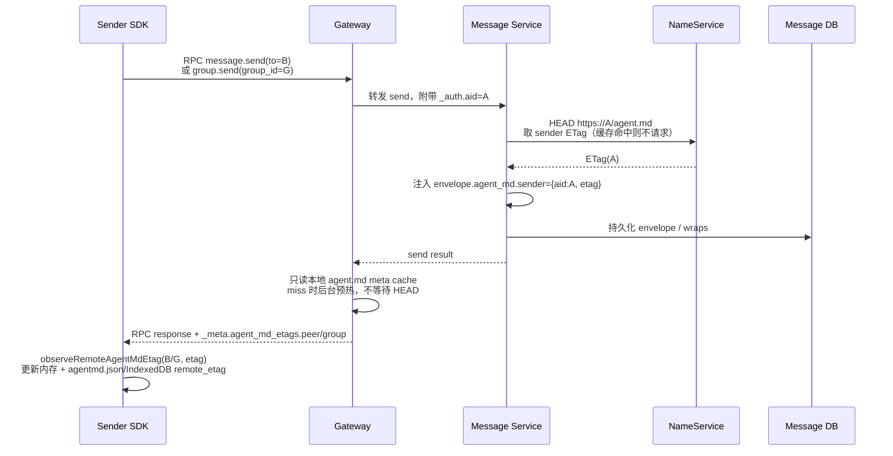
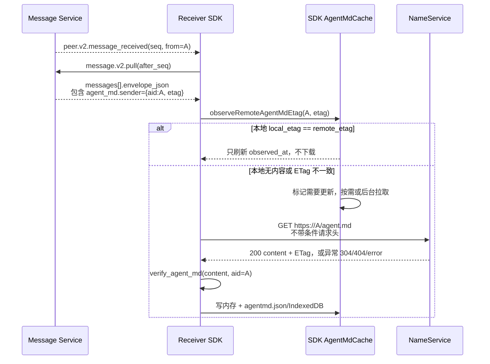
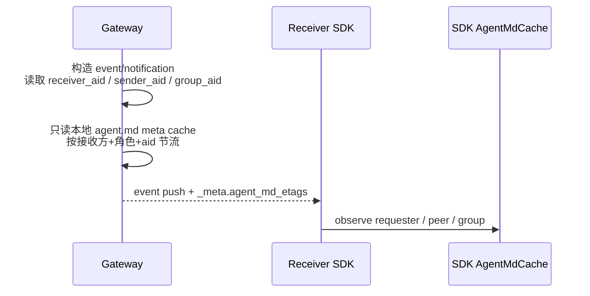
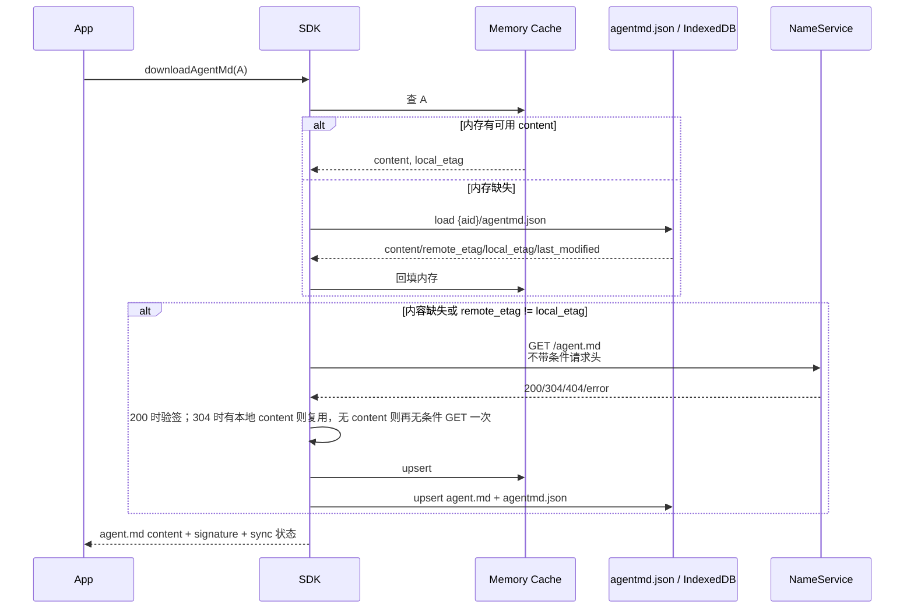
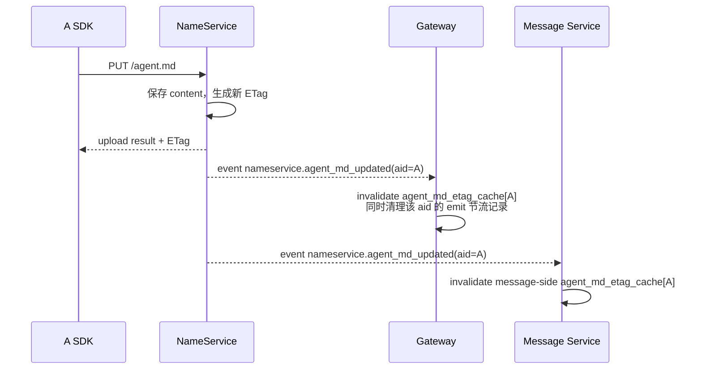

# 远程 agent.md 缓存与 ETag 透传方案

状态：已实现（以当前 Gateway / Message Service / SDK 代码为准）

## 目标

让 SDK 在给对端发送消息、收到对端消息时，都能观察到对端云端 `agent.md` 的最新 ETag，并据此维护本机远程 `agent.md` 缓存状态。

核心目标：

- 每个远程 AID 在 SDK 本地维护一条 `agent.md` 记录，包含 `remote_etag`、`local_etag`、`content`、`last_modified` 等字段。
- Python / TypeScript / Go 将正文和元数据持久化到 `{aun_path}/AIDs/{aid}/agent.md` 与 `agentmd.json`；浏览器 JavaScript 使用 IndexedDB 等价 key，存储不可用时退化为内存缓存。
- Gateway 在 RPC 响应和事件推送 `_meta.agent_md_etags` 中携带 `requester`、`peer` 和 `group` 的云端 `agent.md` 元数据。
- `message.send` 的 RPC 响应可让发送方观察到对端和群自身的云端版本；事件推送可让接收方观察到订阅方、事件源和群自身的云端版本。
- Message Service V2 P2P 信封携带发送方 `agent.md` ETag；四端 SDK 也能识别信封中的 `agent_md.group`。
- ETag 只作为版本提示，不替代 `agent.md` 内容下载和验签。

## 实现结论

服务端已有 `agent.md` HEAD/ETag 能力，当前实现已经覆盖三条观察路径：

1. Gateway RPC response：在 `_meta.agent_md_etag` 保留旧的请求方 ETag，同时在 `_meta.agent_md_etags` 注入结构化角色元数据。
2. Gateway event push：在事件通知 `_meta.agent_md_etags` 注入订阅方、事件源和群自身元数据。
3. Message Service V2 P2P envelope：将 `from_aid` 的 ETag 持久化到 `envelope.agent_md.sender`，随 `message.v2.pull` 到达接收端。

注意：服务端注入的 ETag 只能代表云端版本。SDK 本地必须区分“观察到的远端云端 ETag”和“当前本地内容对应的 ETag”。字段命名固定为 `remote_etag` 和 `local_etag`，其中 `remote_etag` 表示远端云端版本，`local_etag` 表示本地 `content` 对应版本。下载必须始终使用无条件 GET，不能把 `remote_etag` 或 `local_etag` 放进 `If-None-Match` / `If-Modified-Since`，否则会把版本提示误用成 HTTP 缓存状态。

## 字段结构

消息信封中的 `agent_md` 字段：

```json
{
  "agent_md": {
    "sender": {
      "aid": "alice.agentid.pub",
      "etag": "\"sha256...\"",
      "last_modified": "Sat, 01 Jan 2026 12:00:00 GMT"
    },
    "group": {
      "aid": "team.agentid.pub",
      "etag": "\"sha256...\"",
      "last_modified": "Sat, 01 Jan 2026 12:00:00 GMT"
    }
  }
}
```

当前 Message Service V2 P2P 路径实际持久化 `agent_md.sender`。四端 SDK 已支持提取 `agent_md.group`；当群消息信封或后续服务端路径携带该字段时，会按同一缓存模型写入群 AID 的 `remote_etag`。

Gateway RPC response 和 event push 的 `_meta` 字段：

```json
{
  "_meta": {
    "agent_md_etag": "\"requester-etag\"",
    "agent_md_etags": {
      "requester": {
        "aid": "alice.agentid.pub",
        "etag": "\"sha256...\"",
        "last_modified": "Sat, 01 Jan 2026 12:00:00 GMT"
      },
      "peer": {
        "aid": "bob.agentid.pub",
        "etag": "\"sha256...\"",
        "last_modified": "Sat, 01 Jan 2026 12:00:00 GMT"
      },
      "group": {
        "aid": "team.agentid.pub",
        "etag": "\"sha256...\"",
        "last_modified": "Sat, 01 Jan 2026 12:00:00 GMT"
      }
    }
  }
}
```

角色语义：

| 角色键 | 含义 | 注入场景 |
| --- | --- | --- |
| `requester` | 请求方 / 事件订阅方 | RPC response、event push |
| `peer` | 对端 / 事件源 | RPC response、event push |
| `group` | 群自身 `group_aid` / `group_id` 对应的 `agent.md` | 群 RPC response、群事件推送、群通知 |

兼容别名：

| 别名 | 指向 | 说明 |
| --- | --- | --- |
| `receiver` / `target` | `requester` | 旧 SDK 对响应/事件接收方的命名 |
| `sender` / `from` | `peer` | 旧 SDK 对事件源 / 消息发送方的命名 |
| `to` | `peer` | 旧 SDK 在 `message.send` 响应中读取目标 AID 的命名 |

每个角色对象至少包含 `aid`；`etag` 和 `last_modified` 只有在 HEAD/cache 命中时出现。

- `_meta.agent_md_etag` 保持现有语义，仍表示请求者自己在服务端的 `agent.md` ETag。
- `_meta.agent_md_etags.peer` 表示本次 RPC 对端或事件源的 `agent.md` ETag。
- `_meta.agent_md_etags.group` 表示群自身 `group_aid` / `group_id` 的 `agent.md` ETag。
- `envelope.agent_md.sender` 表示本条消息发送方的 `agent.md` ETag。
- 字段缺失、ETag 为空、HEAD 失败均不影响消息收发。

## SDK 缓存模型

每个远程 AID 在内存和本地持久化记录中都维护一条 agent.md 状态。Python / TypeScript / Go 的持久化记录是 `{aun_path}/AIDs/{aid}/agentmd.json`；浏览器 JavaScript 是 IndexedDB 中的 `{aid}/agentmd.json` logical key。SDK 启动或内存 miss 时按需加载该记录。

| 字段 | 含义 |
| --- | --- |
| `aid` | 远程 AID |
| `content` | 本地缓存的完整 `agent.md` 内容，可为空 |
| `local_etag` | 当前 `content` 对应的 ETag，由成功 GET 200 内容确认；304 复用本地内容时沿用原值 |
| `remote_etag` | 从消息信封、RPC response `_meta` 或 event push `_meta` 观察到的远端云端 ETag |
| `last_modified` | GET 响应的 `Last-Modified` |
| `fetched_at` | 最近一次成功确认内容的本机时间 |
| `checked_at` | 最近一次 HEAD / GET 确认远端状态的本机时间 |
| `observed_at` | 最近一次观察到远端 ETag 的本机时间 |
| `remote_status` | `found` / `missing` / `error` |
| `verify_status` | 最近一次 agent.md 验签结果：`ok` / `unsigned` / `invalid` 等 |
| `verify_error` | 最近一次验签失败原因 |
| `last_error` | 最近一次网络或 HTTP 错误 |

状态规则：

- 收到远端 ETag 时，只更新 `remote_etag` 和 `observed_at`。
- 只有下载到内容并完成验签后，才能更新 `content`、`local_etag`、`last_modified`、`fetched_at`。
- `remote_etag == local_etag` 时视为同步。
- `remote_etag != local_etag` 或 `content` 为空时视为需要更新；该状态可由字段推导，不要求单独存储 `stale` 字段。
- `verify_status=invalid` 时内容可以缓存但应用层应能看到无效状态；是否拒绝展示由上层策略决定。

## 时序图

### 发送消息时，发送端获得 peer / group 的 agent.md ETag



### 接收消息时，接收端获得 from 的 agent.md ETag



### 事件推送时，接收端获得 requester / peer / group 的 agent.md ETag



### SDK 本地缓存按需加载



### agent.md 上传后的服务端缓存失效



## 服务端流程细化

### Gateway

现有行为：

- `deliver_response_to_client` 在 RPC response `_meta.agent_md_etag` 中保留请求者自己的 `agent.md` ETag。
- RPC response `_meta.agent_md_etags` 使用标准角色键 `requester`、`peer`、`group`，并保留 `receiver` / `target` / `to` / `sender` / `from` 兼容别名。
- Event push 构造时同样注入 `_meta.agent_md_etags`：`requester` 是事件订阅方，`peer` 是事件源，`group` 是事件数据中的 `group_aid` / `group_id`。
- ETag 获取采用本地 TTL 缓存：正缓存 300 秒，负缓存 60 秒；miss 时只按配置触发后台 HEAD 预热，不阻塞 RPC response 或 event push 热路径。
- 默认只有缓存已存在或启用后台刷新时才注入；`AUN_GATEWAY_AGENT_MD_BACKGROUND_REFRESH` / `AUN_AGENT_MD_BACKGROUND_REFRESH` 可启用后台预热。
- 注入发送本身有节流：按 `recipient_scope + role + aid` 记录最近发送状态，默认 60 秒；首次、`etag` 变化或 `last_modified` 变化立即注入。
- 注入节流间隔可由 `AUN_GATEWAY_AGENT_MD_META_EMIT_INTERVAL_SECONDS` 或 `AUN_AGENT_MD_META_EMIT_INTERVAL_SECONDS` 覆盖，取值被限制在 `0..86400` 秒。
- `nameservice.agent_md_updated` 事件会失效对应 AID 的 Gateway ETag 缓存，并清理该 AID 的注入节流记录。

### Message Service

现有 V2 路径：

- SDK 加密 P2P 消息当前实际调用 `message.send`。
- 服务端通过 payload `type=e2ee.p2p_encrypted` 且 `version=v2` 进入 `_rpc_send_v2_p2p`。
- `_rpc_send_v2_p2p` 持久化 `protected_headers`、`context`、`agent_md_json`，并在 `message.v2.pull` 时重建 `envelope_json`。
- `_rpc_send_v2_p2p` 写入共享体前为 `from_aid` 查询 `agent.md` ETag，并将结果注入 envelope 顶层 `agent_md.sender`。
- Message Service 的 ETag 缓存同样使用正缓存 300 秒、负缓存 60 秒；热路径可用 `AUN_MESSAGE_AGENT_MD_BACKGROUND_REFRESH` 或 `agent_md_background_refresh` 配置控制后台刷新。
- 在线 push 事件可以只带 seq，不强制带完整 ETag；接收端通过 pull 取得完整信封即可。
- 当前群自身 `group` 元数据主要由 Gateway 在 RPC response / event push `_meta.agent_md_etags.group` 中注入；SDK 已兼容信封 `agent_md.group`。

### NameService

现有能力足够支撑：

- `GET /agent.md` 与 `HEAD /agent.md` 返回 `ETag` 和 `Last-Modified`。
- `PUT /agent.md` 上传后生成新 ETag。
- 上传后发布 `nameservice.agent_md_updated` 事件，Gateway 已订阅并失效缓存。

运行约束：

- Message Service 维护自己的 ETag 缓存时，应继续订阅 `nameservice.agent_md_updated`。
- HEAD 失败、404、超时返回空 ETag，不影响消息主链路。

## SDK 流程细化

### 观察远端 ETag

SDK 内部使用统一观察入口：

```text
observe_remote_agent_md_etag(aid, etag, source)
```

触发来源：

- RPC response / event push `_meta.agent_md_etags.requester`：观察请求方 / 订阅方。
- RPC response / event push `_meta.agent_md_etags.peer`：观察对端 / 事件源。
- RPC response / event push `_meta.agent_md_etags.group`：观察群自身 `group_aid` / `group_id`。
- 兼容别名 `_meta.agent_md_etags.receiver`、`target`、`to`、`sender`、`from`：四端 SDK 均继续读取。
- 消息信封 `agent_md.sender`：收到消息后观察 `from`；缺少 `aid` 时从 envelope 顶层或 AAD 的 `from` 兜底。
- 消息信封 `agent_md.group`：观察群自身；缺少 `aid` 时从 envelope 顶层或 AAD 的 `group_aid` / `group_id` 兜底。
- 现有 `_meta.agent_md_etag`：仍用于当前客户端自己的云端 ETag。

处理规则：

- aid 为空，或 `etag` / `last_modified` 都为空时忽略。
- etag 与当前 `remote_etag` 相同且 `last_modified` 未变化：保持记录并触发缺内容检查。
- etag 或 `last_modified` 变化：更新 `remote_etag`、`last_modified`、`observed_at`，并根据 `local_etag` 推导是否需要更新。
- 变更需要同时写入内存和 agentmd.json / IndexedDB。
- 本地没有 `content` 时，SDK 会按各语言实现触发去重后的后台下载；下载仍使用无条件 GET。

### 按需下载

当应用调用 `downloadAgentMd(aid)` 或 SDK 需要展示远程 agent 信息时：

- 可先查内存，miss 时查 agentmd.json / IndexedDB，用于展示本地已有状态。
- `downloadAgentMd(aid)` 的远端下载请求一律发起无条件 GET，不用本地 ETag 决定请求头。
- GET 请求不得发送 `If-None-Match` / `If-Modified-Since`。
- 200：验签，更新内容和 `local_etag`。
- 304：本地已有 content 时复用该 content；本地没有 content 时再发起一次无条件 GET。第二次仍非 2xx 时按错误返回。
- 404：标记远端未发布 `agent.md`，不要删除已有内容，除非产品要求严格同步。
- 网络错误：保留旧内容，记录 `fetch_error` 或更新失败时间。

### 本地文件 / 浏览器持久化

agent.md 不写入 SQLite。当前 SDK 使用以下持久化位置：

| SDK | 正文 | 元数据 |
| --- | --- | --- |
| Python | `{aun_path}/AIDs/{aid}/agent.md` | `{aun_path}/AIDs/{aid}/agentmd.json` |
| TypeScript / Node | `{aun_path}/AIDs/{aid}/agent.md` | `{aun_path}/AIDs/{aid}/agentmd.json` |
| Go | `{aun_path}/AIDs/{aid}/agent.md` | `{aun_path}/AIDs/{aid}/agentmd.json` |
| JavaScript / 浏览器 | IndexedDB logical key `{root}/{aid}/agent.md` | IndexedDB logical key `{root}/{aid}/agentmd.json` |

`agentmd.json` 至少承载以下语义字段：

| 字段 | 说明 |
| --- | --- |
| `aid` | AID |
| `content` | 正文副本；文件系统 SDK 也会单独写 `agent.md` |
| `local_etag` / `remote_etag` | 本地内容版本 / 远端观察版本 |
| `last_modified` | 远端 Last-Modified |
| `fetched_at` / `checked_at` / `observed_at` / `updated_at` | 本机时间戳 |
| `remote_status` | `found` / `missing` / `error` |
| `verify_status` / `verify_error` | 最近一次验签状态 |
| `last_error` | 最近一次错误 |

四个已实现 SDK 应保持字段语义一致。旧 `agent_md_cache` / `remote_agent_md_cache` SQLite 表不再作为 agent.md 缓存来源；迁移逻辑可清理旧表，但不得把新 agent.md 写回 SQLite。

## 异常与竞态处理

- 多个消息同时观察同一 AID 的新 ETag：按 ETag 值幂等 upsert。
- 多个协程同时触发同一 AID 下载：需要 per-AID in-flight 去重。
- 观察到 ETag A 后开始下载，期间又观察到 ETag B：下载完成时只更新 `local_etag=A`，随后仍可由 `remote_etag != local_etag` 推导为需要更新，下一轮继续拉 B。
- 304 但本地 content 缺失：不能返回空内容，必须再无条件 GET 一次。
- 信封里的 ETag 不参与 AAD，不作为安全声明；安全性仍依赖 `agent.md` 签名和证书校验。
- Gateway `_meta` 里的 ETag 也不参与 E2EE AAD 或业务鉴权，只是版本提示。
- HEAD/GET 超时不影响 message send 和 message pull。
- 跨域场景中，目标域 Message Service 注入 sender ETag 时可能需要跨域 HEAD；失败时允许缺字段。

## 测试要点

- 发送方收到 `message.send` 响应后，能把 `peer` / `to` 的 ETag 写入本地缓存 `remote_etag`。
- 群 RPC response 或群事件 push 带 `_meta.agent_md_etags.group` 时，四端 SDK 都能把群 AID 的 ETag 写入本地缓存 `remote_etag`。
- 接收方 `message.v2.pull` 后，能从 `envelope.agent_md.sender` 写入 `from` 的 `remote_etag`。
- 信封带 `agent_md.group` 且缺少 `aid` 时，四端 SDK 能从 `group_aid` / `group_id` 兜底识别群 AID。
- ETag 变化但内容未下载时，可由 `remote_etag != local_etag` 推导为需要更新。
- 本地文件 / IndexedDB 有缓存、内存为空时，SDK 能按需加载。
- 304 且本地有内容时复用内容；304 但本地无内容时再无条件 GET 一次。
- `agent.md` 上传后，Gateway 缓存失效，后续消息能看到新 ETag。
- Gateway 元数据注入在未变化时默认 60 秒内不重复发送，ETag 或 `last_modified` 变化时立即发送。
- HEAD/GET 404、超时、网络错误不影响消息收发主链路。
- Python / TS / JS / Go 四个 SDK 对 `remote_etag`、`local_etag`、`content`、`remote_status`、`verify_status` 语义一致。


