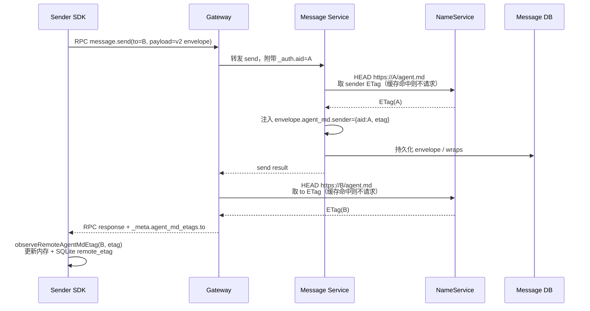
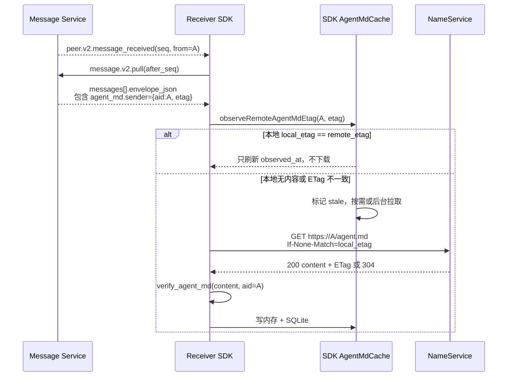
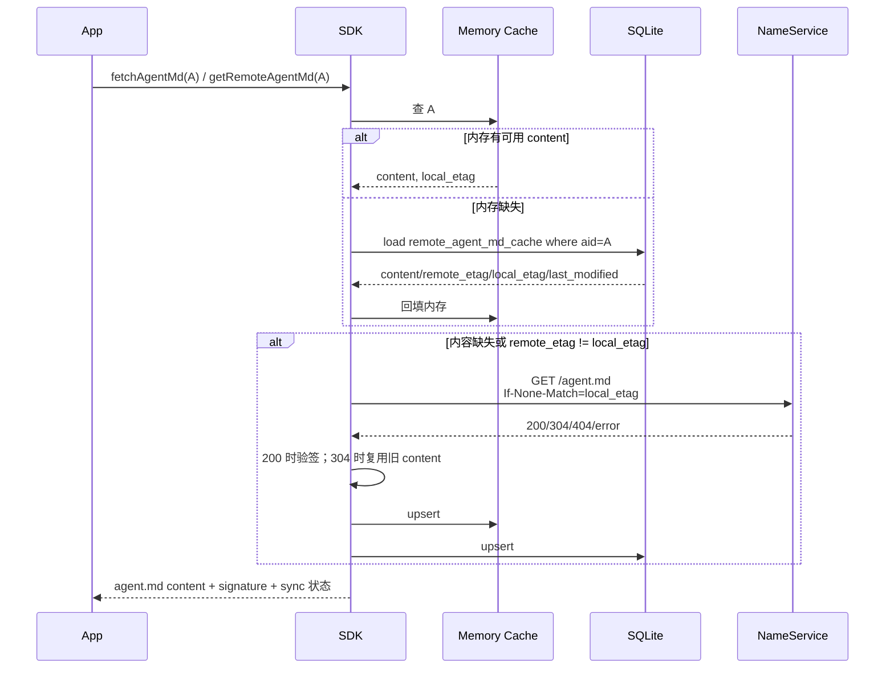
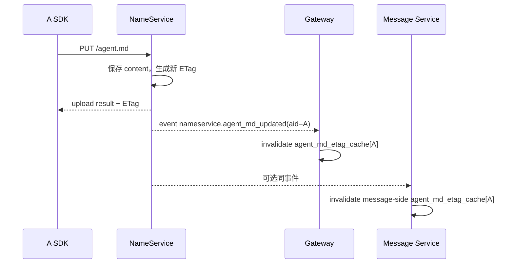

# 远程 agent.md 缓存与 ETag 透传方案

状态：方案草案

## 目标

让 SDK 在给对端发送消息、收到对端消息时，都能观察到对端云端 `agent.md` 的最新 ETag，并据此维护本机远程 `agent.md` 缓存状态。

核心目标：

- 每个远程 AID 在 SDK 本地内存中维护一条 `agent.md` 记录，包含 `remote_etag`、`local_etag`、`content`、`last_modified` 等字段。
- 同一条远程缓存记录持久化到本地 SQLite 表，SDK 启动或内存 miss 时按需加载。
- `message.send` 的 RPC 响应携带接收方 `agent.md` ETag，让发送方更新 `to` 的云端版本。
- 接收端收到消息信封时携带发送方 `agent.md` ETag，让接收方更新 `from` 的云端版本。
- ETag 只作为版本提示，不替代 `agent.md` 内容下载和验签。

## 可行性结论

方案可行。服务端已有 `agent.md` HEAD/ETag 能力，Gateway 当前也已经在 RPC response `_meta.agent_md_etag` 中注入“请求者自己”的服务端 ETag。需要扩展两条路径：

1. `message.send` / V2 P2P send：把 `from` 的 `agent.md` ETag 注入消息信封，随消息到达接收端。
2. `message.send` RPC response：把 `to` 的 `agent.md` ETag 注入响应 `_meta`，返回发送端。

注意：服务端注入的 ETag 只能代表云端版本。SDK 本地必须区分“观察到的远端云端 ETag”和“当前本地内容对应的 ETag”。字段命名固定为 `remote_etag` 和 `local_etag`，其中 `remote_etag` 表示远端云端版本，`local_etag` 表示本地 `content` 对应版本。不能在只有远端 ETag、没有内容的情况下直接覆盖 `local_etag`，否则后续 `If-None-Match` 命中 304 时本地可能没有可用内容。

## 字段建议

消息信封新增字段：

```json
{
  "agent_md": {
    "sender": {
      "aid": "alice.agentid.pub",
      "etag": "\"sha256...\""
    }
  }
}
```

`message.send` RPC response 的 `_meta` 新增字段：

```json
{
  "_meta": {
    "agent_md_etag": "\"sender-self-etag\"",
    "agent_md_etags": {
      "to": {
        "aid": "bob.agentid.pub",
        "etag": "\"sha256...\""
      }
    }
  }
}
```

兼容说明：

- `_meta.agent_md_etag` 保持现有语义，仍表示请求者自己在服务端的 `agent.md` ETag。
- `_meta.agent_md_etags.to` 表示本次消息接收方的 `agent.md` ETag。
- `envelope.agent_md.sender` 表示本条消息发送方的 `agent.md` ETag。
- 字段缺失、ETag 为空、HEAD 失败均不影响消息收发。

## SDK 缓存模型

每个远程 AID 在内存和 SQLite 表中都维护一条缓存记录。内存记录与 SQLite 表记录字段语义一致，SQLite 用于 SDK 重启或内存 miss 时按需加载。

| 字段 | 含义 |
| --- | --- |
| `aid` | 远程 AID |
| `content` | 本地缓存的完整 `agent.md` 内容，可为空 |
| `local_etag` | 当前 `content` 对应的 ETag，只能由 GET 200/304 确认 |
| `remote_etag` | 从消息信封或 RPC `_meta` 观察到的远端云端 ETag |
| `last_modified` | GET 响应的 `Last-Modified` |
| `fetched_at` | 最近一次成功确认内容的本机时间 |
| `observed_at` | 最近一次观察到远端 ETag 的本机时间 |
| `stale` | `remote_etag` 与 `local_etag` 不一致，或有远端 ETag 但无内容 |
| `verify_status` | 最近一次 `verify_agent_md` 结果：`verified` / `unsigned` / `invalid` |

状态规则：

- 收到远端 ETag 时，只更新 `remote_etag` 和 `observed_at`。
- 只有下载到内容并完成验签后，才能更新 `content`、`local_etag`、`last_modified`、`fetched_at`。
- `remote_etag == local_etag` 时，`stale=false`。
- `remote_etag != local_etag` 或 `content` 为空时，`stale=true`。
- `verify_status=invalid` 时内容可以缓存但应用层应能看到无效状态；是否拒绝展示由上层策略决定。

## 时序图

### 发送消息时，发送端获得 to 的 agent.md ETag



### 接收消息时，接收端获得 from 的 agent.md ETag



### SDK 本地缓存按需加载



### agent.md 上传后的服务端缓存失效



## 服务端流程细化

### Gateway

现有行为：

- `deliver_response_to_client` 会在 RPC response `_meta.agent_md_etag` 中注入请求者自己的 `agent.md` ETag。
- ETag 获取采用本地 TTL 缓存，miss 时异步 HEAD 预热，不阻塞响应热路径。
- `nameservice.agent_md_updated` 事件会失效对应 AID 的 Gateway ETag 缓存。

新增行为：

- 对 `message.send` 和未来真实启用的 `message.v2.send`，根据请求参数提取 `to`。
- 在响应 `_meta.agent_md_etags.to` 中注入 `to` 的 ETag。
- 注入逻辑应使用同一套 ETag 缓存和 HEAD fetcher。
- 如果缓存 miss，第一轮响应可以不带 `to` ETag；后台预热后下一次消息或 RPC 再带上。
- 如果产品希望“发送后立即拿到 to ETag”，可对 message send 做同步 HEAD，但应设置短超时并保证失败不影响发送。

### Message Service

现有 V2 路径：

- SDK 加密 P2P 消息当前实际调用 `message.send`。
- 服务端通过 payload `type=e2ee.p2p_encrypted` 且 `version=v2` 进入 `_rpc_send_v2_p2p`。
- `_rpc_send_v2_p2p` 持久化 `protected_headers`、`context`，并在 `message.v2.pull` 时重建 `envelope_json`。

新增行为：

- 在 `_rpc_send_v2_p2p` 写入共享体前，为 `from_aid` 查询 `agent.md` ETag。
- 将结果注入 envelope 顶层 `agent_md.sender`。
- `agent_md` 应随 envelope 持久化并在 `_rebuild_v2_envelope_json` 中恢复。
- 在线 push 事件可以只带 seq，不强制带完整 ETag；接收端通过 pull 取得完整信封即可。
- V1 明文/旧 `message.send` 如需同样能力，可在传统 message envelope 中透传同等 `agent_md.sender` 字段。

### NameService

现有能力足够支撑：

- `GET /agent.md` 与 `HEAD /agent.md` 返回 `ETag` 和 `Last-Modified`。
- `PUT /agent.md` 上传后生成新 ETag。
- 上传后发布 `nameservice.agent_md_updated` 事件，Gateway 已订阅并失效缓存。

建议补齐：

- 如果 Message Service 也维护自己的 ETag 缓存，应订阅同一事件或复用 Gateway 的注入结果。
- HEAD 失败、404、超时返回空 ETag，不影响消息主链路。

## SDK 流程细化

### 观察远端 ETag

SDK 增加统一入口：

```text
observe_remote_agent_md_etag(aid, etag, source)
```

触发来源：

- RPC response `_meta.agent_md_etags.to`：发送消息后观察 `to`。
- 消息信封 `agent_md.sender`：收到消息后观察 `from`。
- 现有 `_meta.agent_md_etag`：仍用于当前客户端自己的云端 ETag。

处理规则：

- aid 或 etag 为空时忽略。
- etag 与当前 `remote_etag` 相同：只刷新 `observed_at`。
- etag 变化：更新 `remote_etag`、`observed_at`，并根据 `local_etag` 设置 `stale`。
- 变更需要同时写入内存和 SQLite。

### 按需下载

当应用调用 `fetchAgentMd(aid)` 或 SDK 需要展示远程 agent 信息时：

- 先查内存，miss 时查 SQLite 表。
- 如果 `content` 存在且 `local_etag == remote_etag`，可直接返回缓存。
- 如果 `content` 缺失或 stale，则发起 GET。
- GET 时优先带 `If-None-Match=local_etag`，其次带 `If-Modified-Since=last_modified`。
- 200：验签，更新内容和 `local_etag`。
- 304：只有本地已有 content 时才能复用；如果本地没有 content 却收到 304，应清空条件头重试一次 GET。
- 404：标记远端未发布 `agent.md`，不要删除已有内容，除非产品要求严格同步。
- 网络错误：保留旧内容，记录 `fetch_error` 或更新失败时间。

### SQLite 持久化

新增结构化表 `remote_agent_md_cache`，每个远程 AID 一行：

| 列 | 类型 |
| --- | --- |
| `aid` | TEXT PRIMARY KEY |
| `content` | TEXT NOT NULL DEFAULT '' |
| `local_etag` | TEXT NOT NULL DEFAULT '' |
| `remote_etag` | TEXT NOT NULL DEFAULT '' |
| `last_modified` | TEXT NOT NULL DEFAULT '' |
| `fetched_at` | INTEGER NOT NULL DEFAULT 0 |
| `observed_at` | INTEGER NOT NULL DEFAULT 0 |
| `verify_status` | TEXT NOT NULL DEFAULT '' |
| `verify_error` | TEXT NOT NULL DEFAULT '' |
| `updated_at` | INTEGER NOT NULL DEFAULT 0 |

建议 SQL：

```sql
CREATE TABLE IF NOT EXISTS remote_agent_md_cache (
  aid TEXT PRIMARY KEY,
  content TEXT NOT NULL DEFAULT '',
  local_etag TEXT NOT NULL DEFAULT '',
  remote_etag TEXT NOT NULL DEFAULT '',
  last_modified TEXT NOT NULL DEFAULT '',
  fetched_at INTEGER NOT NULL DEFAULT 0,
  observed_at INTEGER NOT NULL DEFAULT 0,
  verify_status TEXT NOT NULL DEFAULT '',
  verify_error TEXT NOT NULL DEFAULT '',
  updated_at INTEGER NOT NULL DEFAULT 0
);

CREATE INDEX IF NOT EXISTS idx_remote_agent_md_cache_observed_at
ON remote_agent_md_cache(observed_at);
```

五个 SDK 应保持字段语义一致。浏览器 JS 可落 IndexedDB；Node TS、Python、Go、C++ 落各自现有本地存储。

## 异常与竞态处理

- 多个消息同时观察同一 AID 的新 ETag：按 ETag 值幂等 upsert。
- 多个协程同时触发同一 AID 下载：需要 per-AID in-flight 去重。
- 观察到 ETag A 后开始下载，期间又观察到 ETag B：下载完成时只更新 `local_etag=A`，随后仍保持 stale，下一轮继续拉 B。
- 304 但本地 content 缺失：不能返回空内容，必须无条件 GET 重试。
- 信封里的 ETag 不参与 AAD，不作为安全声明；安全性仍依赖 `agent.md` 签名和证书校验。
- HEAD/GET 超时不影响 message send 和 message pull。
- 跨域场景中，目标域 Message Service 注入 sender ETag 时可能需要跨域 HEAD；失败时允许缺字段。

## 测试要点

- 发送方收到 `message.send` 响应后，能把 `to` 的 ETag 写入本地缓存 `remote_etag`。
- 接收方 `message.v2.pull` 后，能从 `envelope.agent_md.sender` 写入 `from` 的 `remote_etag`。
- ETag 变化但内容未下载时，缓存状态为 stale。
- 本地 SQLite 有缓存、内存为空时，SDK 能按需加载。
- 304 且本地有内容时复用内容；304 但本地无内容时强制重拉。
- `agent.md` 上传后，Gateway 缓存失效，后续消息能看到新 ETag。
- HEAD/GET 404、超时、网络错误不影响消息收发主链路。
- Python / TS / JS / Go / C++ 五个 SDK 对 `remote_etag`、`local_etag`、`content`、`stale` 语义一致。