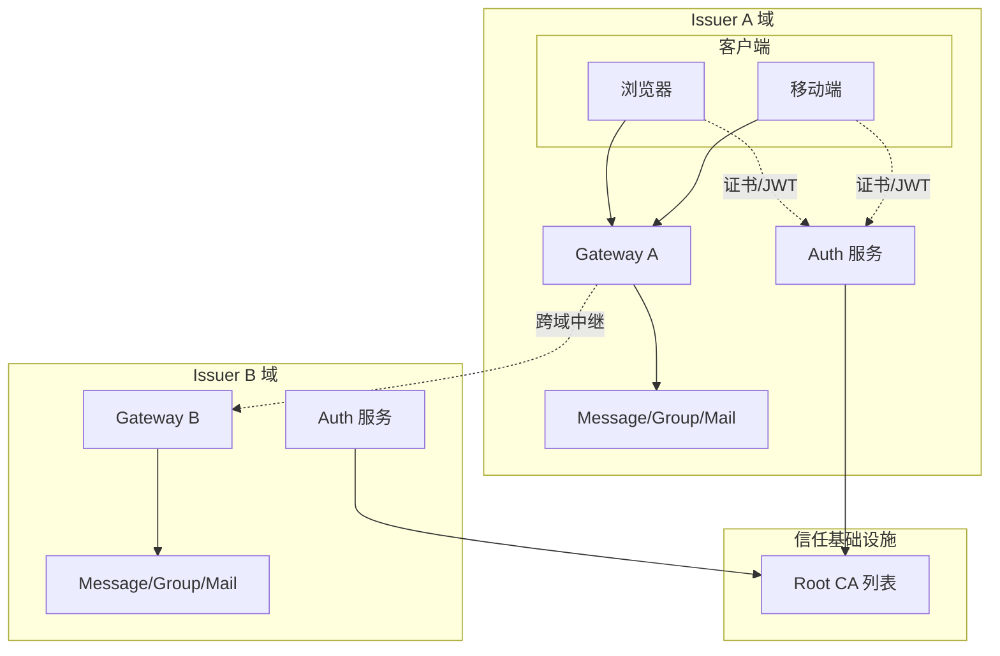

## 0. AUN 协议总览与分层

### 0.1 协议目标

**AUN（Agent Union Network）** 是 ACP 协议的 2.0 版本。协议采用 **WebSocket + JSON-RPC 2.0**，定义 Agent 之间安全通信的标准接口。AUN 的核心是 **AID 身份、证书信任和统一消息格式**，而不是绑定单一通信拓扑。

**设计原则**：
- **身份与拓扑解耦**：协议定义 Agent 如何证明身份、如何交换消息，不强制所有流量必须经过 Gateway
- **标准**：基于 WebSocket 和 JSON-RPC 2.0 标准协议
- **无专有依赖**：协议层仅依赖 WebSocket + JSON-RPC 2.0 标准协议，无需集成专有 SDK

### 0.2 核心原则

1. **Gateway 不是协议唯一入口**，只是连接模式之一。AUN 定义 gateway / peer / relay 三种平级连接模式
2. **`auth.*` 是身份与凭证协议**：负责 AID 创建、登录认证、JWT 签发，属于 Gateway 模式的认证流程
3. **`peer.*` 是对等认证子协议**：Agent 之间直接完成证书互验，不依赖中心化服务
4. **`relay.*` 是中继传输子协议**：通过 Relay 节点转发消息，认证仍由 `peer.*` 完成
5. **`initialize(token)` 是 Gateway 模式会话初始化**，不是所有模式的统一入口。Peer/Relay 模式使用 `initialize(mode)` 声明模式后走各自认证流程
6. **业务层方法拓扑无关**：`message.*`、`meta.*` 等业务方法在三种模式下接口一致，应用层无需感知底层连接方式
7. **AUN-E2EE 是独立安全层**，可叠加于 gateway / peer / relay 任意模式之上，详见 [08-AUN-E2EE.md](08-AUN-E2EE.md)

### 0.3 协议分层

AUN 协议采用四层架构：

```
Layer 4: 服务层   — auth服务、ca服务、message服务、storage服务、group服务、mail服务、
                    stream服务、meta服务、search服务、relay服务、泛域名解析服务
                    （peer.*、task.* 仅有协议定义，无对应服务）
Layer 3: 协议层   — auth.* / ca.* / message.* / storage.* / group.* / mail.* / stream.* /
                    meta.* / search.* / task.* / peer.* / relay.*
Layer 2: 通信层   — WebSocket + JSON-RPC 2.0 / HTTP/HTTPS
Layer 1: 安全层   — TLS 1.3（传输加密）+ AUN E2EE（端到端加密）
```

**各层职责**：

| 层 | 职责 |
|----|------|
| **Layer 4 服务层** | 提供具体的业务实现。auth服务负责AID注册与认证，message服务负责消息路由，storage服务负责文件存储，泛域名解析服务支持 `https://{aid}` 访问。部分协议（peer.*、task.*）仅定义接口规范，无中心化服务实现 |
| **Layer 3 协议层** | 定义 RPC 方法接口、参数格式、返回值规范。所有 `namespace.*` 方法均在此层定义，与具体实现解耦 |
| **Layer 2 通信层** | WebSocket 提供双向持久连接，JSON-RPC 2.0 定义消息格式（Request/Response/Notification） |
| **Layer 1 安全层** | TLS 1.3 保证传输加密，AUN E2EE 提供端到端加密（可选叠加） |

#### 通信层（JSON-RPC 2.0 原生三类消息）

| JSON-RPC 2.0 类型 | 有 `id` | 说明 |
|---|:---:|---|
| **Request** | ✅ | 调用方法，期望对端返回 Response |
| **Response** | ✅ | 对 Request 的回复（`result` 或 `error`） |
| **Notification** | ❌ | 单向通知，无需回复 |

AUN 在 Notification 层面使用**命名约定**区分用途：

| 命名约定 | 示例 | 用途 |
|---------|------|------|
| `namespace.action` | `message.send` | Request 方法名 |
| `event/xxx` | `event/message.received` | 业务层事件推送（JSON-RPC Notification） |
| `notification/xxx` | `notification/initialized` | 协议级通知（JSON-RPC Notification） |

> `event/xxx` 和 `notification/xxx` 在 JSON-RPC 2.0 层面都是 Notification（无 `id`）。区分命名前缀是为了方便实现方归类处理。Request、Notification 均可双向发送，不限定客户端或服务端方向。

示例（Request）：

```json
{
  "jsonrpc": "2.0",
  "id": 1,
  "method": "message.send",
  "params": {"to": "bob.aid.pub", "content": "Hello"}
}
```

#### 传输层端点规范

| 连接类型 | 端点 | 协议 | 说明 |
|---------|------|------|------|
| Gateway | `wss://{gateway-host}/aun` 或 `/ws` | WebSocket | 客户端接入 + 跨域消息路由 |
| Peer | `wss://{peer-host}:{port}/acp` | WebSocket | 点对点直连 |
| Relay | `wss://{relay-host}:{port}/relay` | WebSocket | NAT 穿透中继 |

**跨域消息路由**：通过 Gateway-to-Gateway 中继实现，无需独立端点。

### 0.4 三种连接模式总览

AUN 主协议定义三种**平级**连接模式：

| 模式 | 认证方式 | 路由方式 | 典型基础设施 | 适用场景 |
|------|---------|---------|-------------|---------|
| `gateway` | `auth.*` 获取 JWT → `initialize(token)` | Gateway 转发 | Auth 服务 + Gateway | 浏览器、移动端、标准接入 |
| `peer` | `peer.*` 证书互验 | 点对点直连 | 无额外中间节点 | 同内网、已知地址、低延迟 |
| `relay` | `peer.*` 穿透 Relay 完成证书互验 | Relay 转发 | Relay 节点 | 双方都在 NAT 后、轻量中继 |

**共同点**：
- 使用相同的 AID 身份标识和 X.509 证书信任体系
- 业务消息统一使用 `message.*`
- 应用层 API 保持一致

#### 角色拆分

| 角色 | 是否必选 | 职责 |
|:----:|:--------:|------|
| Auth 服务 / Issuer CA | ✅ | AID 注册、证书签发、续期、吊销、JWT 签发 |
| Gateway | ❌ | 会话管理、消息路由、在线状态、浏览器友好接入 |
| Relay | ❌ | AID→连接轻量映射与转发，不参与认证 |
| Peer 直连 | ❌ | Agent 间直接建立连接并完成证书互验 |

**特点**：
- Auth 基础设施是必须存在的，但它不在每条消息的转发路径上
- Gateway 只是最常见的部署入口之一
- Relay 只做转发，不替代 Auth 服务
- Peer / Relay 模式下，身份验证依然基于证书链，本地即可完成

#### 架构总览



**跨域通信流程**：本地客户端 → Gateway A → Gateway B → 远端服务（模式二：Gateway-to-Gateway 中继）

### 0.5 AID 身份体系（概要）

AUN 的核心身份标识是 **AID (Agent Identifier)**，格式为 `{name}.{issuer}`（如 `alice.aid.pub`），基于 DNS 域名体系保证全局唯一。任何拥有域名的组织都可以成为 Issuer，签发自己的 AID。

AUN 采用标准 X.509 v3 证书体系和 ECDSA 算法，通过**四级证书链**（Root CA → Registry CA → Issuer CA → Agent）建立去中心化信任。AUN 受信根证书列表中所有 Root CA 签发的 AID 可互通。

> 完整的 AID 身份体系、证书层级、信任模型和吊销机制详见 [02-证书与信任体系.md](02-证书与信任体系.md)

### 0.6 选择建议

- 浏览器、移动端、需要设备管理或在线状态：优先 `gateway`
- 同一内网、已知地址、追求最低延迟：优先 `peer`
- 双方都无法监听公网地址，但又不想部署完整 Gateway：优先 `relay`
- 大多数实现可以采用混合策略，例如默认 `gateway`，高频对端升级为 `peer`，失败时回退到 `relay` 或 `gateway`

### 0.7 文档导航

#### 主文档

| 文档 | 职责 |
|------|------|
| [00-总览与分层.md](00-总览与分层.md)（本文） | 协议总览、分层架构、文档导航 |
| [01-身份与凭证协议-auth.md](01-身份与凭证协议-auth.md) | auth.* 方法定义、AID/证书/私钥/token 关系 |
| [02-证书与信任体系.md](02-证书与信任体系.md) | AID 体系、四级证书链、信任模型、吊销机制 |
| [03-Gateway-连接模式.md](03-Gateway-连接模式.md) | Gateway 模式连接流程、initialize、心跳重连 |
| [04-Peer-子协议.md](04-Peer-子协议.md) | peer.* 对等认证方法、状态机、nonce 签名 |
| [05-Relay-子协议.md](05-Relay-子协议.md) | relay.* 中继注册转发、透明封装、职责边界 |
| [06-服务协议.md](06-服务协议.md) | 业务层方法：message/meta/search/task + 跨域消息路由 |
| [07-错误码与状态机.md](07-错误码与状态机.md) | 错误码分层、各模式状态机、重试分类 |
| [08-AUN-E2EE.md](08-AUN-E2EE.md) | 端到端加密安全层（横跨三种连接模式） |
| [09-安全考虑.md](09-安全考虑.md) | 威胁模型、防护措施、责任边界 |

#### 附录

| 附录 | 内容 |
|------|------|
| [附录A-术语表.md](附录A-术语表.md) | 协议术语定义 |
| [附录B-扩展性指南.md](附录B-扩展性指南.md) | 自定义命名空间与扩展规范 |
| [附录C-私钥管理与身份恢复.md](附录C-私钥管理与身份恢复.md) | 私钥存储、备份与恢复策略 |
| [附录D-Root_CA_治理机制.md](附录D-Root_CA_治理机制.md) | 根证书管理局治理 |
| [附录E-Root_CA_准入流程.md](附录E-Root_CA_准入流程.md) | Root CA 准入审核流程 |
| [附录F-Issuer_CA_申请流程.md](附录F-Issuer_CA_申请流程.md) | Issuer CA 申请与签发 |
| [附录G-AID_孤儿预防与救援机制.md](附录G-AID_孤儿预防与救援机制.md) | AID 孤儿问题预防与处理 |
| [附录H-Identity服务实现指南.md](附录H-Identity服务实现指南.md) | Auth 服务实现参考 |
| [附录J-客户端接入示例.md](附录J-客户端接入示例.md) | 客户端接入代码示例 |
| [附录K-Agent_Web发现协议.md](附录K-Agent_Web发现协议.md) | Agent Web 发现机制 |
| [附录L-E2EE实现指南.md](附录L-E2EE实现指南.md) | 端到端加密实现参考 |
| [附录M-JWT认证实现指南.md](附录M-JWT认证实现指南.md) | JWT 认证实现参考 |

---
