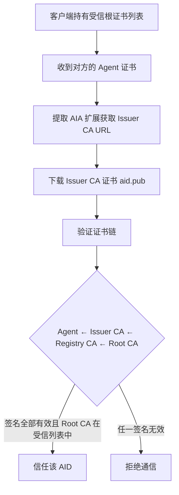

## 2. AID 身份体系与证书信任模型

在深入协议细节之前，需要先理解 AUN 的核心身份系统：**AID (Agent Identifier)** 及其基于 X.509 证书的信任模型。

### 2.1 什么是 AID

**AID** 是 AUN 网络中的全局唯一身份标识，格式为：

```
{name}.{issuer}
```

其中 `{name}` 是用户名（不允许包含 `.`），`{issuer}` 是签发者域名（可以是多级域名）。

**命名规则**：
- `name`：仅允许 `[a-z0-9_-]`，首字符不允许为 `-`，不允许包含 `.`
- `issuer`：合法的可注册域名，可以是多级（如 `aid.pub`、`company.co.uk`、`agency.gov.cn`）
- AID 不区分大小写，存储和比较时统一转为小写

**示例**：
- `alice.aid.pub` — 由 aid.pub 签发的 alice
- `bob.company.com` — 由 company.com 签发的 bob
- `device001.iot.org` — 由 iot.org 签发的设备
- `agent.company.co.uk` — 由 company.co.uk 签发的 agent

**关键特性**：
- **全局唯一**：通过 DNS 域名体系保证唯一性（类似邮箱地址）
- **自主签发**：任何拥有域名的组织都可以成为 Issuer，签发自己的 AID
- **去中心化**：无需中央授权机构，基于 PKI 证书链建立信任
- **天然映射**：AID 可直接映射为邮箱地址（`alice.aid.pub` → `alice@aid.pub`）

### 2.2 AUN 网络与根证书管理局

AUN 是一个**去中心化的开放网络**，而非由单一组织控制的私有网络。任何组织都可以运营自己的 Root CA 并申请加入 AUN 公共网络，就像任何组织都可以申请成为 HTTPS 的受信 CA 一样。

**网络架构**：

```
AUN 根证书管理局（AUN Root CA Authority）
    │
    ├── 管理 → 受信根证书列表
    │           ├── Root CA A（组织 A 运营）
    │           ├── Root CA B（组织 B 运营）
    │           └── Root CA C（组织 C 运营）
    │
    └── 各 Root CA 独立运营，签发各自的证书链
        ├── Root CA A → Issuer CA → Agent 证书
        ├── Root CA B → Issuer CA → Agent 证书
        └── Root CA C → Issuer CA → Agent 证书
```

受信列表中所有 Root CA 签发的 AID 可以互通，形成统一的 AUN 公共网络。不在列表中的 Root CA 只能运行私有 AUN 网络，无法与公共网络互通（但可申请加入）。

#### AUN 根证书管理局（AUN Root CA Authority）

AUN 受信根证书列表由 **AUN 根证书管理局** 管理，负责根证书的准入审批和生命周期管理。

**治理结构：多方共治模型**

AUN 根证书管理局采用**多方共治（Multi-Stakeholder Governance）**模型，类似 ICANN、W3C 或欧盟的治理结构，确保决策的公正性和透明度。

治理结构包括：
- **理事会**：技术社区、商业组织、学术机构、政府/监管机构、独立专家代表
- **技术委员会**：制定证书策略，审查技术合规性
- **审计委员会**：监督审计，确保透明度和问责制
- **运营团队**：日常运营，维护 HSM 和密钥

详细的治理机制、决策流程、密钥管理请参考：[Root CA 治理机制](./附录D-Root_CA_治理机制.md)

**管理局证书**：

管理局持有一张自签名证书，与 Root CA 证书本质相同（自签名、P-384、HSM 生成），区别在于职责分离：

```
管理局证书（AUN Root CA Authority Certificate）
├── 自签名（没有更上层的签发者）
├── P-384 密钥对，离线 HSM 中生成
├── 用途：签名受信根证书列表（不签发下级证书）
├── 公钥：硬编码在所有 AUN 客户端中
├── 多人授权：签名操作需 5/7 理事会成员授权
└── 有效期：30+ 年

Root CA 证书（可以有多个，各组织独立运营）
├── 自签名
├── P-384 密钥对，HSM 中生成
├── 用途：签发 Issuer CA → Agent 证书链
├── 公钥：通过受信根证书列表分发
└── 有效期：20-30 年
```

**信任引导（Trust Bootstrap）**：

```
客户端硬编码管理局证书公钥
    │
    └─ 验签 → 受信根证书列表（管理局私钥签名）
                  │
                  ├── Root CA A（自签名）→ 签发证书链 → Agent 证书
                  ├── Root CA B（自签名）→ 签发证书链 → Agent 证书
                  └── Root CA C（自签名）→ 签发证书链 → Agent 证书
```

信任起点是客户端代码本身：用户信任 AUN 客户端软件，就信任其硬编码的管理局公钥，进而信任管理局签名的受信列表，最终信任列表中 Root CA 签发的所有 Agent 证书。这与浏览器信任模型一致（信任 Chrome → 信任 Google 维护的根证书列表 → 信任列表中的 CA）。

**职责分离的安全意义**：

| 证书类型 | 职责 | 泄露影响 |
|---------|------|---------|
| 管理局证书 | 签名受信根证书列表 | 可伪造列表加入恶意 Root CA，但不能直接签发 Agent 证书 |
| Root CA 证书 | 签发 Issuer CA → Agent 证书链 | 可伪造该 Root CA 下的 Agent 证书，但不影响管理局和其他 Root CA |

#### Root CA 准入与退出

**准入流程概览**：

Root CA 加入 AUN 受信列表需要经过严格的审查流程（约 4-5 个月）：

1. **提交申请**（第 1 周）：提交 Root CA 证书、审计报告、技术文档等
2. **技术审查**（第 2-9 周）：HSM 验证、CRL/OCSP 测试、CP/CPS 审查
3. **合规审查**（第 10-13 周）：审计报告审查、法律合规检查、财务评估
4. **公示期**（第 13-17 周）：公开征求社区反馈（30 天）
5. **理事会投票**（第 18 周）：需 2/3 多数通过（至少 5/7 赞成）
6. **加入列表**（第 19 周）：管理局签名发布新列表

详细的准入条件、审查标准、流程说明请参考：[Root CA 准入流程](./附录E-Root_CA_准入流程.md)

**退出与吊销机制**：

Root CA 可以主动退出或被吊销：

| 类型 | 触发条件 | 过渡期 | 决策要求 | 迁移支持 |
|------|---------|--------|---------|---------|
| **主动退出** | Root CA 申请 | 90-180 天 | 简单多数 | Root CA 负责 |
| **合规吊销** | 违反证书策略 | 30-90 天 | 2/3 多数 | 管理局协助 |
| **紧急吊销** | 私钥泄露 | 立即 | 1/2 多数 | 管理局主导 |

退出/吊销后，管理局协助受影响的 Issuer CA 迁移到其他 Root CA，确保平稳过渡。

详细的退出流程、吊销条件、迁移支持请参考：[Root CA 治理机制](./附录D-Root_CA_治理机制.md)

**孤儿 AID 预防与救援**：

当 Root CA 或 Issuer CA 运营商突然倒闭或退出时，可能导致大量 AID 变成"孤儿 AID"（证书链无法验证）。AUN 建立了完善的预防和救援机制：

- **预防机制**：提前预警系统、强制迁移通知期、证书有效期限制、财务保证金制度
- **应急救援**：应急接管流程、AID 迁移机制、临时证书服务
- **用户自救**：证书备份、跨 Issuer 迁移工具、多 Issuer 备份策略

详细的预防措施、应急流程、迁移方案请参考：[AID 孤儿预防与救援机制](./附录G-AID_孤儿预防与救援机制.md)

**受信根证书列表分发**：
- 客户端内置初始受信根证书列表
- 首选从 AUN 根证书管理局权威端点下载：`https://trust.aun.network/.well-known/aun/trust-roots.json`
- 不可达时，可从 Issuer PKI 泛域名端点下载：`https://pki.{issuer}/trust-root.json`，或从 Gateway 镜像端点下载：`https://gateway.{issuer}/pki/trust-roots.json`
- 已连接客户端也可通过 `meta.trust_roots` 方法查询服务端缓存列表（见 [06-服务协议](06-服务协议.md)）
- Issuer PKI 泛域名服务必须提供 `https://pki.{issuer}/root.crt`，用于下载该 Issuer 证书链锚定的 Root CA PEM；客户端导入前必须确认其指纹存在于已验签的受信根列表
- 客户端应定期更新受信列表（建议每 24 小时检查一次）
- 列表更新由 AUN 根证书管理局签名，防止篡改

**证书透明日志**：
- Root CA、Registry CA、Issuer CA 以及 Issuer 本地 CA 写操作应写入 CT 日志，便于公开审计证书签发、续期、换钥和吊销行为。
- Issuer 的公开 CT 查询入口为 `https://ct.{issuer}`，公开 URL 和响应格式必须保持稳定。
- CT 查询不属于 SDK RPC 能力。客户端或审计方如需检查日志，应直接访问公开 HTTP 端点；完整端点和数据结构见 [附录D D.8](附录D-Root_CA_治理机制.md) 与 [附录F](附录F-Issuer_CA_申请流程.md)。

### 2.3 证书层级结构

AUN 采用标准 X.509 v3 证书体系，使用 **ECDSA** 算法，四级证书层级：

```
Root CA (根证书, P-384, 离线)
  └─ Registry CA (注册CA, P-384, 在线, Root CA 签发)
      └─ Issuer CA: aid.pub (P-384, Registry CA 签发)
          ├─ 内置服务 Agent: auth.aid.pub (P-384)
          ├─ 内置服务 Agent: msg.aid.pub (P-384)
          └─ 终端用户 Agent: alice.aid.pub (P-256 默认, 可选 P-384)
```

**四级 CA 职责与 pathlen 约束**：

| 层级 | 证书 | pathlen | 可签发对象 | 部署方式 |
|:----:|------|:-------:|-----------|---------|
| Level 0 | Root CA | 2 | Registry CA | 离线 HSM，30+ 年 |
| Level 1 | Registry CA | 1 | Issuer CA | 在线服务，5-10 年 |
| Level 2 | Issuer CA | 0 | Agent 终端证书 | 在线（Auth 服务），10 年 |
| Level 3 | Agent 证书 | — | 不可签发 | 终端实体，1-3 年 |

`pathlen` 在密码学层面强制执行签发范围，不依赖运营策略：
- Root CA（pathlen:2）只能签发 Registry CA，不能直接签发 Issuer CA 或 Agent 证书
- Registry CA（pathlen:1）只能签发 Issuer CA，不能签发 Agent 证书
- Issuer CA（pathlen:0）只能签发终端证书（Agent），不能签发任何 CA 证书

**证书链示例**：

```
1. Root CA: CN=AUN Root CA A, O=AgentUnion
   ├─ 自签名根证书
   ├─ 公钥：ECDSA P-384 (384 bit)
   ├─ 签名算法：ECDSA-SHA384
   ├─ 有效期：30 年
   └─ 扩展：CA=true, pathlen=2

2. Registry CA: CN=AUN Registry CA A
   ├─ 由 Root CA 签发
   ├─ 公钥：ECDSA P-384 (384 bit)
   ├─ 签名算法：ECDSA-SHA384
   ├─ 有效期：10 年
   └─ 扩展：CA=true, pathlen=1

3. Issuer CA: CN=aid.pub
   ├─ 由 Registry CA 签发
   ├─ 公钥：ECDSA P-384 (384 bit)
   ├─ 签名算法：ECDSA-SHA384
   ├─ 有效期：10 年
   └─ 扩展：CA=true, pathlen=0

4a. 内置服务 Agent: CN=auth.aid.pub
    ├─ 由 Issuer CA (aid.pub) 签发
    ├─ 公钥：ECDSA P-384 (384 bit)
    ├─ 签名算法：ECDSA-SHA384
    ├─ 有效期：2 年
    └─ AIA: http://aid.pub/ca/cert

4b. 终端用户 Agent: CN=alice.aid.pub
    ├─ 由 Issuer CA (aid.pub) 签发
    ├─ 公钥：ECDSA P-256 (256 bit，默认；可选 P-384)
    ├─ 签名算法：ECDSA-SHA256
    ├─ 有效期：2 年
    └─ AIA: http://aid.pub/ca/cert
```

**证书链关系**：

```
alice.aid.pub 的完整信任链：
  alice.aid.pub ← aid.pub ← Registry CA ← Root CA
```

### 2.4 终端证书生命周期与签名权限

AUN 将“证书是否还能用于产生新签名”与“证书是否还能用于验证历史签名”明确区分。仅凭 X.509 有效期不能表达这种业务语义，因此协议在应用层引入证书生命周期状态。

#### 2.4.1 状态定义

对终端 Agent 证书，AUN 定义以下生命周期状态：

| 状态 | 含义 | 是否允许产生新签名 | 是否允许验证历史签名 |
|------|------|:------------------:|:--------------------:|
| `active_signing` | 当前活跃签名证书 | ✅ | ✅ |
| `verify_only` | 已被新证书替换，仅保留历史验证用途 | ❌ | ✅ |
| `inactive` | 暂停使用，等待管理员重新激活 | ❌ | 视实现策略而定 |
| `revoked` | 已吊销 | ❌ | 默认 ❌ |
| `expired` | 自然过期 | ❌ | 仅限历史验证场景按策略处理 |

#### 2.4.2 唯一活跃签名证书规则

对于同一 `AID + curve + key_purpose=signing`，AUN 要求在任意时刻最多只有一张证书处于 `active_signing` 状态。

这意味着：

- 同一 AID 可以同时持有多张不同曲线证书，例如一张 `P-256` 和一张 `P-384`
- 但同一 AID 的同一曲线签名证书只能有一张是当前活跃证书
- 被替换的旧证书必须自动降级为 `verify_only`

该规则用于确保：

- 当前签名身份唯一，避免并行主证书造成审计歧义
- 换钥（rekey）后旧私钥即使仍被保留，也不再被协议视为当前可签名密钥
- 历史签名仍可用旧证书验证，不破坏可追溯性

#### 2.4.3 renew 与 rekey

AUN 区分两类常见证书更新操作：

| 操作 | 是否更换私钥 | 典型用途 |
|------|:------------:|---------|
| `renew` | ❌ | 仅续签证书，保持原密钥对 |
| `rekey` | ✅ | 轮换到新的公私钥对 |

两者都遵循同一状态切换规则：

1. 原 `active_signing` 证书降级为 `verify_only`
2. 新证书成为新的 `active_signing`
3. 验签方仍可使用旧证书验证其活跃期内产生的历史签名

#### 2.4.4 状态切换的实现位置

该规则必须由三层共同保证：

1. **证书数据库/状态存储**：记录证书状态与替换关系
2. **持钥组件**（如 Auth / Issuer CA / Registry CA / Agent runtime）：签名前只允许使用 `active_signing`
3. **验签组件**：验证签名时额外检查签名时间是否落在证书的活跃签名窗口内

仅依赖数据库记录状态是不够的；若验签方不执行时序校验，旧证书在密码学上仍可继续生成可通过的签名。

**椭圆曲线选择**：

| 证书类型 | 推荐曲线 | 安全强度 | 签名哈希 | 签发者 |
|---------|:-------:|:-------:|:--------:|:------:|
| Root CA | P-384 | 192 bit | SHA-384 | 自签名 |
| Registry CA | P-384 | 192 bit | SHA-384 | Root CA |
| Issuer CA (aid.pub) | P-384 | 192 bit | SHA-384 | Registry CA |
| 内置服务 (auth/msg/group) | P-384 | 192 bit | SHA-384 | Issuer CA |
| 终端用户（默认） | P-256 | 128 bit | SHA-256 | Issuer CA |
| 终端用户（可选） | P-384 | 192 bit | SHA-384 | Issuer CA |
| 终端用户（可选） | Ed25519 | 128 bit | — (EdDSA) | Issuer CA |
| 终端用户（可选） | SM2 | 128 bit | SM3 | Issuer CA |

#### Issuer CA 职责与部署

**Issuer CA 职责由 Auth 服务代行**：

在 AUN 架构中，Issuer CA 的所有职责（证书签发、验证、管理）都由 Auth 服务统一负责：

- **证书签发**：Auth 服务持有 Issuer CA 私钥，负责签发所有 Agent 证书
- **证书验证**：验证客户端提交的证书链，确认证书有效性
- **证书续期**：处理 `auth.renew_cert` 请求，签发续期证书
- **证书轮换**：处理 `auth.rekey` 请求，签发新密钥对应的证书
- **JWT 签发**：用 Auth 服务自身的证书私钥签发 JWT token

**Issuer CA 证书申请**：

Issuer CA 证书由 Registry CA（在线服务）签发。Registry CA 是 Root CA 签发的中间 CA，专门负责 Issuer CA 的在线自动化签发。申请流程包括域名所有权验证（`.well-known` 文件验证）、泛域名解析验证等步骤，全程自动化，无需离线操作。详细的申请流程、安全要求和操作规范请参考：[Issuer CA 证书申请流程](./附录F-Issuer_CA_申请流程.md)

**部署安全要求**：

为保护 Issuer CA 私钥安全，Auth 服务必须部署在受保护的网络环境中：

```
部署架构：

Internet
   ↓
Gateway (公网可访问)
   ↓ (内网通信)
Auth 服务 (仅监听内网地址，如 127.0.0.1 或内网 IP)
   ↓
Issuer CA 私钥 (HSM 或加密存储)
```

**安全措施**：

1. **网络隔离**：
   - Auth 服务仅监听内网地址（如 `127.0.0.1:8080` 或 `10.0.0.10:8080`）
   - 普通 AID 无法直接访问 Auth 服务
   - 仅 Gateway 可通过内网访问 Auth 服务

2. **访问控制**：
   - Gateway 作为推荐的接入方式，转发客户端的 `auth.*` 请求
   - 防火墙规则限制只有 Gateway 可访问 Auth 服务端口
   - 可选：Gateway 与 Auth 服务间使用 mTLS 双向认证
   - 注：Agent 也可选择 `peer` 直连或 `relay` 中继模式（详见 [03-连接与认证](03-连接与认证.md) 与 [08-服务协议](08-服务协议.md)）

3. **密钥保护**：
   - Issuer CA 私钥存储在 HSM（硬件安全模块）中
   - 或使用加密存储 + 严格的访问控制
   - 定期审计密钥使用日志

**Root CA (P-384) 设计原则**：
- **零信任架构**：客户端必须能够独立验证 Auth 服务证书链到 Root CA，不依赖 Gateway
- **全平台兼容**：P-384 在所有平台完全支持（浏览器、iOS、Android 全版本）
- **足够安全**：192 bit 安全强度满足长期需求（NIST 推荐到 2030 年后）
- **性能优势**：比 P-521 快，客户端验证体验更好

**终端证书曲线选择建议**：

**重要说明**：
- **创建 AID 时固定使用 P-256**：`auth.create_aid` 只能创建 P-256 证书，不可选择其他曲线
- **额外曲线通过后续申请**：认证后可通过 `auth.request_cert` 申请 P-384/Ed25519/SM2 等额外曲线证书
- **P-256 是全网互通基础**：所有 Agent 必须持有 P-256 证书，保证任意两个 Agent 都能建立 E2EE

- **P-256（必需，创建 AID 时默认）**：
  - ✅ 全平台零依赖支持（浏览器、移动端、桌面端）
  - ✅ Web Crypto API 最佳支持
  - ✅ 性能最优（Go 汇编优化，比 P-384 快 6-8x）
  - ✅ 128 位安全强度，满足大多数应用需求
  - ⚠️ 仅能与同为 P-256 的用户建立 E2EE（ECDH）

- **P-384（可选）**：
  - ✅ 192 位安全强度，适合金融、政务等高安全场景
  - ✅ 全平台支持
  - ⚠️ 性能比 P-256 慢
  - ⚠️ 仅能与同为 P-384 的用户建立 E2EE（ECDH）

- **Ed25519（可选，非浏览器客户端）**：
  - ✅ 签名/验签性能远超 P-256（快 5-10x），适合 IoT/嵌入式等资源受限场景
  - ✅ 确定性签名（无需随机数），天然抗侧信道攻击，消除 ECDSA 的 k 值泄露风险
  - ✅ 128 位安全强度，与 P-256 同级
  - ✅ Go/Rust/Python/Java/Swift/Kotlin 原生支持
  - ✅ X.509 标准支持（RFC 8410, 2018）
  - ⚠️ 浏览器不支持：Web Crypto API 尚未支持 Ed25519，浏览器客户端不可用
  - ⚠️ E2EE 密钥交换需使用 X25519（同一曲线族 Curve25519，密钥可数学转换）
  - ⚠️ 签名算法为 EdDSA（非 ECDSA），验证方需支持 EdDSA

- **SM2（可选，国密合规场景）**：
  - ✅ 128 位安全强度，与 P-256 同级
  - ✅ 中国商用密码标准（GM/T 0003-2012）
  - ✅ Go/Java/Python/C/C++ 等服务端语言支持良好
  - ⚠️ 浏览器不支持：Web Crypto API 无国密支持
  - ⚠️ 性能比 P-256 慢约 2-3x（无硬件加速）
  - ⚠️ 仅能与同为 SM2 的用户建立 E2EE
  - ⚠️ 需国密 CA 签发证书（如 CFCA），证书格式遵循 GMT 0015-2012
  - ⚠️ 仅在中国境内合规要求场景使用

- **多曲线模式（可选）**：
  - 同一 AID 可持有多曲线证书（如 P-256 + Ed25519 或 P-256 + SM2），通过 `auth.request_cert` 申请额外曲线
  - 与不同曲线的用户通信时自动选择匹配的证书
  - ⚠️ 需管理多套密钥和证书
  - ⚠️ 浏览器仅支持 P-256

**各客户端提供的选项**：

| 客户端 | P-256 | P-384 | Ed25519 | SM2 | 多曲线 |
|--------|:-----:|:-----:|:-------:|:---:|:------:|
| 浏览器 | ✅ 唯一 | — | — | — | — |
| 移动端 App | ✅ 默认 | ✅ 可选 | ✅ 可选 | ✅ 可选 | ✅ 可选 |
| 桌面端 App | ✅ 默认 | ✅ 可选 | ✅ 可选 | ✅ 可选 | ✅ 可选 |
| Go/Rust SDK | ✅ 默认 | ✅ 可选 | ✅ 可选 | ✅ 可选 | ✅ 可选 |
| Python/Node SDK | ✅ 默认 | ✅ 可选 | ✅ 可选 | ✅ 可选 | ✅ 可选 |
| IoT/嵌入式 | ✅ 可选 | — | ✅ 推荐 | ✅ 可选 | — |

**各曲线/算法兼容性详表**：

| 平台/运行时 | P-256 (ECDSA) | P-384 (ECDSA) | Ed25519 (EdDSA) | X25519 (ECDH) | SM2 | 备注 |
|------------|:-------------:|:-------------:|:---------------:|:-------------:|:---:|------|
| **浏览器 Web Crypto API** | ✅ | ✅ | ❌ | ❌ | ❌ | Ed25519 在 W3C 草案中，Chrome 实验性支持 |
| **Node.js (crypto)** | ✅ | ✅ | ✅ (v12+) | ✅ (v12+) | ⚠️ | 基于 OpenSSL，需第三方库 `sm-crypto` |
| **Go (crypto/*)** | ✅ 汇编优化 | ✅ | ✅ (crypto/ed25519) | ✅ (crypto/ecdh) | ✅ | 标准库原生支持，国密需 `tjfoc/gmsm` |
| **Rust (ring/rustls)** | ✅ | ✅ | ✅ | ✅ | ✅ | ring 库原生支持，国密需 `libsm` |
| **Python (cryptography)** | ✅ | ✅ | ✅ (v2.6+) | ✅ (v2.6+) | ✅ | 基于 OpenSSL，国密需 `gmssl`/`pysmx` |
| **Java (JDK)** | ✅ | ✅ | ✅ (JDK 15+) | ✅ (JDK 11+) | ✅ | JDK 15 前需 BouncyCastle，国密需 BC 1.68+ |
| **Swift (CryptoKit)** | ✅ | ✅ | ✅ (iOS 13+) | ✅ (iOS 13+) | ⚠️ | Apple CryptoKit 原生，国密需第三方 `GMObjC` |
| **Kotlin/Android** | ✅ | ✅ | ✅ (API 33+) | ✅ (API 33+) | ✅ | 低版本需 BouncyCastle/Tink，国密需 BC |
| **OpenSSL** | ✅ | ✅ | ✅ (1.1.1+) | ✅ (1.1.1+) | ✅ | 大多数服务端基础设施，国密需 1.1.1+ 或 GmSSL |
| **X.509 证书** | ✅ RFC 5480 | ✅ RFC 5480 | ✅ RFC 8410 | N/A | ✅ | Ed25519 证书需较新的解析库，SM2 需 GMT 0015-2012 |
| **TLS 1.3** | ✅ | ✅ | ✅ (RFC 8446) | ✅ | ✅ | 主流 TLS 库均支持，SM2 需 GMSSL/TLCP |

**国密算法支持（可选）**：

AUN 协议可选支持中国商用密码算法（国密），用于满足特定合规要求。国密算法不是默认选项，仅在明确需要时启用。

| 算法 | 类型 | 对应国际算法 | 说明 |
|------|------|-------------|------|
| **SM2** | 非对称加密/签名 | P-256 (ECDSA) | 256 bit 椭圆曲线，基于 SM2 曲线（非 NIST 曲线） |
| **SM3** | 哈希 | SHA-256 | 256 bit 输出，用于 SM2 签名的哈希 |
| **SM4** | 对称加密 | AES-128 | 128 bit 分组密码，支持 GCM/CBC 等模式 |
| **SM9** | 基于身份的密码 | — | 标识密码算法，AUN 暂不支持 |

**各语言/平台国密支持情况**：

| 语言/平台 | SM2 | SM3 | SM4 | 推荐库 | 生产可用 |
|----------|:---:|:---:|:---:|--------|:--------:|
| **Go** | ✅ | ✅ | ✅ | `github.com/tjfoc/gmsm` | ✅ |
| **Java** | ✅ | ✅ | ✅ | BouncyCastle 1.68+ | ✅ |
| **Kotlin/Android** | ✅ | ✅ | ✅ | BouncyCastle | ✅ |
| **Python** | ✅ | ✅ | ✅ | `gmssl` / `pysmx` | ✅ |
| **Rust** | ✅ | ✅ | ✅ | `libsm` | ✅ |
| **C/C++** | ✅ | ✅ | ✅ | GmSSL / OpenSSL 1.1.1+ | ✅ |
| **C#/.NET** | ✅ | ✅ | ✅ | BouncyCastle.Crypto | ✅ |
| **Swift/iOS** | ⚠️ | ⚠️ | ⚠️ | `GMObjC` (第三方) | ⚠️ |
| **Node.js** | ⚠️ | ⚠️ | ⚠️ | `sm-crypto` (纯 JS，性能差) | ⚠️ |
| **浏览器** | ❌ | ❌ | ❌ | Web Crypto API 不支持 | ❌ |

**使用建议**：

1. **默认不启用**：国密算法不是 AUN 的默认选项，仅在以下场景启用：
   - 中国境内部署，需满足《商用密码应用安全性评估》要求
   - 政务、金融等强制要求使用国密的行业
   - 与已有国密系统对接

2. **性能考虑**：
   - SM2 签名/验签比 P-256 慢约 2-3x（无硬件加速）
   - SM4 比 AES 慢（AES 有 AES-NI 硬件加速，SM4 通常没有）
   - 建议仅服务端和原生 App 支持，浏览器客户端不支持

3. **证书要求**：
   - SM2 证书需由国密 CA 签发（如 CFCA）
   - 证书格式遵循 GMT 0015-2012 标准
   - Root CA 需在国密受信列表中

4. **E2EE 支持**：
   - 曲线：SM2（密钥交换类似 ECDH）
   - 对称加密：SM4-GCM（128 bit 密钥，12 bytes nonce，16 bytes tag）
   - 协商时标识：`supported_curves: ["SM2"]`, `supported_ciphers: ["SM4-GCM"]`

5. **互操作性**：
   - SM2 用户只能与 SM2 用户建立 E2EE（曲线不兼容）
   - SM2 用户可与 P-256/P-384/Ed25519 用户普通通信（仅身份验证，不可 E2EE）
   - 建议国密用户同时持有 P-256 证书（多曲线模式），以便与国际用户互通

6. **合规性**：
   - 商用密码产品需通过国家密码管理局认证
   - 密钥需存储在国密硬件（如国密 USB Key、国密 HSM）
   - 需遵循 GM/T 系列标准

**多曲线共存与互操作性**：

AUN 网络中可能存在多种曲线的证书（P-256、P-384、Ed25519），它们的互操作性如下：

| 功能 | 不同曲线之间 | 说明 |
|------|:----------:|------|
| **身份验证** | ✅ 支持 | 证书链验证不依赖曲线类型，验证方只需支持对应的签名算法（ECDSA 或 EdDSA） |
| **消息签名验证** | ✅ 支持 | 标准签名验证，任意曲线间可验证（ECDSA 验 ECDSA，EdDSA 验 EdDSA） |
| **E2EE 密钥交换** | ⚠️ 有限支持 | ECDH 要求相同曲线族，E2EE 双方必须使用相同的曲线（P-256↔P-256、P-384↔P-384、X25519↔X25519）。持有多曲线证书的用户可自动匹配对方曲线 |

### 2.4 信任模型与共识机制

AUN 的信任建立基于 **证书链验证**，而非中心化授权。

#### 证书链验证流程



**验证步骤**：
1. 客户端预装受信根证书列表（包含一个或多个 Root CA 公钥证书）
2. 收到 Agent 证书（如 `alice.aid.pub`）
3. 从 Agent 证书的 AIA 扩展提取 Issuer CA URL
4. 下载 Issuer CA 证书（`aid.pub`）及其上级 Registry CA 证书并缓存
5. 验证签名链：
   - 用 `aid.pub` 公钥验证 `alice.aid.pub` 证书签名 ✓
   - 用 Registry CA 公钥验证 `aid.pub` 证书签名 ✓
   - 用 Root CA 公钥验证 Registry CA 证书签名 ✓
6. 检查证书有效期（必需）、吊销状态（推荐，CRL/OCSP，见 2.5 节）
7. 验证 pathlen 约束（Issuer CA pathlen=0，Registry CA pathlen=1）
8. 验证通过，信任该 AID

#### 共识场景

**场景 1：同 Auth 服务内的 AID（相同 Issuer CA）**

```
alice.aid.pub ↔ bob.aid.pub
     ↓               ↓
   aid.pub ← Registry CA ← Root CA（相同）
```

- 两个 AID 由同一个 Issuer CA（`aid.pub`）签发
- 证书链完全相同：都追溯到同一个 Registry CA 和 Root CA
- **共识机制**：双方验证对方证书链到 Root CA 即可信任
- **性能最优**：Issuer CA 和 Registry CA 证书已缓存，无需重复下载

**场景 2：跨 Auth 服务的 AID（不同 Issuer CA，相同 Root CA）**

```
alice.aid.pub ↔ bob.company.com
     ↓                 ↓
  aid.pub          company.com
     ↓                 ↓
  Registry CA A（相同 Root CA 签发）
     ↓
  Root CA
```

- 两个 AID 由不同 Issuer CA 签发（`aid.pub` vs `company.com`）
- 但都追溯到同一个 Root CA（可能经由相同或不同的 Registry CA）
- **共识机制**：双方各自验证对方证书链到 Root CA
  - Alice 验证：`bob.company.com` ← `company.com` ← Registry CA ← Root CA ✓
  - Bob 验证：`alice.aid.pub` ← `aid.pub` ← Registry CA ← Root CA ✓
- **关键**：双方的 Root CA 都在受信列表中是信任的基础
- **首次通信**：需下载对方的 Issuer CA 和 Registry CA 证书

**场景 3：跨 Root CA 的 AID（不同 Root CA，均在受信列表中）**

```
alice.aid.pub ↔ bob.other.net
     ↓                 ↓
  aid.pub          other.net
     ↓                 ↓
Registry CA A    Registry CA B
     ↓                 ↓
  Root CA A ←互信→ Root CA B
     ↑                 ↑
     └── AUN 受信根证书列表 ──┘
```

- 两个 AID 追溯到不同的 Root CA
- 但两个 Root CA 均在 **AUN 受信根证书列表** 中
- **可以互通**：客户端内置多个受信根证书，验证对方证书链时只要追溯到列表中任一根证书即可
  - Alice 验证：`bob.other.net` ← `other.net` ← Root CA B（在受信列表中）✓
  - Bob 验证：`alice.aid.pub` ← `aid.pub` ← Root CA A（在受信列表中）✓
- **关键**：受信根证书列表中的所有 Root CA 彼此互信，形成统一的 AUN 公共网络

**场景 4：私有 Root CA（私有 AUN 网络）**

```
alice.aid.pub (Root CA A, 受信) ✗ charlie.private.org (Root CA P, 未受信)
```

- `Root CA P` 不在 AUN 受信根证书列表中
- 由 `Root CA P` 签发的 AID 只能在其私有 AUN 网络内通信
- **无法与公共 AUN 网络互通**：公共网络客户端的受信列表中没有 `Root CA P`，证书链验证失败
- **私有网络内部正常工作**：私有网络的客户端只需内置 `Root CA P` 即可互通
- **升级路径**：私有 Root CA 可向 AUN 根证书管理局申请加入受信列表，审批通过后即可与公共网络互通（见 2.2 节）

#### 共识达成的技术基础

1. **受信根证书列表**：所有 AUN 客户端内置受信根证书列表（包含一个或多个 Root CA 公钥）
2. **证书链验证**：通过密码学验证证书签名链的完整性，追溯到列表中任一 Root CA 即可
3. **AIA 扩展**：证书包含 Authority Information Access 扩展，指向签发者证书的下载地址
4. **自动获取**：客户端自动下载并缓存中间证书（Issuer CA）
5. **离线验证**：证书链验证完全离线完成（除首次下载中间证书和列表更新）

#### 关键特性

- ✅ **去中心化信任**：信任源于受信根证书列表，而非某个中心服务器
- ✅ **可扩展**：任何组织都可以申请成为 Issuer，签发自己的 AID
- ✅ **多根互信**：受信列表中的不同 Root CA 签发的 AID 可互通
- ✅ **跨域互通**：不同 Issuer 的 AID 可互通（只要 Root CA 在受信列表中）
- ✅ **私有网络**：未加入受信列表的 Root CA 可独立运行私有 AUN 网络
- ✅ **升级路径**：私有网络可申请加入公共网络，无需重新签发证书
- ⚠️ **Root CA 安全至关重要**：任一受信 Root CA 私钥泄露将影响其签发的所有证书

### 2.5 证书吊销机制

证书签发后可能因私钥泄露、身份变更或违规行为需要提前作废。AUN 支持两种互补的吊销检查机制。

#### 吊销权限层级

AUN 证书体系中，吊销权限遵循签发权限：

| 吊销者 | 可吊销的证书 | 吊销方式 | 说明 |
|--------|-------------|---------|------|
| **根证书管理局** | Root CA 证书 | 更新受信根证书列表 | 从受信列表中移除该 Root CA，其签发的所有证书链自动失效 |
| **Root CA** | Issuer CA 证书 + 该 Root CA 下所有 Agent 证书 | CRL + OCSP | Root CA 可吊销其直接签发的 Issuer CA，也可吊销任何下级 Agent 证书 |
| **Issuer CA** | Agent 证书（该 Issuer 下） | CRL + OCSP | Issuer CA 只能吊销其直接签发的 Agent 证书 |

**重要说明**：
- 证书吊销操作**不通过 AUN 协议**完成，而是通过 CA 运营商的管理系统（通常是 Web 管理界面或专用 API）
- AUN 协议只负责**查询和验证**吊销状态（通过 CRL/OCSP）
- 吊销申请通常需要身份验证（如证书持有者的私钥签名、管理员凭证等）

#### 吊销流程示例

**Agent 证书吊销流程**：

```
证书持有者/管理员
  │
  │ 1. 登录 Issuer CA 管理系统
  │ 2. 提交吊销申请（需身份验证）
  │    - 原因：私钥泄露/身份变更/违规等
  │    - 证明：私钥签名或管理员授权
  ↓
Issuer CA 管理系统
  │
  │ 3. 验证申请者身份
  │ 4. 将证书序列号加入吊销数据库
  │ 5. 更新 CRL（定期发布，如每小时）
  │ 6. 更新 OCSP Responder 数据
  ↓
客户端验证时
  │
  │ 7. 下载最新 CRL 或查询 OCSP
  │ 8. 检查证书序列号是否在吊销列表中
  └─ 如已吊销 → 拒绝连接
```

**Issuer CA 证书吊销流程**：

```
Root CA 操作员
  │
  │ 1. 在离线 Root CA 环境中操作
  │ 2. 多人授权（如 3/5 多签）
  │ 3. 将 Issuer CA 证书序列号加入 Root CA 的 CRL
  │ 4. 签名并发布 CRL
  ↓
所有客户端
  │
  │ 5. 下载 Root CA 的 CRL
  │ 6. 验证证书链时检查 Issuer CA 是否被吊销
  └─ 如已吊销 → 该 Issuer 下所有 Agent 证书链验证失败
```

**Root CA 证书吊销流程**：

```
根证书管理局
  │
  │ 1. 多人授权决策
  │ 2. 从受信根证书列表中移除该 Root CA
  │ 3. 签名并发布新的受信列表
  ↓
所有客户端
  │
  │ 4. 更新受信根证书列表
  │ 5. 该 Root CA 签发的所有证书链验证失败
  └─ 拒绝连接
```

#### CRL（Certificate Revocation List，证书吊销列表）

由签发者（Issuer CA 或 Root CA）定期发布的已吊销证书序列号列表，经签发者私钥签名。

**工作流程**：

```
Issuer CA/Root CA 定期发布 CRL（签名的吊销列表）
    │
    └─ 客户端下载 CRL → 缓存到本地
                          │
                          └─ 验证对方证书时，检查序列号是否在 CRL 中
                               ├── 不在列表中 → 证书有效
                               └── 在列表中 → 证书已吊销，拒绝连接
```

**特性**：

| 项目 | 说明 |
|------|------|
| 发布者 | Issuer CA（Agent 证书 CRL）或 Root CA（Issuer CA 证书 CRL） |
| 发布频率 | 建议每 1-6 小时更新一次 |
| 分发方式 | 证书的 CRL Distribution Points 扩展指向下载 URL |
| 签名 | 签发者私钥签名，防止篡改 |
| 缓存 | 客户端本地缓存，按 `nextUpdate` 字段判断是否过期 |
| 优点 | 离线验证、实现简单、批量查询高效 |
| 缺点 | 存在时间窗口（吊销后到下次发布之间，客户端可能仍认为有效） |

#### OCSP（Online Certificate Status Protocol，在线证书状态协议）

实时查询单张证书的吊销状态，由 OCSP Responder 提供服务。

**工作流程**：

```
客户端 ──请求──→ OCSP Responder（Issuer CA 运营）
  │                    │
  │                    └─ 查询证书状态，签名响应
  │
  └─ 收到响应
       ├── status: good → 证书有效
       ├── status: revoked → 证书已吊销，拒绝连接
       └── status: unknown → 按策略处理（建议拒绝）
```

**特性**：

| 项目 | 说明 |
|------|------|
| 服务方 | Issuer CA 或 Root CA 运营的 OCSP Responder |
| 查询方式 | 证书的 Authority Information Access (AIA) 扩展指向 OCSP URL |
| 实时性 | 接近实时（取决于 Responder 的数据更新频率） |
| 签名 | Responder 私钥签名（可由 CA 委托专用签名证书） |
| 优点 | 实时性好、响应体积小、无需下载完整列表 |
| 缺点 | 依赖网络可达性、增加连接延迟、Responder 可能成为单点故障 |

#### OCSP Stapling（OCSP 装订）

为解决 OCSP 的延迟和隐私问题，AUN 推荐使用 OCSP Stapling：

```
Agent 服务端 ──定期请求──→ OCSP Responder
  │                           │
  │                           └─ 返回签名的 OCSP 响应
  │
  └─ 将 OCSP 响应缓存，在 TLS 握手时附带发送给客户端
       │
       客户端验证 OCSP 响应签名 → 无需自己联系 Responder
```

- 服务端预取 OCSP 响应并缓存（有效期内复用）
- TLS 握手时通过 `status_request` 扩展将响应"装订"在证书旁
- 客户端无需额外网络请求，既降低延迟又保护隐私（Responder 不知道谁在查询谁）

#### AUN 推荐的吊销策略

| 层级 | 推荐机制 | 理由 |
|------|---------|------|
| Root CA 吊销 | 更新受信根证书列表（2.2 节） | Root CA 数量少，由管理局集中管理 |
| Issuer CA 吊销 | CRL（由 Root CA 发布） | 中间 CA 数量有限，CRL 体积可控 |
| Agent 证书吊销 | OCSP Stapling + CRL 兜底（由 Issuer CA 发布） | Agent 数量大，OCSP 实时性好；CRL 作为离线兜底 |

**客户端验证顺序**：

1. 检查证书是否在本地 CRL 缓存中（快速、离线）
2. 如有 OCSP Stapling 响应，验证其签名和时效性
3. 如无 Stapling 且 CRL 已过期，尝试在线 OCSP 查询
4. 如 OCSP 不可达，按本地策略决定（严格模式拒绝，宽松模式允许但记录告警）

#### 吊销申请的身份验证

为防止恶意吊销攻击，CA 管理系统必须验证吊销申请者的身份：

**方法 1：私钥签名验证**
```
申请者用证书对应的私钥签名吊销请求
→ CA 验证签名 → 确认是证书持有者本人
```

**方法 2：管理员授权**
```
组织管理员登录 CA 管理系统
→ 提供管理员凭证（密码/2FA）
→ 吊销该组织下的证书
```

**方法 3：应急吊销**
```
私钥已泄露，无法签名
→ 通过预留的恢复邮箱/电话验证身份
→ 人工审核后吊销
```
