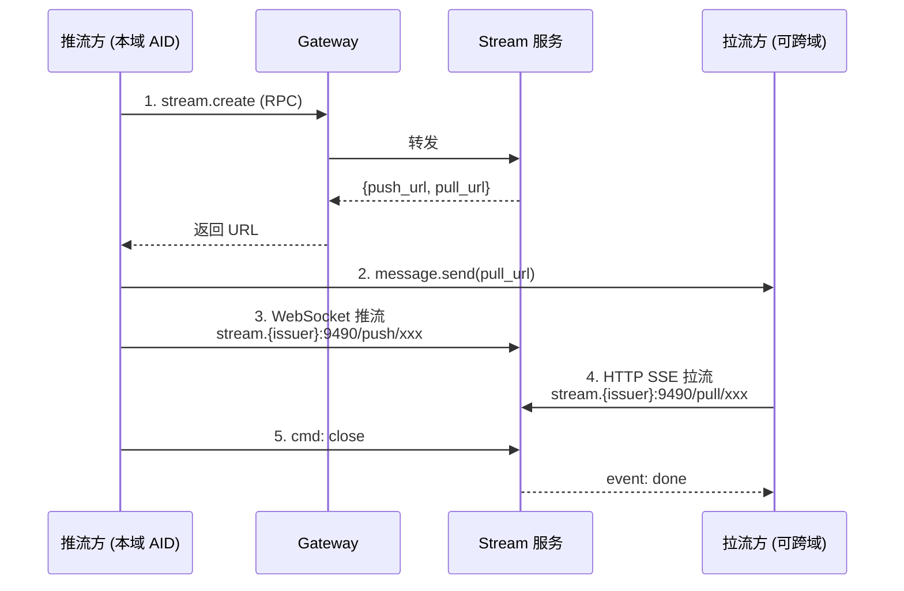
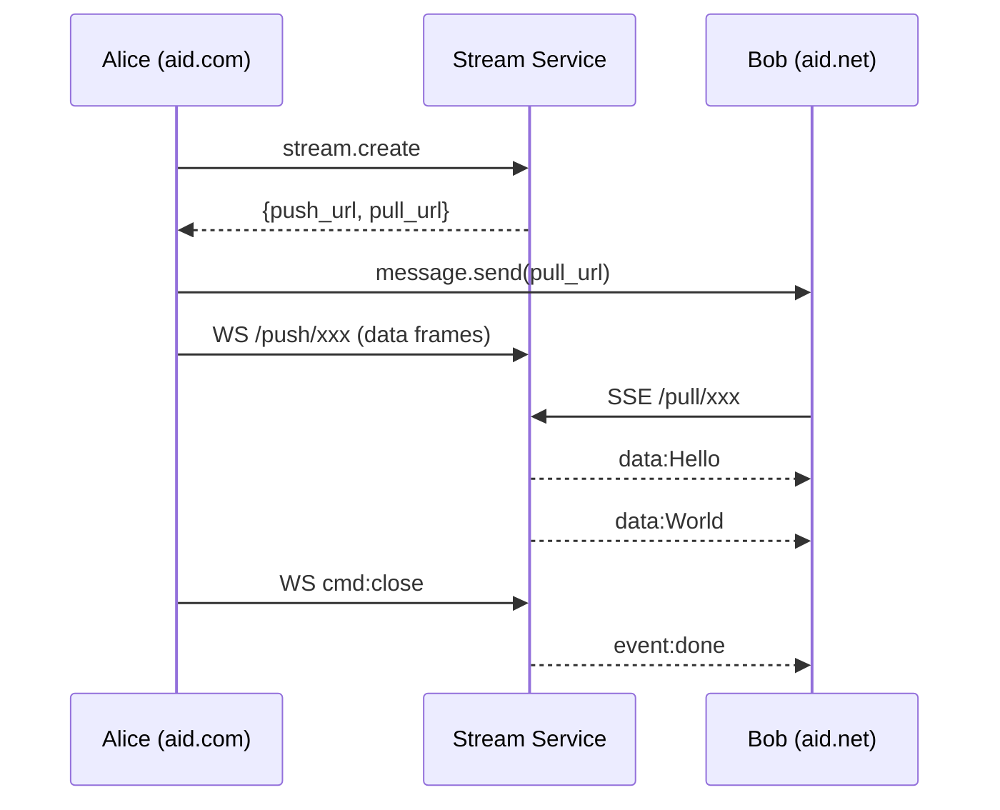
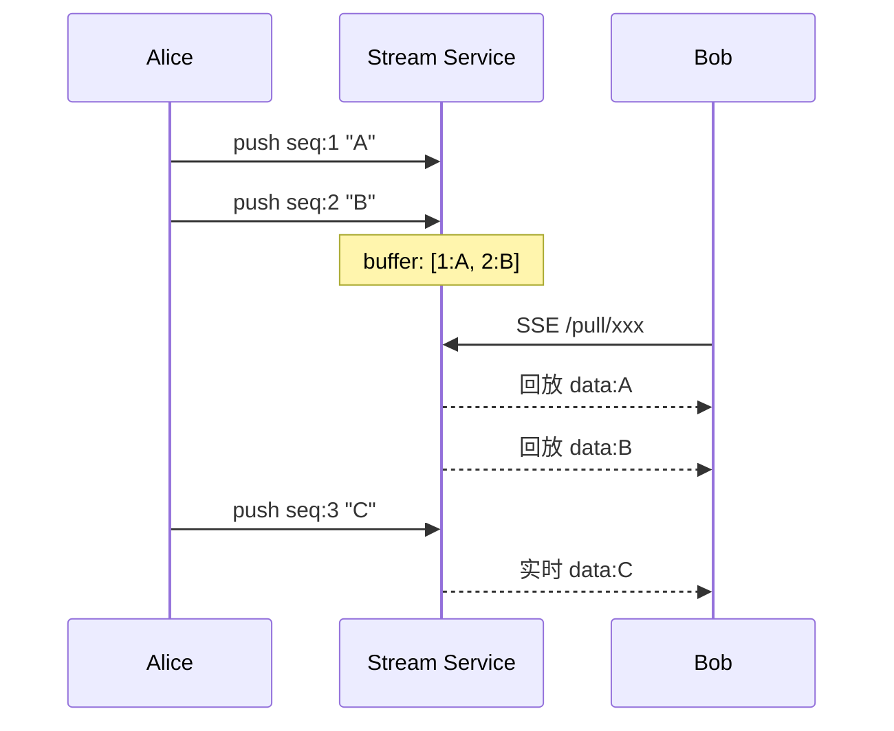

# 12. Stream 子协议

> **适用版本**：AUN 1.0 | **状态**：Draft

Stream 服务是 AUN 协议的应用层扩展，提供实时流式数据传输能力。典型场景包括 LLM 逐字输出、实时数据推送、JSON 对象流等。Stream 服务采用控制面与数据面分离架构：控制面通过 `stream.*` JSON-RPC 方法管理流的生命周期，数据面通过独立端口的 WebSocket（推流）和 HTTP SSE（拉流）传输数据。

---

## 12.1 设计原则

- **控制面与数据面分离**：`stream.*` RPC 方法管理流的创建、关闭和查询；实际数据通过独立的 WebSocket / HTTP SSE 端点传输
- **推流限本域、拉流可跨域**：推流方必须是本域 AID，通过 push_token 验证；拉流方可以是任何域的客户端，通过 pull_token 验证
- **URL 即凭证**：`stream.create` 返回的 push_url / pull_url 内含 token，持有 URL 即可操作流，便于通过 `message.send` 传递给接收方
- **无协商流程**：不需要 accept/reject，创建即可推流，适合 LLM 等单向输出场景
- **内存缓冲 + 实时广播**：推送的数据帧先写入内存缓冲区，同时广播到所有在线拉流端；后加入的拉流端先回放缓冲区再接收实时数据

---

## 12.2 架构与角色



- **Stream 服务**：独立模块，控制面通过 JSON-RPC 2.0 提供流管理方法，数据面监听独立端口（默认 9490）
- **推流方**：创建流的 AID，通过 WebSocket 连接 push_url 发送数据帧
- **拉流方**：持有 pull_url 的任意客户端，通过 HTTP SSE 接收数据

---

## 12.3 约束与限制

| 约束 | 默认值 | 说明 |
|------|--------|------|
| 最大并发流数 | 200 | 服务全局活跃流上限 |
| 单帧大小 | 无显式限制 | 受 WebSocket 帧上限约束（64 MB） |
| 流空闲超时 | 300 秒 | 无推送也无拉取时自动关闭 |
| 推流端离线超时 | 120 秒 | 推流 WebSocket 断开后等待重连 |
| SSE 心跳间隔 | 10 秒 | 无数据时发送 `: keep-alive` 注释 |
| 单流最大拉流端 | 10 | 同一流的并发拉流连接数 |
| push_token / pull_token | 32 字节 hex | 随机生成，流关闭即失效 |

---

## 12.4 数据模型

### StreamSession 对象

| 字段 | 类型 | 说明 |
|------|------|------|
| `stream_id` | string | 流唯一 ID（16 位 hex） |
| `creator_aid` | string | 创建者 AID |
| `content_type` | string | 内容类型（如 `text/plain`、`application/json-stream`） |
| `metadata` | object | 自定义元数据 |
| `status` | string | `"waiting"` / `"active"` / `"done"` |
| `is_online` | boolean | 推流端是否在线 |
| `seq` | integer | 当前最大序列号 |
| `frames_pushed` | integer | 已推送帧数 |
| `bytes_pushed` | integer | 已推送字节数 |
| `puller_count` | integer | 当前拉流端数量 |
| `age_seconds` | float | 流存活时间 |
| `idle_seconds` | float | 最近一次活动距今时间 |

### 流状态说明

| 状态 | 含义 |
|------|------|
| `waiting` | 已创建，推流端尚未连接 |
| `active` | 推流端在线，正在传输数据 |
| `done` | 流已关闭（推流方主动关闭或超时） |

---

## 12.5 控制面方法（JSON-RPC 2.0，通过 Gateway）

### `stream.create`

创建一条新的流，返回推流和拉流 URL。

**参数**：

| 参数 | 类型 | 必需 | 说明 |
|------|------|:----:|------|
| `content_type` | string | ❌ | 内容类型，默认 `"text/plain"` |
| `metadata` | object | ❌ | 自定义元数据 |
| `target_aid` | string | ❌ | 绑定拉流方 AID，设置后仅该 AID 可拉流 |

**返回**：

| 字段 | 类型 | 说明 |
|------|------|------|
| `stream_id` | string | 流 ID |
| `push_url` | string | 推流 WebSocket URL（含 push_token） |
| `pull_url` | string | 拉流 HTTP SSE URL（含 pull_token） |
| `pull_token` | string | 拉流凭证（便于单独传递） |

**示例**：

```json
// 请求
{"jsonrpc":"2.0","id":"1","method":"stream.create","params":{"content_type":"text/plain"}}

// 响应
{
  "jsonrpc":"2.0","id":"1",
  "result":{
    "stream_id":"4d5067f203cf42ba",
    "push_url":"wss://stream.aid.com:9490/push/4d5067f203cf42ba?token=ec80...",
    "pull_url":"https://stream.aid.com:9490/pull/4d5067f203cf42ba?token=c438...",
    "pull_token":"c438953be0ca887b..."
  }
}
```

---

### `stream.close`

关闭流。仅流的创建者可调用。关闭后所有拉流端收到 `event: done`。

**参数**：

| 参数 | 类型 | 必需 | 说明 |
|------|------|:----:|------|
| `stream_id` | string | ✅ | 流 ID |

**返回**：`{ "success": true }`

---

### `stream.get_info`

获取流的状态和统计信息。

**参数**：

| 参数 | 类型 | 必需 | 说明 |
|------|------|:----:|------|
| `stream_id` | string | ✅ | 流 ID |

**返回**：StreamSession 对象（见 12.4）。

---

### `stream.list_active`

列出当前 AID 创建的所有活跃流。

**参数**：无。

**返回**：`{ "streams": [StreamSession, ...] }`

---

## 12.6 数据平面（独立端口）

Stream 服务在独立端口（默认 9490）上监听，提供推流和拉流端点。

### 推流端点

```
GET /push/{stream_id}?token={push_token}  →  WebSocket 升级
```

**认证**：push_token 必须匹配 `stream.create` 时生成的值。

**WebSocket 帧格式**（客户端 → 服务端）：

```json
{"cmd": "data", "data": "chunk内容", "seq": 1}
{"cmd": "data", "data": "chunk内容", "seq": 2}
{"cmd": "close"}
```

| 字段 | 类型 | 必需 | 说明 |
|------|------|:----:|------|
| `cmd` | string | ✅ | `"data"` 或 `"close"` |
| `data` | string | `data`时✅ | 数据内容，无大小限制（受 WS 帧 64MB 上限约束） |
| `seq` | integer | ❌ | 序列号，不提供则服务端自增 |

**关闭流**：发送 `{"cmd": "close"}` 后服务端关闭流并通知所有拉流端。

**断线重连**：推流 WebSocket 断开后，服务端保留流状态最多 120 秒（`pusher_offline_timeout`），期间重连可继续推送。

---

### 拉流端点

```
GET /pull/{stream_id}?token={pull_token}&aid={puller_aid}  →  HTTP SSE
```

**认证**：
- `token`：必须匹配 pull_token
- `aid`：可选，若 `stream.create` 时指定了 `target_aid`，则 aid 必须匹配

**SSE 响应格式**：

```
HTTP/1.1 200 OK
Content-Type: text/event-stream
Cache-Control: no-cache
Connection: keep-alive

data: Hello 

data: World

event: done
data: {}
```

- `data:` 字段是推流方发送的原始数据内容
- 流结束时发送 `event: done`
- 无数据期间每 10 秒发送 `: keep-alive` 注释（SSE 标准心跳）

**断线续拉**：不支持自动续传。客户端重连需从头拉取或通过应用层机制（如在 JSON 数据中嵌入 seq）实现增量拉取。

**Late Joiner**：拉流端连接时，先回放缓冲区中的历史数据，再切换为实时接收。

---

### 健康检查

```
GET /health  →  JSON
```

返回：`{"status": "healthy", "active_streams": 0, "uptime_seconds": 123}`

---

## 12.7 典型流程

### 流程一：LLM 流式输出



### 流程二：Late Joiner 回放



---

## 12.8 安全考量

1. **推流域限制**：push_token 在 `stream.create` 时生成，仅返回给创建者（本域已认证 AID），外域无法获取
2. **拉流 token 鉴权**：pull_token 为 32 字节随机 hex，持有即可拉流，可通过 `target_aid` 进一步限制
3. **URL 传递安全**：pull_url 应通过 E2EE 加密的 `message.send` 传递，避免 token 泄露
4. **传输加密**：数据平面支持 TLS（wss:// / https://），生产环境必须启用
5. **资源保护**：单流最大 10 个拉流端，全局最大 200 条活跃流，空闲自动关闭

---

## 12.9 错误码

| code | message | 说明 |
|------|---------|------|
| -33401 | Stream not found | stream_id 无效或流已被清理 |
| -33402 | Stream already closed | 流已关闭 |
| -33403 | Stream limit reached | 活跃流数超过上限 |
| -33404 | Stream push token invalid | 推流端 token 不匹配 |
| -33405 | Stream pull token invalid | 拉流端 token 不匹配 |
| -33406 | Stream puller limit reached | 拉流端数量已达上限 |
| -33407 | Stream permission denied | 非创建者执行受限操作 |
| HTTP 403 | — | push/pull token 无效，或 target_aid 不匹配 |
| HTTP 404 | — | 数据平面找不到流 |
| HTTP 410 | — | 流已关闭 |
| HTTP 429 | — | 拉流端数量已达上限 |
