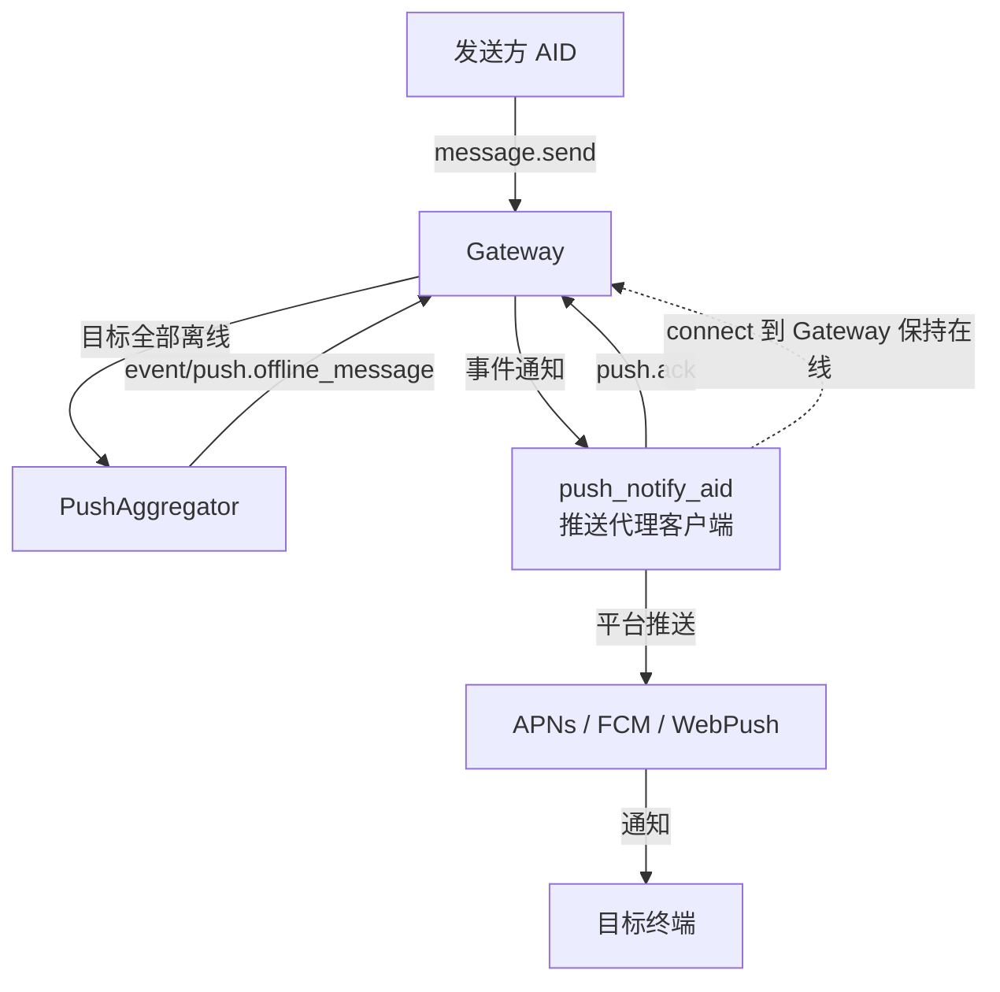
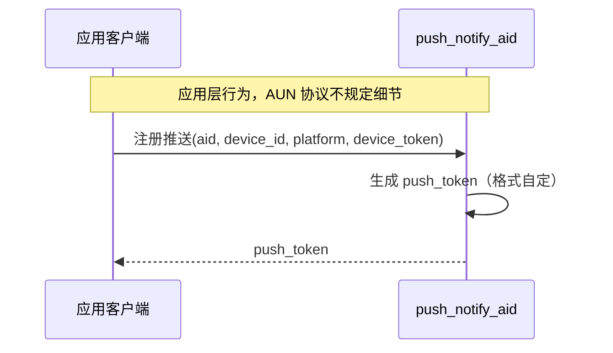
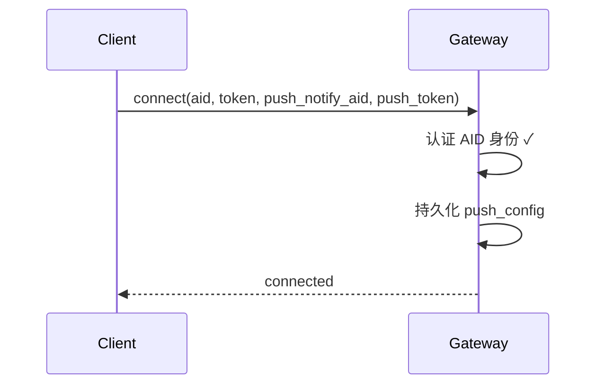
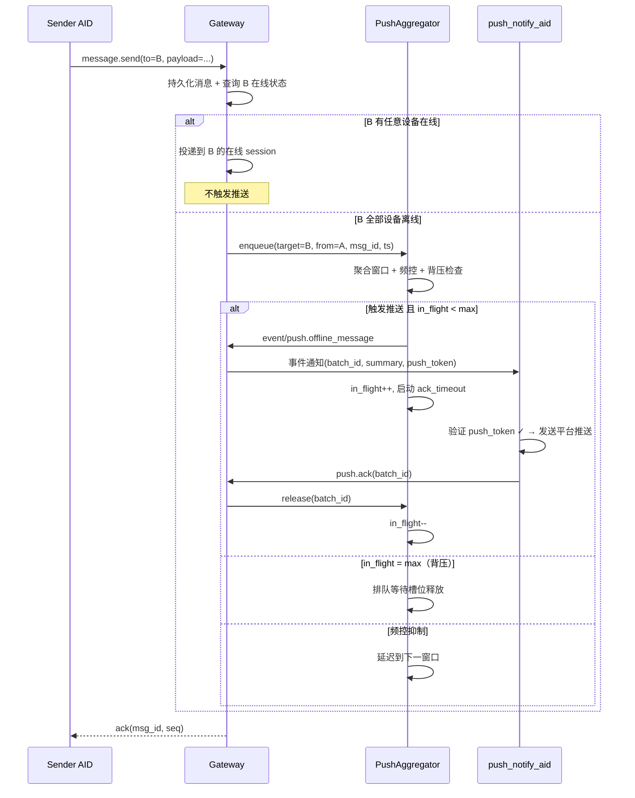
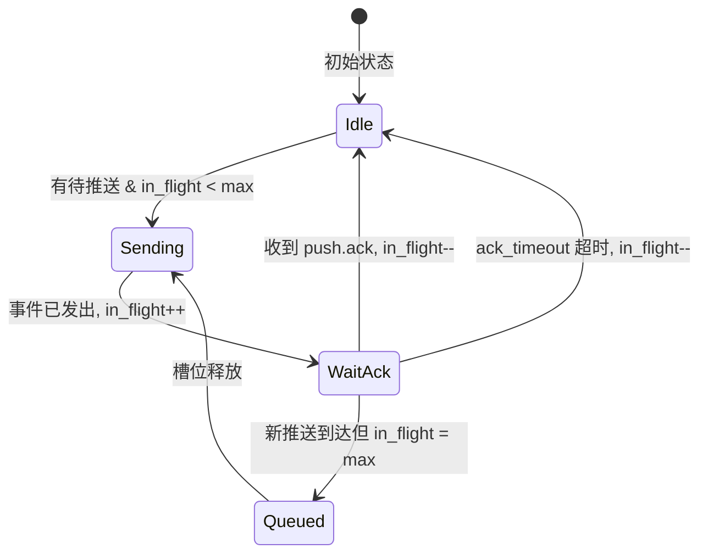
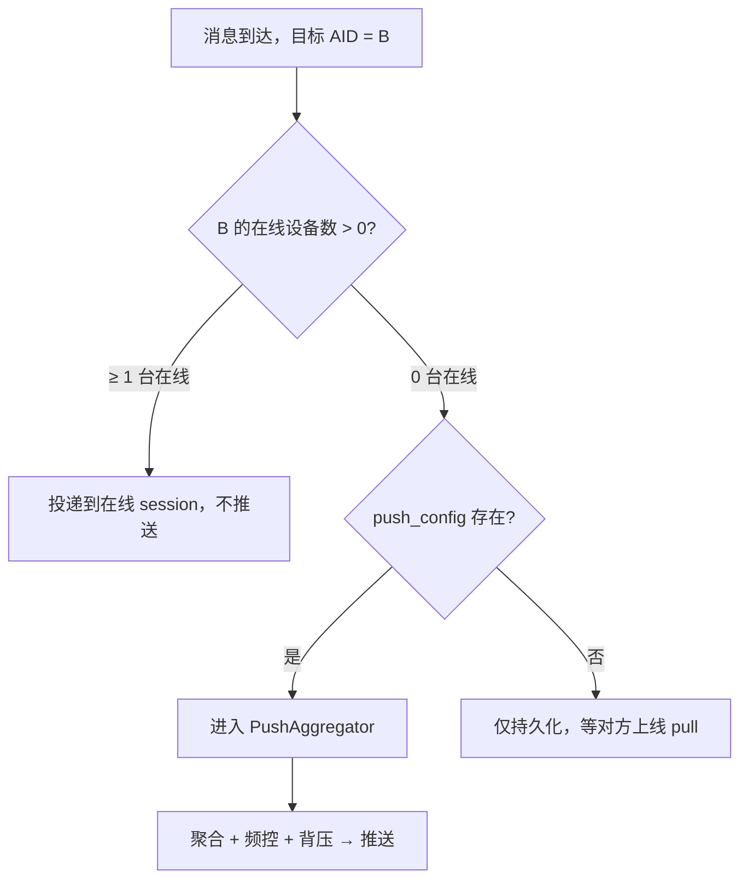
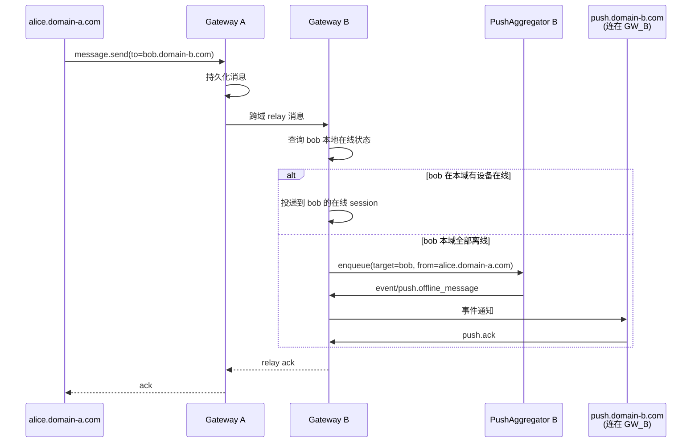
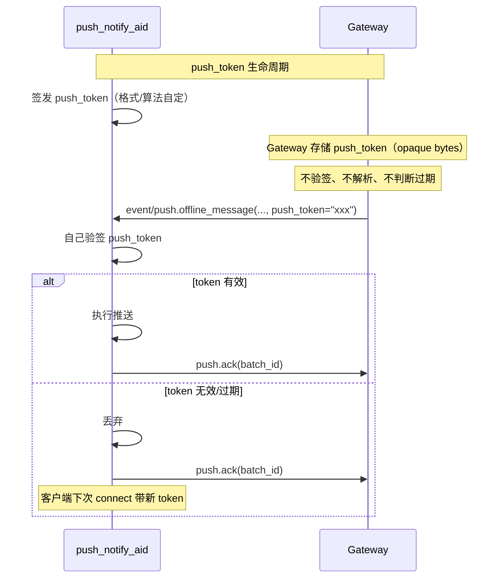

# 15 - 离线推送通知协议 (Push Notification)

## 1. 概述

当目标 AID 的所有设备均离线时，AUN Gateway 通过事件通知将推送摘要发送给 `push_notify_aid`（推送代理 AID），由其完成最终的平台推送（APNs / FCM / WebPush 等）。

**设计原则：**

- push_notify_aid 是普通客户端 AID，不是 AUN 内部服务
- 通过事件通知（非 P2P 消息）下发推送摘要——轻量、实时、不持久化
- push_token 对 Gateway 完全不透明（opaque），push_notify_aid 自签自验
- 任意一台设备在线即不触发推送
- 推送内容仅含元数据，不含消息正文（E2EE 安全保证）
- 背压控制：串行确认，Gateway 等 push_notify_aid ack 后再发下一批
- 跨域推送：推送由**目标 AID 所属域**的 Gateway 触发，发送方域不参与

---

## 2. 架构



**关键约束：**

- push_notify_aid 作为普通客户端 AID 连接到 Gateway，通过事件通知接收推送摘要
- push_notify_aid 离线时事件丢弃——推送是 best-effort，消息可靠性由 message.pull 保证
- 目标 AID 有任意一台设备在线时，不触发推送

---

## 3. 推送注册流程

### 3.1 应用层：客户端向推送代理注册



push_token 的格式、签名算法、有效期完全由 push_notify_aid 自行决定。AUN 协议不做任何约束。

### 3.2 协议层：connect 时携带推送配置



---

## 4. 离线推送时序



---

## 5. 背压与 in-flight 控制



### 参数

| 参数 | 默认值 | 说明 |
|------|--------|------|
| max_in_flight | 1 | 同一 push_notify_aid 未确认批次上限（串行） |
| ack_timeout | 30s | 超时未 ack 自动释放槽位 |
| batch_size | 50 | 每批最多聚合多少个 target_aid 的通知 |

### 行为规则

- in_flight < max → 发送事件，in_flight++
- in_flight = max → 排队等待
- 收到 `push.ack(batch_id)` → in_flight--，触发队列中下一批
- 超时 → in_flight--，**不重试**（推送是 best-effort，过时推送是噪音）
- push_notify_aid 离线 → 事件丢弃，in_flight 不增加

---

## 6. 在线判断规则



**边界情况：**

- 目标 AID 上线瞬间：清空该 AID 的聚合桶，取消待发推送
- 最后一台设备断连：不立即触发推送，只有后续新消息到达时发现全离线才走推送路径

---

## 7. 跨域推送

**核心原则：推送由目标 AID 所属域的 Gateway 触发。**

发送方域不感知目标域的 push_config 和白名单，也不需要任何跨域配置同步。



**规则：**

| 关注点 | 行为 |
|--------|------|
| 推送配置存储 | 仅存于目标 AID 所属域，不跨域同步 |
| 白名单管理 | 各域独立配置 `allowed_notify_aids`，互不影响 |
| push_notify_aid 必须连接位置 | 目标 AID 所属域的 Gateway |
| push_notify_aid 跨域时 | 不支持。push_notify_aid 必须与其服务的 AID 同域 |
| summary.senders 中的跨域 AID | 保留完整 AID（含域名），如 `alice.domain-a.com` |

**约束：** push_notify_aid 必须与其服务的目标 AID 处于同一域。如果应用希望在多个域提供推送服务，需要在每个域部署独立的 push_notify_aid 并分别加入白名单。

---

## 8. 聚合与频控

### 8.1 PushAggregator 数据结构

每个离线目标 AID 一个聚合桶：

```
bucket[target_aid] = {
    push_notify_aid: "push.myapp.com",
    push_token: "eyJhb...",
    pending: [{from, msg_id, ts}, ...],
    first_enqueue_ts: timestamp,
    last_push_ts: timestamp,
}
```

### 8.2 去重规则

同一 target_aid 在频控窗口内只产生一次推送通知。具体行为：

- 首条消息触发推送后，该 target_aid 进入频控冷却期（默认 60s）
- 冷却期内新消息只更新聚合桶的 summary（unread_count++、senders 去重追加），不产生新推送
- 冷却期结束时，若桶内有新增未推送内容，合并为一条推送发出

效果：无论短时间内收到多少条消息，target_aid 最多每 60s 收到一次推送通知，且 summary 是累积聚合的。

### 8.3 触发规则

| 规则 | 说明 | 默认值 |
|------|------|--------|
| 首条即推 | 桶为空且不在冷却期时，第一条消息立即触发 | 开启 |
| 窗口聚合 | 首条之后的消息等待窗口合并 | 5 秒 |
| 数量上限 | 桶内积累 N 条立即触发（不等窗口） | 20 条 |

### 8.4 频控规则

| 维度 | 限制 | 说明 |
|------|------|------|
| 同一 target_aid | 60 秒内最多 1 次推送 | 避免终端刷屏 |
| 同一 push_notify_aid | 1000 次/分钟 | 保护推送代理服务 |
| 全局 | 5000 次/分钟 | 系统保护 |

频控被触发时消息不丢弃，等窗口过后下一次聚合时一并推送。

---

## 9. 协议字段

### 9.1 connect 扩展字段

```json
{
  "method": "auth.login",
  "params": {
    "aid": "bob.example.com",
    "challenge_response": "...",
    "push_notify_aid": "push.myapp.com",
    "push_token": "eyJhbGciOiJIUzI1NiJ9..."
  }
}
```

- `push_notify_aid` 和 `push_token` 均为可选字段
- 两者必须同时提供或同时不提供
- 不提供 = 不需要离线推送
- 每次 connect 覆盖写（最新连接为准）

### 9.2 事件通知格式

Gateway 向 push_notify_aid 下发的事件通知：

```json
{
  "method": "event/push.offline_message",
  "params": {
    "batch_id": "uuid-xxx",
    "items": [
      {
        "target_aid": "bob.example.com",
        "push_token": "eyJhbGciOiJIUzI1NiJ9...",
        "summary": {
          "unread_count": 3,
          "senders": ["alice.example.com", "charlie.example.com"],
          "latest_ts": 1716100005,
          "group_ids": ["group-uuid-1"]
        }
      }
    ]
  }
}
```

**安全约束：** 不包含消息正文。E2EE 场景下 Gateway 无法解密，推送代理只需知道"有 N 条未读来自谁"即可构造推送文案。

### 9.3 push.ack RPC

push_notify_aid 处理完一批推送后回调确认：

```json
{
  "method": "push.ack",
  "params": {
    "batch_id": "uuid-xxx"
  }
}
```

Gateway 收到后释放 in-flight 槽位，触发下一批。

### 9.4 push.update_config RPC（可选）

允许客户端在不重连的情况下更新推送配置：

```json
{
  "method": "push.update_config",
  "params": {
    "push_notify_aid": "push.myapp.com",
    "push_token": "new-token..."
  }
}
```

---

## 10. push_token 鉴权模型

### 10.1 push_notify_aid 白名单

Gateway 配置允许的 push_notify_aid 白名单，只有白名单内的 AID 才能被设置为推送代理：

- 客户端 connect 时携带的 `push_notify_aid` 不在白名单内 → 忽略该字段，不报错，不存储
- 白名单为空 → 禁用推送功能
- 白名单配置在 Gateway 启动配置中，运行时不可动态修改

```json
{
  "push": {
    "allowed_notify_aids": [
      "push.myapp.com",
      "push.partner.com"
    ]
  }
}
```

### 10.2 token 透传模型



**职责划分：**

| 角色 | 职责 |
|------|------|
| push_notify_aid | 签发 token、验证 token、决定格式和有效期、处理后 ack |
| Gateway | 存储 token、透传 token、不解析不验证、管理 in-flight |
| Client | 向 push_notify_aid 申请 token、connect 时携带 |

---

## 11. 持久化

### push_config 表

```sql
CREATE TABLE push_config (
    aid VARCHAR(255) PRIMARY KEY,
    push_notify_aid VARCHAR(255) NOT NULL,
    push_token TEXT NOT NULL,
    updated_at DATETIME NOT NULL DEFAULT CURRENT_TIMESTAMP
);
```

- 随 connect 写入/更新（UPSERT）
- 可加内存缓存（TTL 5 分钟）

---

## 12. 边界情况

| 场景 | 处理 |
|------|------|
| push_notify_aid 离线 | 事件丢弃，不持久化。推送是 best-effort，消息可靠性由 pull 保证 |
| 目标 AID 未配置推送 | 不推送，消息正常持久化等对方上线 pull |
| 目标 AID 上线瞬间 | 清空聚合桶，取消待发推送 |
| E2EE 消息 | 推送内容只含元数据（发送者、数量），不含密文 |
| 群组消息 | 群内每个离线成员独立聚合，summary 含 group_ids |
| push_token 过期 | push_notify_aid 丢弃但仍 ack，客户端下次 connect 刷新 token |
| ack 超时 | 释放槽位，不重试。后续新消息触发新批次时会包含累积通知 |
| 同一 AID 多设备不同推送配置 | 以最后一次 connect 为准（单条记录覆盖） |
| 跨域消息推送 | 由目标 AID 所属域的 Gateway 触发，发送方域不参与 |
| push_notify_aid 跨域 | 不支持，必须与目标 AID 同域 |


