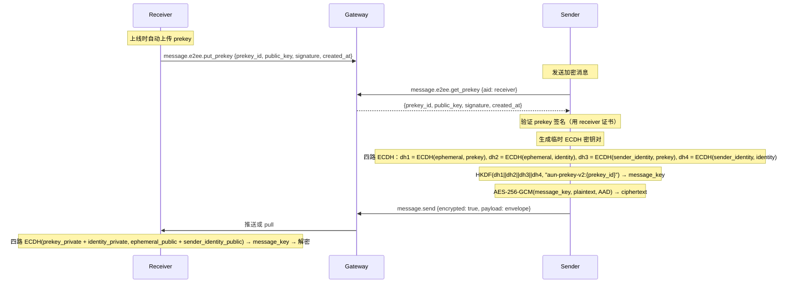
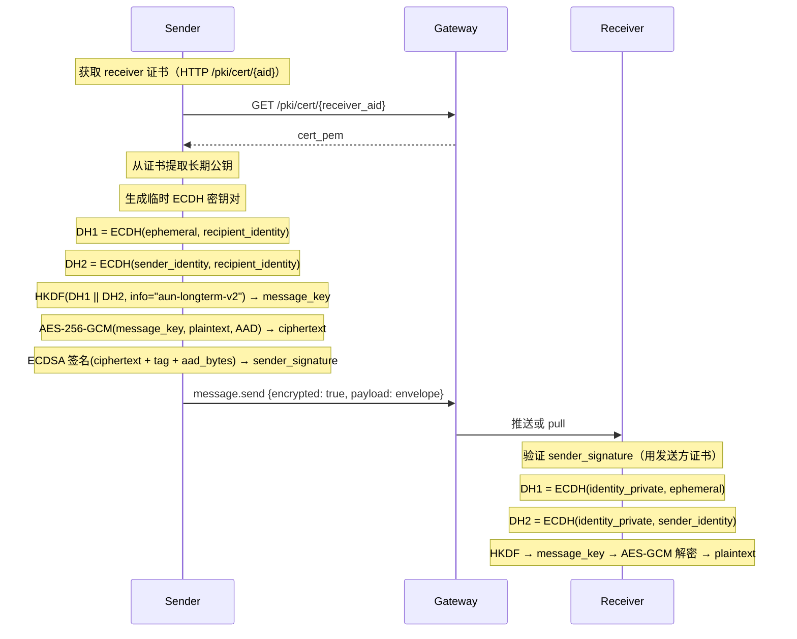

# 附录 L：E2EE 实现指南（非规范性）

> **本文档为非规范性内容**：提供端到端加密的实现建议、交互流程、代码示例和安全考虑，不是协议强制要求。
> 规范性定义见 [08-AUN-E2EE.md](08-AUN-E2EE.md)。

## L.0 加密模式概述

AUN-E2EE 支持两种加密模式，SDK 实现应同时支持。

### L.0.1 模式 1：prekey_ecdh_v2（优先）

**机制**：发送方获取接收方预上传的 prekey，生成临时 ECDH 密钥对，通过四路 ECDH（ephemeral × prekey + ephemeral × identity + sender_identity × prekey + sender_identity × identity）+ HKDF 派生消息密钥。

**优势**：
- 前向安全（临时密钥用完即丢）
- 一消息一密钥（每条消息独立临时密钥对）
- 四路 ECDH 绑定双方身份，防止 prekey 替换攻击和中间人攻击
- 支持接收方离线
- 无需在线协商

**限制**：
- 需要接收方预先上传 prekey

### L.0.2 模式 2：long_term_key（降级）

**机制**：使用接收方长期公钥（从 X.509 证书获取），生成临时 ECDH 密钥对，通过双 DH（ephemeral × recipient_identity + sender_identity × recipient_identity）+ HKDF 派生消息密钥。

**优势**：
- 支持接收方离线且无 prekey 时发送加密消息
- 一消息一密钥（每条消息独立临时密钥对）
- 双 DH 绑定双方身份

**限制**：
- 不提供严格意义上的前向安全性
- 长期私钥泄露会导致历史消息被解密
- Python SDK 默认 `require_forward_secrecy=true`，会拒绝此模式；需显式配置才允许降级

### L.0.3 模式选择策略

SDK 按以下优先级自动选择：

1. **优先**：prekey_ecdh_v2（服务端有接收方 prekey）
2. **降级**：long_term_key（无 prekey 时）

---

## L.1 交互流程

### L.1.1 prekey_ecdh_v2 时序图



### L.1.2 long_term_key 时序图



---

## L.2 SDK 实现参考（Python）

### L.2.1 通过 AUNClient 发送加密消息（推荐）

```python
# SDK 自动获取证书和 prekey，自动选择加密模式
await client.call("message.send", {
    "to": "bob.agentid.pub",
    "payload": {"text": "秘密消息"},
    "encrypt": True,
})
```

### L.2.2 通过 AUNClient 接收加密消息

```python
# 推送自动解密
client.on("message.received", lambda msg: print(msg["payload"]))

# Pull 自动解密
result = await client.call("message.pull", {"after_seq": 0, "limit": 50})
for msg in result["messages"]:
    if msg.get("encrypted"):
        print(f"加密模式: {msg['e2ee']['encryption_mode']}")
        print(f"内容: {msg['payload']}")
```

### L.2.3 裸 WebSocket 开发者

```python
from aun_core.e2ee import E2EEManager
from aun_core.keystore.file import FileKeyStore

# 1. 实例化（纯工具类，无 I/O 依赖）
e2ee = E2EEManager(
    identity_fn=lambda: my_identity,
    keystore=FileKeyStore("~/.aun/myapp"),
)

# 2. 获取对方证书和 prekey（调用方自行实现 I/O）
peer_cert_pem = await fetch_cert("bob.agentid.pub")
prekey = await rpc_call("message.e2ee.get_prekey", {"aid": "bob.agentid.pub"})
prekey_data = prekey.get("prekey") if prekey.get("found") else None

# 3. 加密（prekey 传入后自动缓存，后续可传 None 复用缓存）
envelope, ok = e2ee.encrypt_message(
    to_aid="bob.agentid.pub",
    payload={"text": "秘密消息"},
    peer_cert_pem=peer_cert_pem,
    prekey=prekey_data,
)

# 4. 通过 WebSocket 发送
aad = envelope["aad"]
await rpc_call("message.send", {
    "to": "bob.agentid.pub",
    "payload": envelope,
    "type": "e2ee.encrypted",
    "encrypted": True,
    "message_id": aad["message_id"],
    "timestamp": aad["timestamp"],
    "persist": True,
})

# 5. 解密（内置本地防重放）
decrypted = e2ee.decrypt_message(raw_message)
```

---

## L.3 Prekey 管理

### L.3.1 生成与上传

```python
# E2EEManager 只生成材料，不做 RPC
material = e2ee.generate_prekey()
# 返回: {"prekey_id": "uuid", "public_key": "base64", "signature": "base64"}

# 调用方自行上传
await rpc_call("message.e2ee.put_prekey", material)
```

AUNClient 连接时自动上传 prekey，并定时轮换（默认每小时）。

### L.3.2 Prekey 签名

签名格式：`ECDSA(identity_private_key, "prekey_id|public_key_b64|created_at")`

接收方用身份私钥签名 prekey（绑定时间戳防止旧 prekey 重放），发送方用接收方证书验证签名，防止服务端替换假 prekey。

### L.3.3 旧 Prekey 私钥保留

旧 prekey 私钥本地保留 7 天（`PREKEY_RETENTION_SECONDS`），确保轮换后在途消息仍可解密。

### L.3.4 Prekey 缓存

E2EEManager 内置 prekey 缓存（默认 TTL 1 小时）：

```python
e2ee.cache_prekey("bob.agentid.pub", prekey_dict)    # 手动缓存
cached = e2ee.get_cached_prekey("bob.agentid.pub")    # 查询缓存
e2ee.invalidate_prekey_cache("bob.agentid.pub")        # 使缓存失效
```

`encrypt_message` / `encrypt_outbound` 传入 prekey 时自动缓存，传入 None 时自动查缓存。

---

## L.4 防重放

### L.4.1 本地防重放（E2EEManager 内置）

- 维护 `seen_messages` 集合，以 `{sender_aid}:{message_id}` 为 key
- 同一 key 的消息返回 `None`（拒绝解密）
- 集合上限 5000 条，超出时淘汰最旧的 20%

### L.4.2 服务端防重放（AUNClient 可选增强）

通过 `server_replay_guard` 配置项开启（默认关闭）：

```python
client = AUNClient({"server_replay_guard": True})
```

调用 `message.e2ee.record_replay_guard` RPC，跨进程/跨重启持久化防重放。

---

## L.5 防篡改

AES-GCM + AAD 验证保证消息完整性。AAD 包含以下字段，按 Canonical JSON for AAD 规范序列化（递归键排序 + 紧凑格式 + UTF-8 直接输出，详见 P2P E2EE §8.3）：

| 字段 | 说明 |
|------|------|
| `from` | 发送方 AID |
| `to` | 接收方 AID |
| `message_id` | 消息唯一标识 |
| `timestamp` | 发送时间戳（ms） |
| `encryption_mode` | 加密模式 |
| `suite` | 算法套件 |
| `ephemeral_public_key` | 发送方临时公钥 |
| `recipient_cert_fingerprint` | 接收方证书公钥指纹 |

任何字段被篡改都会导致 AEAD tag 校验失败，解密报错。

---

## L.6 安全建议

1. **不静默降级**：加密失败时不应静默发送明文，应由上层应用显式决定
2. **临时密钥**：每条消息使用独立的临时 ECDH 密钥对，用完即丢
3. **私钥保护**：Prekey 私钥通过 FileKeyStore 加密存储（Windows DPAPI / SecretStore）
4. **证书验证**：发送方必须验证 prekey 签名，防止中间人替换
5. **Prekey 轮换**：建议每小时轮换一次 prekey，旧私钥保留 7 天

---

## L.7 兼容性说明

- 发送端 **MUST** 使用 `prekey_ecdh_v2`（四路 ECDH）模式发送新消息
