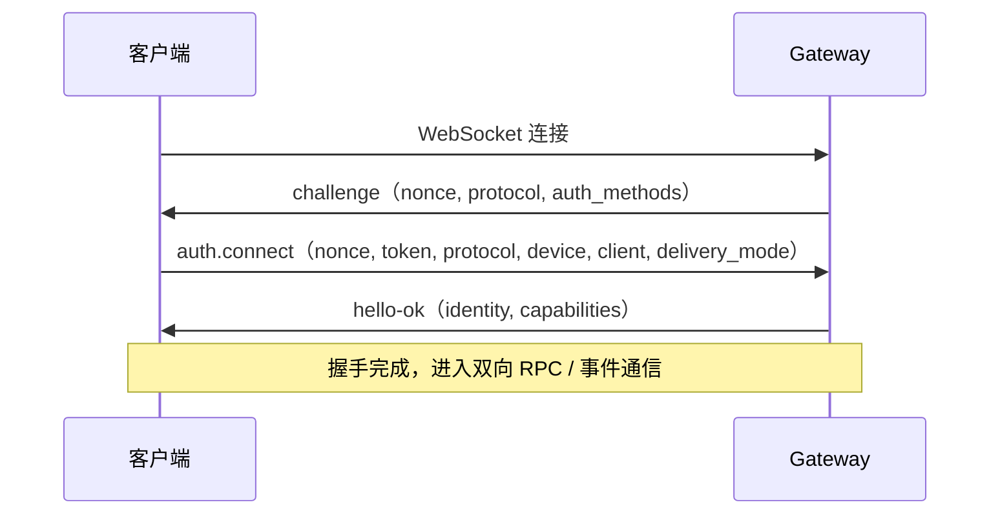

# AUN SDK Python - WebSocket 协议

本章介绍 AUN Gateway 的 WebSocket 协议细节。掌握这些内容后，可以用任何语言（或直接用 `websockets` 库）实现客户端，不依赖 SDK 的高层 API。

---

## 连接握手



### (1) challenge — 服务器发送挑战

连接建立后，Gateway 立即发送：

```json
{
    "jsonrpc": "2.0",
    "method": "challenge",
    "params": {
        "nonce": "随机字符串（防重放）",
        "server": "kite-gateway",
        "protocol": { "min": "1.0", "max": "1.0" },
        "auth_methods": ["pairing_code", "kite_token", "aid"],
        "capabilities": { ... },
        "server_time": 1774878000.123
    }
}
```

### (2) auth.connect — 客户端认证

客户端回复，携带 token 和从 challenge 中获取的 nonce：

```json
{
    "jsonrpc": "2.0",
    "id": "rpc-xxxx",
    "method": "auth.connect",
    "params": {
        "nonce": "从 challenge 中获取",
        "auth": {
            "method": "kite_token",
            "token": "authenticate() 返回的 access_token"
        },
        "protocol": { "min": "1.0", "max": "1.0" },
        "device": { "id": "来自 ~/.aun/.device_id", "type": "desktop" },
        "client": { "slot_id": "slot-a" },
        "delivery_mode": {
            "mode": "queue",
            "routing": "sender_affinity",
            "affinity_ttl_ms": 300000
        }
    }
}
```

说明：

- `device.id` 是设备级稳定标识，Python SDK 默认从 `~/.aun/.device_id` 读取。
- `client.slot_id` 由应用层显式传入，用于区分同设备上的多个实例槽位。
- `delivery_mode` 决定该 AID 当前连接的投递语义；同一 AID 的所有在线连接必须保持一致。

### (3) hello-ok — 握手完成

认证成功后 Gateway 返回：

```json
{
    "jsonrpc": "2.0",
    "id": "rpc-xxxx",
    "result": {
        "status": "ok",
        "protocol": "1.0",
        "server_time": 1774878000.456,
        "authenticated": true,
        "identity": {
            "module_id": "gateway-client-xxxx",
            "role": "agent",
            "aid": "alice1234.agentid.pub"
        },
        "capabilities": { ... }
    }
}
```

---

## 消息格式

所有消息遵循 JSON-RPC 2.0 格式，通过以下规则区分类型：

| 类型 | 特征 | 示例 |
|------|------|------|
| **RPC 请求** | 有 `id` + `method` | `{"id": "rpc-1", "method": "message.send", "params": {...}}` |
| **RPC 响应** | 有 `id` + `result`/`error` | `{"id": "rpc-1", "result": {...}}` |
| **事件通知** | 无 `id`，`method` 以 `event/` 开头 | `{"method": "event/message.received", "params": {...}}` |

### RPC 请求

```json
{
    "jsonrpc": "2.0",
    "id": "rpc-随机hex",
    "method": "message.send",
    "params": {
        "to": "bob.agentid.pub",
        "type": "text",
        "payload": {"text": "Hello"}
    }
}
```

### RPC 响应

成功：
```json
{
    "jsonrpc": "2.0",
    "id": "rpc-随机hex",
    "result": {
        "message_id": "uuid",
        "seq": 1,
        "status": "delivered"
    }
}
```

错误：
```json
{
    "jsonrpc": "2.0",
    "id": "rpc-随机hex",
    "error": {
        "code": -32603,
        "message": "错误描述"
    }
}
```

### 事件通知

服务器推送，无 `id` 字段：

```json
{
    "jsonrpc": "2.0",
    "method": "event/message.received",
    "params": {
        "from": "alice.agentid.pub",
        "to": "bob.agentid.pub",
        "type": "text",
        "payload": {"text": "Hello"}
    }
}
```

---

## 完整示例

以下示例仅用 SDK 完成认证，其余所有操作（连接、握手、RPC 调用、事件接收）全部通过裸 WebSocket 实现：

```python
import asyncio, json, random, secrets
from datetime import datetime
from aun_core import AUNClient
from aun_core.errors import AUNError, ConnectionError, AuthError
import websockets

DOMAIN = "agentid.pub"
ALICE = f"alice{random.randint(1000,9999)}.{DOMAIN}"
BOB = f"bob{random.randint(1000,9999)}.{DOMAIN}"


def ts():
    return datetime.now().strftime("%H:%M:%S.%f")[:-3]


def make_rpc(method: str, params: dict) -> tuple[str, str]:
    """构造 JSON-RPC 2.0 请求，返回 (rpc_id, json_str)"""
    rpc_id = f"rpc-{secrets.token_hex(4)}"
    msg = {"jsonrpc": "2.0", "id": rpc_id, "method": method, "params": params}
    return rpc_id, json.dumps(msg)


async def authenticate(aid: str) -> dict:
    """用 SDK 完成 AID 创建和认证，返回 auth 结果（含 access_token + gateway）"""
    try:
        client = AUNClient({"aun_path": f"~/.aun/{aid}"})
        if not client._auth.load_identity_or_none(aid):
            await client.auth.create_aid({"aid": aid})
        auth = await client.auth.authenticate({"aid": aid})
        return auth
    except AuthError as e:
        print(f"[错误] 认证失败 ({aid}): {e}")
        raise
    except ConnectionError as e:
        print(f"[错误] 网络连接失败: {e}")
        raise


async def ws_connect(gateway_url: str, token: str) -> websockets.ClientConnection:
    """建立 WebSocket 连接并完成握手（challenge → auth.connect → hello-ok）"""
    ws = await websockets.connect(gateway_url, ping_interval=None)

    # 1. 接收 challenge
    raw = await ws.recv()
    challenge = json.loads(raw)
    nonce = challenge["params"]["nonce"]

    # 2. 发送 auth.connect
    rpc_id, req = make_rpc("auth.connect", {
        "nonce": nonce,
        "auth": {"method": "kite_token", "token": token},
        "protocol": {"min": "1.0", "max": "1.0"},
    })
    await ws.send(req)

    # 3. 接收 hello-ok
    raw = await ws.recv()
    hello = json.loads(raw)
    if "error" in hello:
        raise Exception(f"握手失败: {hello['error']}")
    identity = hello["result"]["identity"]
    print(f"[{ts()}] 已连接: {identity.get('aid')} (module={identity.get('module_id')})")
    return ws


async def ws_call(ws, method: str, params: dict, timeout: float = 10.0) -> dict:
    """发送 RPC 调用并等待响应（从消息流中匹配 id）"""
    rpc_id, req = make_rpc(method, params)
    await ws.send(req)
    deadline = asyncio.get_event_loop().time() + timeout
    while True:
        remaining = deadline - asyncio.get_event_loop().time()
        if remaining <= 0:
            raise TimeoutError(f"RPC 超时: {method}")
        raw = await asyncio.wait_for(ws.recv(), timeout=remaining)
        msg = json.loads(raw)
        if msg.get("id") == rpc_id:
            if "error" in msg:
                raise Exception(f"RPC 错误: {msg['error']}")
            return msg.get("result", {})


async def ws_wait_event(ws, event_name: str, timeout: float = 5.0) -> dict | None:
    """等待指定事件（method 字段以 event/ 为前缀）"""
    target = f"event/{event_name}"
    deadline = asyncio.get_event_loop().time() + timeout
    while True:
        remaining = deadline - asyncio.get_event_loop().time()
        if remaining <= 0:
            return None
        try:
            raw = await asyncio.wait_for(ws.recv(), timeout=remaining)
        except asyncio.TimeoutError:
            return None
        msg = json.loads(raw)
        if msg.get("method") == target:
            return msg.get("params", {})


async def main():
    alice_ws = None
    bob_ws = None

    try:
        # ── 第一阶段：用 SDK 认证，拿到 token + gateway ──
        alice_auth = await authenticate(ALICE)
        bob_auth = await authenticate(BOB)

        # ── 第二阶段：裸 WebSocket 连接（使用 auth 返回的 gateway）──
        try:
            alice_ws = await ws_connect(alice_auth["gateway"], alice_auth["access_token"])
            bob_ws = await ws_connect(bob_auth["gateway"], bob_auth["access_token"])
        except Exception as e:
            print(f"[错误] WebSocket 连接失败: {e}")
            raise

        # ── 第三阶段：Alice 发消息 ──
        try:
            result = await ws_call(alice_ws, "message.send", {
                "to": BOB,
                "type": "text",
                "payload": {"text": "Hello from Alice (raw WebSocket)!"},
            })
            print(f"[{ts()}] [Alice 发送] status={result.get('status')}, seq={result.get('seq')}")
        except TimeoutError as e:
            print(f"[错误] RPC 调用超时: {e}")
        except Exception as e:
            print(f"[错误] 发送消息失败: {e}")

        # ── 第四阶段：Bob 等待事件推送 ──
        event = await ws_wait_event(bob_ws, "message.received", timeout=5.0)
        if event:
            print(f"[{ts()}] [Bob 收到事件] {event.get('payload')}")
        else:
            # 事件未推送，主动拉取
            try:
                pull = await ws_call(bob_ws, "message.pull", {"after_seq": 0, "limit": 10})
                msgs = pull.get("messages", [])
                if msgs:
                    print(f"[{ts()}] [Bob 拉取] 收到 {len(msgs)} 条消息:")
                    for m in msgs:
                        print(f"  {m.get('payload')}")
                else:
                    print(f"[{ts()}] [Bob] 未收到消息")
            except Exception as e:
                print(f"[错误] 拉取消息失败: {e}")

        print(f"[{ts()}] 完成")

    except KeyboardInterrupt:
        print(f"\n[{ts()}] 用户中断")
    except Exception as e:
        print(f"[{ts()}] 程序异常: {e}")
        raise
    finally:
        # ── 关闭 WebSocket ──
        if alice_ws:
            try:
                await alice_ws.close()
            except Exception:
                pass
        if bob_ws:
            try:
                await bob_ws.close()
            except Exception:
                pass


asyncio.run(main())
```
