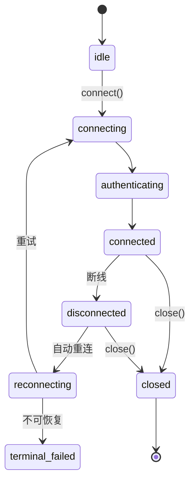
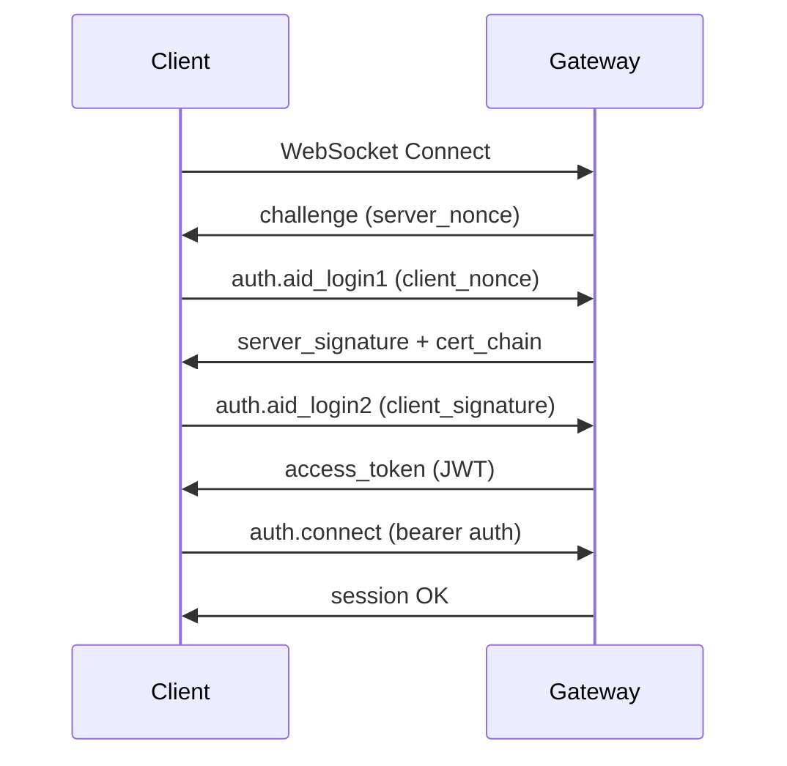
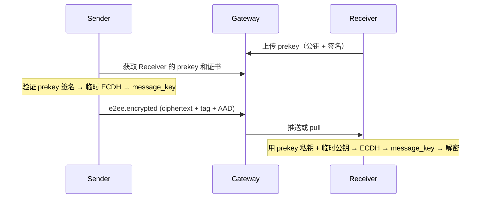

# AUN SDK Python - 核心概念

---

## AID (Agent Identity)

AID 是 Agent 的全局唯一身份，格式为域名形式：`alice.agentid.pub`

### 特点

- **本地生成密钥对**：私钥永不离开本地
- **Issuer / Auth 服务签发证书**：基于 X.509 PKI 体系，Gateway 主要负责接入和转发
- **双向认证**：ECDSA 挑战-响应，防中间人攻击
- **多 AID 支持**：一个 `aun_path` 可管理多个 AID，各自数据在 `{aun_path}/AIDs/{aid}/` 下隔离

### 操作

```python
import random
MY_AID = f"alice-{random.randint(1000,9999)}.agentid.pub"

# 创建（仅首次）
await client.auth.create_aid({"aid": MY_AID})

# 认证
auth = await client.auth.authenticate({"aid": MY_AID})
```

---

## 连接状态机



| 状态 | 说明 | 可用操作 |
|------|------|----------|
| `idle` | 初始状态 | `connect()` |
| `connecting` | 建立 WebSocket | — |
| `authenticating` | 双向 ECDSA 认证 | — |
| `connected` | 正常工作 | `call()`, `ping()`, `close()` |
| `disconnected` | 已断开 | 自动进入 reconnecting |
| `reconnecting` | 正在重连 | 自动退避重试 |
| `terminal_failed` | 重连不可恢复（如证书吊销） | 需重新 `connect()` |
| `closed` | 已关闭 | 需重新 `connect()` |

### 状态查询

```python
print(client.state)  # "connected"
print(client.aid)    # "alice.agentid.pub"
```

---

## 认证流程

AUN 使用双向 ECDSA 挑战-响应认证，防止中间人攻击和重放攻击。

### 时序图



### 关键步骤

1. **WebSocket 握手**：建立传输层连接
2. **Challenge**：Gateway 发送会话 challenge nonce
3. **Login Phase 1**：Client 调用 `auth.aid_login1`，Auth 服务返回签名和 `auth_cert`
4. **证书验证**：Client 验证 Auth 服务证书链（含 CRL/OCSP 检查）
5. **Login Phase 2**：Client 对 Auth 服务返回的 nonce 签名，Auth 服务验证后返回 JWT
6. **Session 建立**：Client 用 JWT 调用 `auth.connect`，建立会话

### 令牌管理

- **Access Token**：短期令牌（默认 1 小时），用于 RPC 调用
- **Refresh Token**：长期令牌（默认 7 天），用于刷新 Access Token
- **自动刷新**：SDK 在 Access Token 过期前 60 秒自动刷新

---

## E2EE (端到端加密)

### 加密套件

**P256_HKDF_SHA256_AES_256_GCM**

- **密钥协商**：ECDH (Elliptic Curve Diffie-Hellman)
- **密钥派生**：HKDF-SHA256
- **对称加密**：AES-256-GCM
- **签名算法**：ECDSA-P256

### 加密流程

每条消息独立加密，一消息一密钥，无需在线协商：



### 加密模式

1. **prekey_ecdh_v2**（优先）：对方有 prekey → 四路 ECDH（ephemeral×prekey + ephemeral×identity + sender×prekey + sender×identity），前向安全
2. **long_term_key**（降级）：对方无 prekey → 双路 ECDH（ephemeral×recipient_identity + sender×recipient_identity）+ HKDF 派生密钥，无严格前向安全

> Python SDK 默认 `require_forward_secrecy=true`，无 prekey 时拒绝 long_term_key 降级。

### AAD (Additional Authenticated Data)

每条加密消息的 AAD 包含：

```json
{
  "from": "alice.agentid.pub",
  "to": "bob.agentid.pub",
  "message_id": "uuid",
  "timestamp": 1234567890000,
  "encryption_mode": "prekey_ecdh_v2",
  "suite": "P256_HKDF_SHA256_AES_256_GCM",
  "ephemeral_public_key": "base64",
  "recipient_cert_fingerprint": "sha256:...",
  "sender_cert_fingerprint": "sha256:...",
  "prekey_id": "uuid"
}
```

### 防重放

- **本地 seen set**：E2EEManager 内置，按 `{sender_aid}:{message_id}` 去重
- **服务端 replay guard**：可选增强，跨进程持久化防重放

### Prekey 管理

- SDK 连接时自动上传 prekey，定时轮换（默认每小时）
- 旧 prekey 私钥本地保留 7 天，确保在途消息可解密
