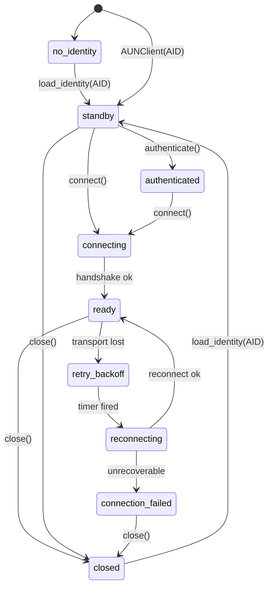
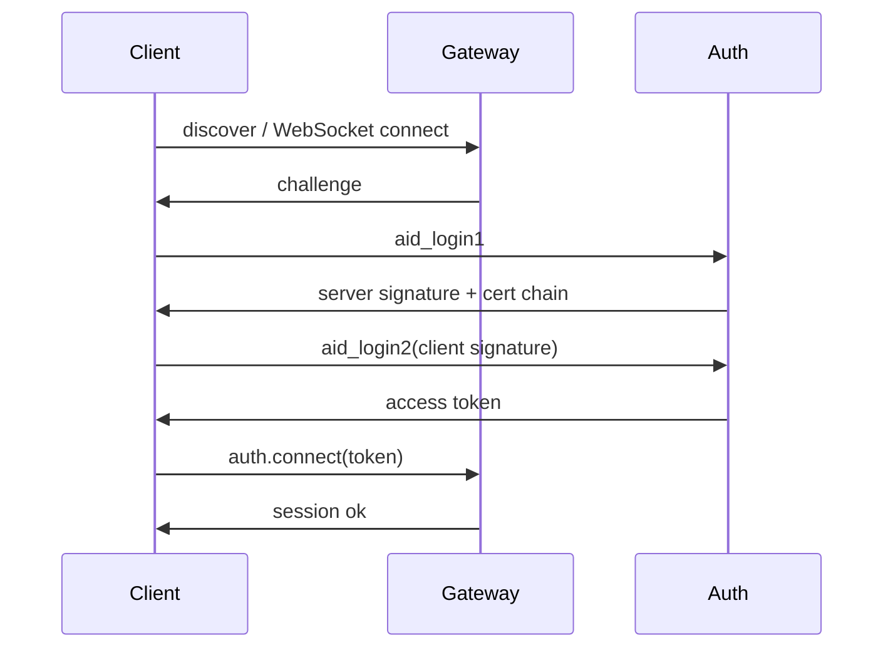

# AUN SDK - 核心概念

---

## AID

AID 是 Agent 的全局唯一身份，格式为域名形式，例如 `alice.agentid.pub`。

特点：

- 私钥在本地生成并保存，不上传到服务端。
- 证书由 Issuer / Auth 服务基于 X.509 PKI 签发。
- AID 加载后是不可变值对象，续签或换钥通过 `AIDStore` 完成，调用方重新 `load()` 获取新对象。
- 一个 `aun_path` 可管理多个 AID，各自数据隔离在 `{aun_path}/AIDs/{aid}/`。

常用操作：

```python
store = AIDStore(aun_path="~/.aun/myapp", encryption_seed="")

registered = await store.register("alice.agentid.pub")
loaded = store.load("alice.agentid.pub")
me = loaded["data"]["aid"]

assert me.is_cert_valid()
assert me.is_private_key_valid()
```

---

## 三主体职责

| 主体 | 说明 | 是否持有连接 |
|------|------|--------------|
| `AIDStore` | keystore 管理器，负责注册、加载、列举、解析和证书运维 | 否 |
| `AID` | 身份值对象，负责签名、验签、agent.md 签验 | 否 |
| `AUNClient` | 会话对象，负责认证、连接、重连、事件和 RPC | 是 |

`AUNClient` 不再通过配置字典持有某个字符串 AID；它只接收已加载并校验过私钥的 AID 对象。

---

## device_id 与 slot_id

`device_id` 是设备级稳定标识，默认写在 `{aun_path}/.device_id`，用于 token、实例状态、V2 设备密钥和消息游标的一级隔离。它是单段安全 token，只允许字母、数字、`.`、`_`、`-`。

`slot_id` 是同一设备下的连接/消费槽位，允许用 `/`、`:`、空格表达共享隔离键。隔离键取第一个分隔符前的部分：

| slot_id | slotIsolationKey |
|---------|------------------|
| `evolclaw daemon` | `evolclaw` |
| `evolclaw cli` | `evolclaw` |
| `evolclaw/netcheck` | `evolclaw` |
| `evolclaw-daemon` | `evolclaw-daemon` |

SDK 在 `message.pull` / `message.ack` 中自动注入当前 `device_id` / `slot_id`，并按隔离键校验显式传入的 `slot_id`。因此共享消费槽位时应使用 `/`、`:` 或空格作为分隔符。

---

## 连接状态机



| 状态 | 说明 | 典型可用操作 |
|------|------|--------------|
| `no_identity` | 尚未加载身份 | `load_identity()` |
| `standby` | 已加载身份，尚未认证或连接 | `authenticate()`, `connect()` |
| `authenticated` | 已取得 token，尚未建立会话 | `connect()` |
| `connecting` | 正在建立 WebSocket 和握手 | `close()` |
| `ready` | 会话可用 | `call()`, `disconnect()`, `close()` |
| `retry_backoff` | 断线后等待退避重连 | `close()` |
| `reconnecting` | 正在自动重连 | `close()` |
| `connection_failed` | 重连失败或不可恢复 | `connect()`, `close()` |
| `closed` | 已关闭 | `load_identity()` 后复用 |

状态查询：

```python
print(client.state)          # ConnectionState.READY
print(client.current_aid)    # AID 对象
print(client.aid)            # "alice.agentid.pub"
print(client.can_send)       # True / False
```

---

## 认证流程

AUN 使用 ECDSA 挑战-响应证明 AID 私钥所有权，SDK 在 `connect()` 内部自动完成认证；需要只获取 token 时可显式调用 `authenticate()`。



关键点：

- 私钥不离开本地。
- SDK 校验证书链、服务端签名和 token 有效期。
- access token / refresh token 会写入本地 keystore 并在连接期间自动刷新。

---

## E2EE

默认加密套件为 `P256_HKDF_SHA256_AES_256_GCM`：

- 密钥协商：ECDH
- 密钥派生：HKDF-SHA256
- 对称加密：AES-256-GCM
- 身份签名：ECDSA-P256

默认行为：

- `message.send` 和 `group.send` 默认加密发送；显式 `encrypt=False` 才发送明文普通消息。
- `group.thought.put` 强制加密。
- SDK 自动上传 prekey、拉取对端 prekey、解密收到的 P2P / Group V2 消息。
- `protected_headers` 会参与消息签名保护，并只注入消息类和 thought 类 RPC。

---

## RPC 与事件

业务能力统一通过 `client.call(method, params)` 调用：

```python
await client.call("message.send", {
    "to": "bob.agentid.pub",
    "payload": {"type": "text", "text": "hello"},
})
```

事件通过 `client.on(event, handler)` 订阅：

```python
client.on("state_change", lambda e: print(e["state"]))
client.on("message.received", lambda e: print(e["payload"]))
```

RPC 方法参数见 `09-message-rpc-manual.md`、`09-group-rpc-manual.md`、`09-storage-rpc-manual.md` 等专项手册。


