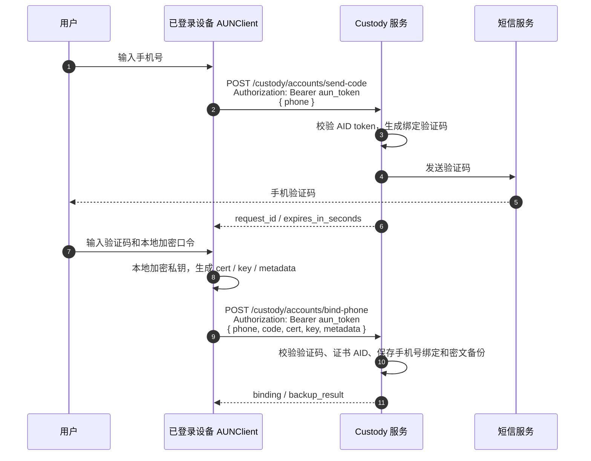
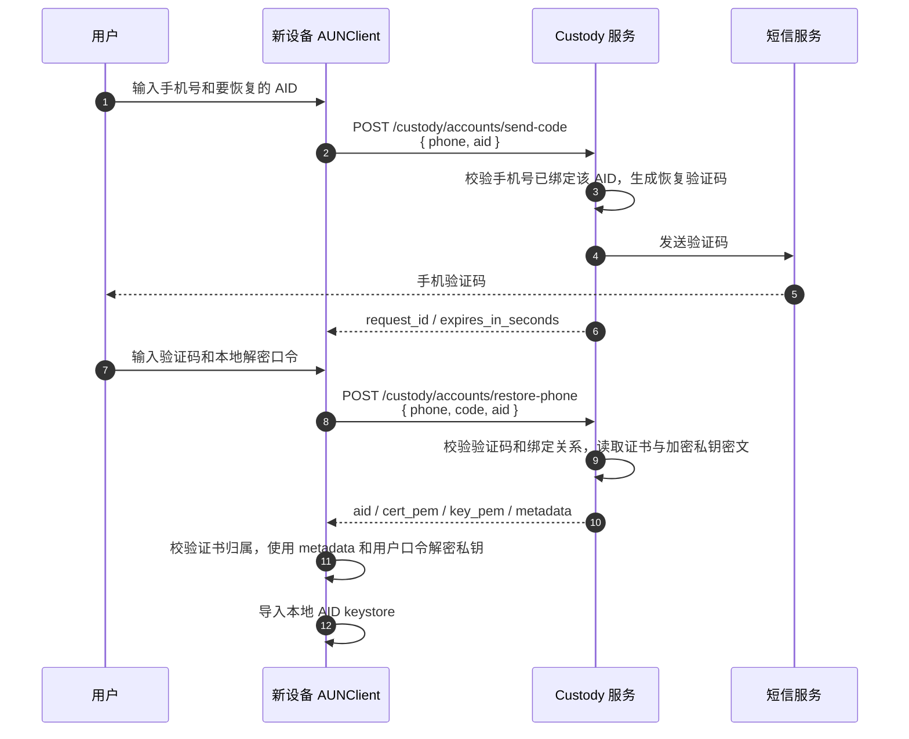
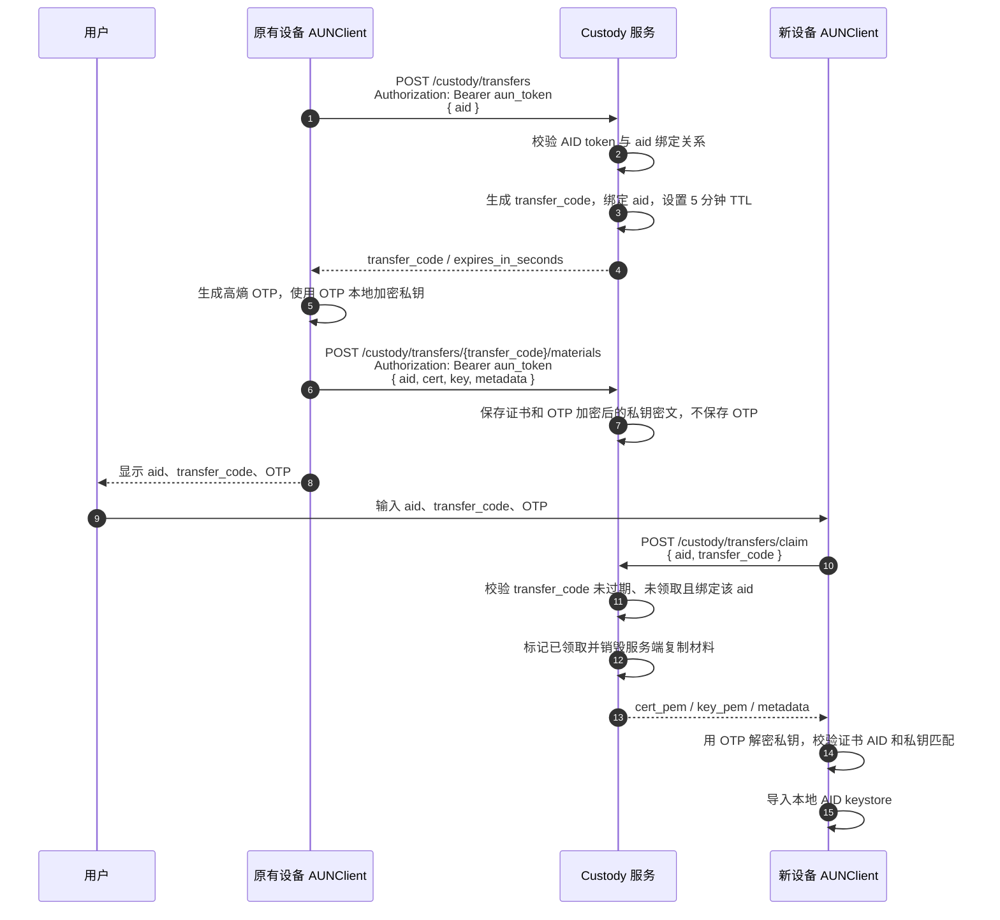

# AID 托管（Custody）HTTP API 手册

AID Custody 是 AUN AP 可选提供的 AID 备份、恢复与跨设备复制服务，不属于 AUN 核心协议强制能力。当前阶段定义两条主流程：通过手机号和验证码上传、下载 AID 证书以及客户端加密后的私钥文件；以及旧设备通过 AID token 授权，新设备凭一次性复制码领取 OTP 加密材料的跨设备复制流程。

用户也可以部署自己的 AID 托管服务。只要服务地址发现格式和本手册定义的 HTTP 接口、请求响应语义保持一致，SDK 即可通过 `client.custody.set_url(...)` 或 well-known 自动发现接入自部署服务。

核心原则：

- 私钥必须由客户端先加密，再上传到 custody 服务。
- custody 服务只保存证书 PEM、加密私钥密文和加密参数元数据，不知道用户密码，也不解密私钥。
- 恢复时，服务端只返回证书和加密私钥密文；客户端使用自己的密码和 `metadata` 解密。

服务地址建议：

```text
https://aid_custody.{issuer_domain}:{port}
```

SDK 使用约束：

- `custody_url` 不作为 `AUNClient` 构造配置参数传入。
- 客户端通过 `client.custody.set_url(...)` 显式配置托管服务地址。
- 也可以通过 `client.custody.discover_url(aid=...)` 从 `https://{aid}/.well-known/aun-custody` 自动发现官方托管服务地址；发现结果会缓存在当前 `client.custody` 实例中。

## 手机号验证码备份/恢复时序

备份/绑定手机号：



恢复/下载：



## AID token 授权的跨设备复制方案

除手机号验证码备份/恢复外，还可以在旧设备仍可用时，基于 AUN 的 AID 认证 token 实现一次性跨设备复制。该方案的核心目标是让 custody 只做短期密文中转：

- 旧设备用已通过 AUN 认证的 `aun_token` 证明自己控制该 AID。
- custody 生成短期复制码，并把复制码绑定到 AID、旧设备认证上下文和过期时间。
- 旧设备本地生成一次性 OTP，用 OTP 加密私钥后上传密文。
- 新设备只向 custody 提交 `aid + transfer_code` 领取密文，不提交 OTP。
- 新设备在本地用 OTP 解密私钥并导入 keystore。
- custody 在领取成功或过期后销毁复制材料。

端点索引：

| 端点 | 方法 | 认证 | 说明 |
|------|------|------|------|
| `/custody/transfers` | POST | `aun_token` | 旧设备发起复制，返回短期复制码 |
| `/custody/transfers/{transfer_code}/materials` | POST | `aun_token` | 旧设备上传证书和 OTP 加密后的私钥密文 |
| `/custody/transfers/claim` | POST | 无 | 新设备凭 `aid + transfer_code` 领取密文材料，不传 OTP |

SDK 方法：

| 语言 | 发起复制 | 上传复制材料 | 领取复制材料 |
|------|----------|--------------|--------------|
| Python | `client.custody.create_device_copy(...)` | `client.custody.upload_device_copy_materials(...)` | `client.custody.claim_device_copy(...)` |
| JS/TS | `client.custody.createDeviceCopy(...)` | `client.custody.uploadDeviceCopyMaterials(...)` | `client.custody.claimDeviceCopy(...)` |
| Go | `client.Custody.CreateDeviceCopy(...)` | `client.Custody.UploadDeviceCopyMaterials(...)` | `client.Custody.ClaimDeviceCopy(...)` |

复制请求：

```http
POST /custody/transfers
Content-Type: application/json
Authorization: Bearer <aun_token>
```

```json
{
  "aid": "alice.agentid.pub"
}
```

响应：

```json
{
  "transfer_code": "A7K9Q2ZB",
  "expires_in_seconds": 300,
  "expires_at": 1713000300000
}
```

上传复制材料：

```http
POST /custody/transfers/A7K9Q2ZB/materials
Content-Type: application/json
Authorization: Bearer <aun_token>
```

```json
{
  "aid": "alice.agentid.pub",
  "cert": "-----BEGIN CERTIFICATE-----\n...\n-----END CERTIFICATE-----",
  "key": "<OTP 加密后的私钥密文>",
  "metadata": {
    "envelope_version": 1,
    "purpose": "device-transfer",
    "encryption": "aes-256-gcm",
    "kdf": "argon2id",
    "kdf_params": {"m": 65536, "t": 3, "p": 4},
    "salt": "...",
    "nonce": "...",
    "otp_hint": "一次性 OTP 只显示给用户，不上传服务端"
  }
}
```

领取复制材料：

```http
POST /custody/transfers/claim
Content-Type: application/json
```

```json
{
  "aid": "alice.agentid.pub",
  "transfer_code": "A7K9Q2ZB"
}
```

响应：

```json
{
  "aid": "alice.agentid.pub",
  "cert_pem": "-----BEGIN CERTIFICATE-----\n...\n-----END CERTIFICATE-----",
  "key_pem": "<OTP 加密后的私钥密文>",
  "key_encrypted": true,
  "metadata": {
    "envelope_version": 1,
    "purpose": "device-transfer",
    "encryption": "aes-256-gcm",
    "kdf": "argon2id",
    "kdf_params": {"m": 65536, "t": 3, "p": 4},
    "salt": "...",
    "nonce": "..."
  }
}
```

跨设备复制时序：



安全等级判断：

- 该方案通常强于单纯手机号验证码恢复，因为发起方必须持有已认证的旧设备 AID token。
- 该方案的端到端保密性取决于 OTP 强度和客户端加密实现；custody 不拿到 OTP 时，无法解密私钥。
- 8 位字母数字复制码约 48 bit 熵，只适合作为短期在线领取码；必须配合 5 分钟 TTL、按 AID/IP 限速、错误次数上限和一次性领取。
- OTP 不能是 6 位短信码级别的低熵密码。建议由旧设备生成至少 128 bit 随机值，再用 Base32、分组字符或助记词展示；并使用 Argon2id 等 KDF 派生加密密钥。

主要风险与约束：

- 如果旧设备已被攻破，攻击者可发起复制并拿到 OTP；该方案无法抵抗旧设备完全失陷。
- 如果用户把 `transfer_code + OTP` 同时泄露给攻击者，攻击者可领取并解密私钥。
- 如果只泄露 `transfer_code`，攻击者可能抢先领取密文并造成拒绝服务；因此领取应一次性、限速，并写审计日志。
- custody 数据库或日志泄露时，攻击者可拿到短期密文；若 OTP 熵不足，会产生离线爆破风险。
- 所有请求必须走 HTTPS，客户端必须校验证书，避免转移码被中间人抢用。
- custody 不得把 OTP、明文私钥、解密后的私钥、完整转移密文写入日志。
- 新设备导入前必须校验证书归属、证书链、返回的 `aid`、以及解密后的私钥与证书公钥是否匹配。
- 如果产品语义要求“复制后让旧设备失效”，完成后还需要触发密钥轮换、旧证书吊销或旧设备注销流程；否则旧设备继续可用。

CT 日志记录：

- `aid.backup`：备份证书和客户端加密私钥时记录。
- `aid.restore` / `aid.restore_by_phone`：通过会话或手机号验证码恢复时记录。
- `device_copy.create`：旧设备创建复制会话时记录，不包含复制码。
- `device_copy.materials_uploaded`：旧设备上传 OTP 加密材料时记录，不包含 OTP 和密文正文。
- `device_copy.claim`：新设备领取复制材料时记录，不包含 OTP 和密文正文。

## 端点索引

| 端点 | 方法 | 认证 | 说明 |
|------|------|------|------|
| `/custody/accounts/send-code` | POST | 绑定场景需要 `aun_token`；恢复场景不需要 | 发送手机验证码 |
| `/custody/accounts/bind-phone` | POST | `aun_token` | 绑定手机号并上传 AID 证书、加密私钥 |
| `/custody/accounts/restore-phone` | POST | 无 | 手机号 + 验证码 + AID 下载证书和加密私钥 |
| `/custody/transfers` | POST | `aun_token` | 旧设备发起一次性跨设备复制 |
| `/custody/transfers/{transfer_code}/materials` | POST | `aun_token` | 旧设备上传 OTP 加密后的证书和私钥密文 |
| `/custody/transfers/claim` | POST | 无 | 新设备领取复制材料，不传 OTP |

## send-code

发送手机号验证码。该端点兼容两种场景：

- 绑定/上传场景：携带 `Authorization: Bearer <aun_token>`，请求体不传 `aid`。
- 恢复/下载场景：不携带 token，请求体传 `aid`，服务端校验手机号已绑定该 AID。

请求：

```http
POST /custody/accounts/send-code
Content-Type: application/json
Authorization: Bearer <aun_token>
```

绑定/上传场景：

```json
{
  "phone": "+8613800138000"
}
```

恢复/下载场景：

```json
{
  "phone": "+8613800138000",
  "aid": "alice.agentid.pub"
}
```

参数：

| 参数 | 类型 | 必填 | 说明 |
|------|------|------|------|
| `phone` | string | 是 | E.164 格式手机号 |
| `aid` | string | 否 | 恢复/下载场景填写。填写后不需要 token |

响应：

```json
{
  "request_id": "bind-phone-a1b2c3d4e5f6",
  "phone": "+8613800138000",
  "provider": "mock",
  "expires_in_seconds": 300,
  "purpose": "bind-phone",
  "debug_code": "123456"
}
```

说明：

- `debug_code` 只应在开发环境返回；生产环境应为空。
- 同一手机号和 IP 会受发送频率限制。

## bind-phone

验证手机验证码，绑定手机号到当前 AID，并上传 AID 证书和客户端加密后的私钥密文。

请求：

```http
POST /custody/accounts/bind-phone
Content-Type: application/json
Authorization: Bearer <aun_token>
```

```json
{
  "phone": "+8613800138000",
  "code": "123456",
  "cert": "-----BEGIN CERTIFICATE-----\n...\n-----END CERTIFICATE-----",
  "key": "<客户端加密后的私钥密文>",
  "metadata": {
    "encryption": "aes-256-gcm",
    "kdf": "argon2id",
    "kdf_params": {"m": 65536, "t": 3, "p": 4},
    "device": "iPhone 15",
    "note": "主密钥备份"
  }
}
```

参数：

| 参数 | 类型 | 必填 | 说明 |
|------|------|------|------|
| `phone` | string | 是 | E.164 格式手机号 |
| `code` | string | 是 | 6 位数字验证码 |
| `cert` | string | 是 | AID 证书 PEM |
| `key` | string | 是 | 客户端加密后的私钥密文 |
| `metadata` | object | 否 | 加密算法、KDF 参数、设备信息等，服务端原样保存 |

响应：

```json
{
  "binding": {
    "provider": "phone",
    "external_subject": "+8613800138000",
    "aid": "alice.agentid.pub",
    "status": "active",
    "created_at": 1713000000000,
    "updated_at": 1713000000000
  },
  "backup_result": {
    "aid": "alice.agentid.pub",
    "status": "active",
    "source": "backup",
    "cert_sn": "1a2b3c4d",
    "curve": "P-256",
    "key_encrypted": true,
    "metadata": {"encryption": "aes-256-gcm"}
  }
}
```

校验要求：

- `aun_token` 必须能证明当前调用者就是要绑定的 AID。
- `cert` 中的 CN 必须是该 AID。
- `key` 必须是密文；服务端不应要求、也不应保存用户密码。

## restore-phone

凭手机号、验证码和 AID 下载已备份的证书和加密私钥。该接口不要求 AID 登录，因为恢复场景下用户可能已经丢失私钥。

请求：

```http
POST /custody/accounts/restore-phone
Content-Type: application/json
```

```json
{
  "phone": "+8613800138000",
  "code": "123456",
  "aid": "alice.agentid.pub"
}
```

参数：

| 参数 | 类型 | 必填 | 说明 |
|------|------|------|------|
| `phone` | string | 是 | E.164 格式手机号 |
| `code` | string | 是 | 6 位数字验证码 |
| `aid` | string | 是 | 要恢复的 AID |

响应：

```json
{
  "aid": "alice.agentid.pub",
  "cert_pem": "-----BEGIN CERTIFICATE-----\n...\n-----END CERTIFICATE-----",
  "key_pem": "<客户端加密后的私钥密文>",
  "key_encrypted": true,
  "cert_sn": "1a2b3c4d",
  "curve": "P-256",
  "metadata": {
    "encryption": "aes-256-gcm",
    "kdf": "argon2id",
    "kdf_params": {"m": 65536, "t": 3, "p": 4},
    "device": "iPhone 15"
  }
}
```

客户端处理：

1. 校验返回的 `aid` 与请求一致。
2. 保存 `cert_pem`。
3. 使用用户密码和 `metadata` 中的 KDF 参数解密 `key_pem`。
4. 将解密后的私钥导入本地 AID keystore。

## 错误语义

| HTTP 状态 | 错误码示例 | 说明 |
|-----------|------------|------|
| 400 | `invalid_phone` | 手机号格式无效 |
| 400 | `invalid_code` | 验证码无效或已过期 |
| 400 | `invalid_crt` | 证书 PEM 无效 |
| 401 | `invalid_token` | `aun_token` 无效 |
| 403 | `phone_not_bound` | 手机号未绑定到该 AID |
| 403 | `wrong_auth_type` | 需要 AID 登录场景却未提供 AID token |
| 404 | `backup_not_found` | 未找到该 AID 的备份 |
| 429 | `rate_limited` | 请求频率超限 |

## 安全边界

- custody 服务不是 AID 身份发行方；AID 身份仍由 auth/CA 体系签发和验证。
- 手机号不是 AID 身份，只是恢复凭据。
- 服务端被攻破时，攻击者最多拿到证书和加密私钥密文；密文强度取决于客户端加密算法、用户密码和 KDF 参数。
- 用户忘记加密密码时，服务端无法解密私钥，也不应提供后门恢复。
