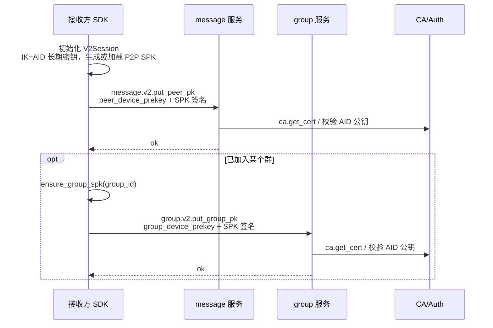
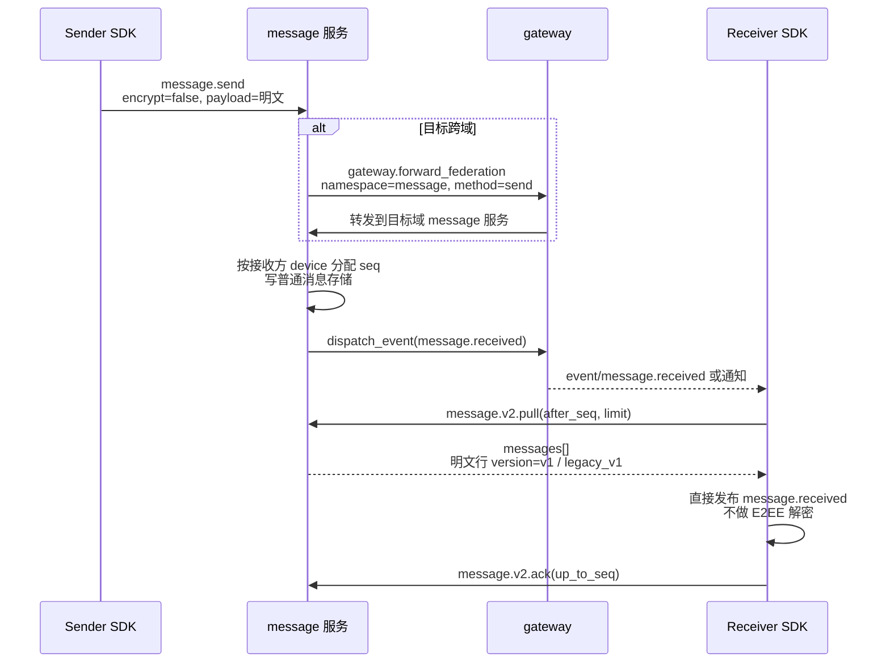
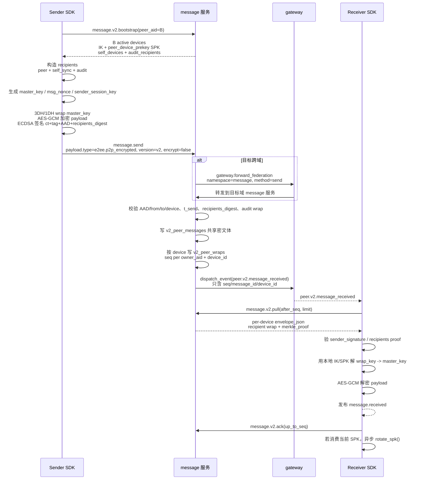
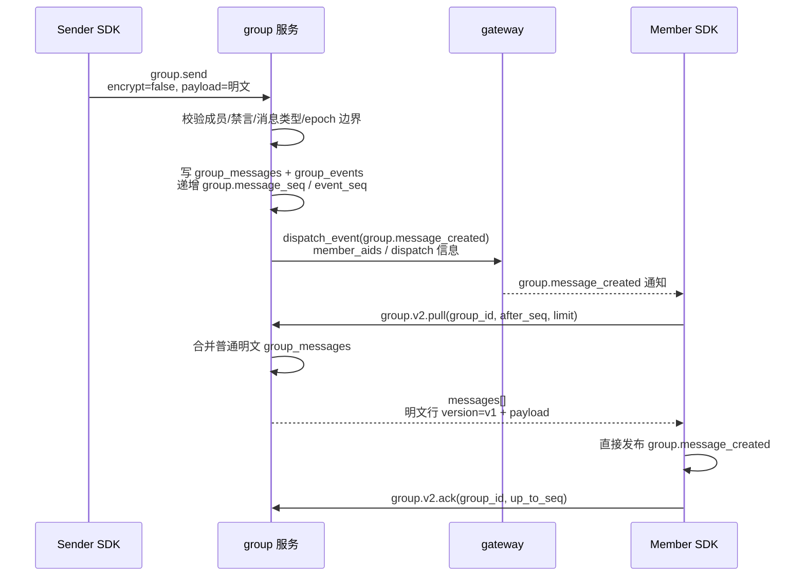
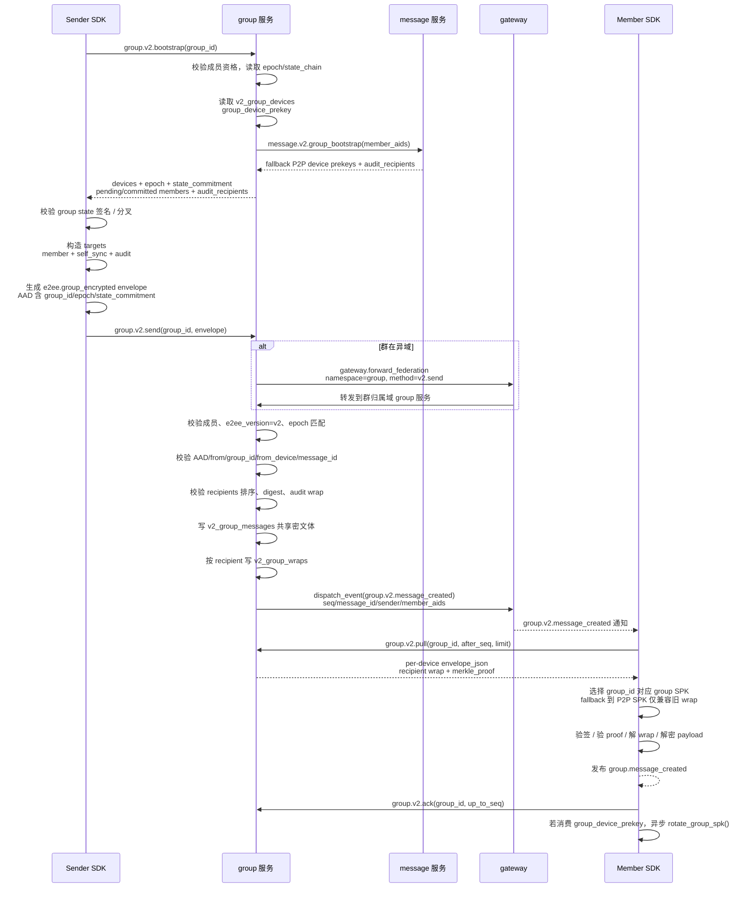

# E2EE V2 消息通信时序图

本文只描述当前 V2-only 链路下的主要时序：P2P/GROUP 明文消息、P2P/GROUP 加密消息，以及 V2 设备密钥注册前置流程。不包含 V1 E2EE、旧 group epoch secret 分发、thought 内容读写。

## 范围约定

- SDK 默认 `message.send` / `group.send` 为 `encrypt=true`，由 SDK 本地构造 V2 加密 envelope。
- 显式 `encrypt=false` 时走明文发送；V2 SDK 接收端仍通过 `message.v2.pull` / `group.v2.pull` 合并拉取明文历史行。
- P2P 加密 envelope 类型为 `e2ee.p2p_encrypted`，通过 `message.send` 提交，服务端按 V2 分流处理。
- GROUP 加密 envelope 类型为 `e2ee.group_encrypted`，通过 `group.v2.send` 提交。
- 服务端只做认证、路由、结构校验、密文存储和事件通知，不持有明文 payload，也不执行端到端解密。

## V2 设备密钥注册

## P2P 明文消息

## P2P 加密消息

## GROUP 明文消息

## GROUP 加密消息

## 核心差异

| 场景 | 发送入口 | 服务端存储 | 接收入口 | 解密位置 |
|------|----------|------------|----------|----------|
| P2P 明文 | `message.send(encrypt=false)` | 普通 device message | `message.v2.pull` 合并明文行 | 不解密 |
| P2P 加密 | `message.send` 承载 `e2ee.p2p_encrypted` | `v2_peer_messages` + `v2_peer_wraps` | `message.v2.pull` | 接收方 SDK |
| GROUP 明文 | `group.send(encrypt=false)` | `group_messages` + `group_events` | `group.v2.pull` 合并明文行 | 不解密 |
| GROUP 加密 | `group.v2.send` 承载 `e2ee.group_encrypted` | `v2_group_messages` + `v2_group_wraps` | `group.v2.pull` | 接收方 SDK |

