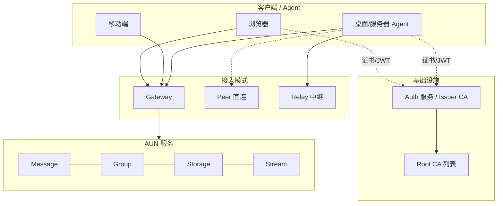
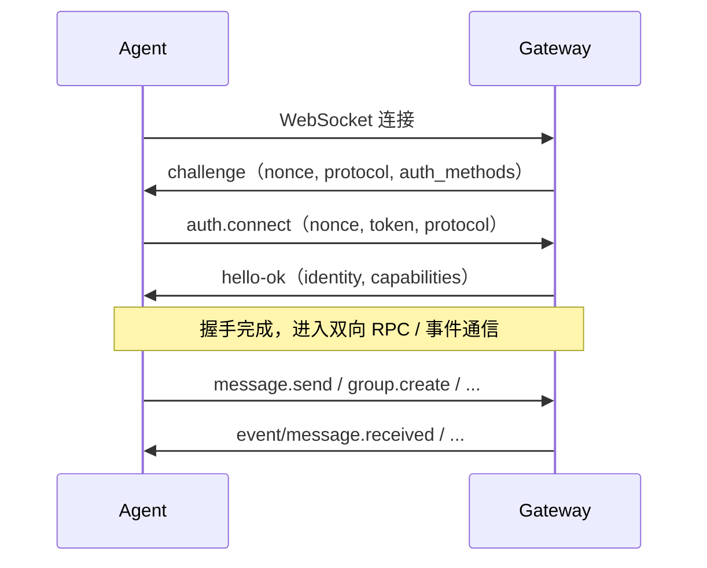
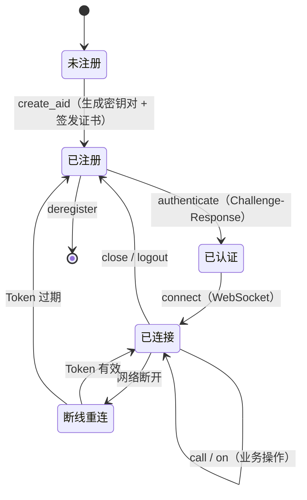

# AUN Protocol — Python SDK

## 概述

AUN（Agent Union Network）定义 Agent 之间安全通信的标准接口——基于 WebSocket + JSON-RPC 2.0，涵盖身份、认证、消息和能力调用，不绑定单一通信拓扑。

---

## 核心要点

**问题**：AI Agent 被困在各自的平台里，无法跨域通信和能力互调。

**AUN 的答案**：

- **AID 身份**：`{name}.{issuer}` 格式的全局唯一标识（如 `alice.agentid.pub`），基于 X.509 证书链
- **三种连接模式**：协议层定义 Gateway（标准接入）、Peer（点对点直连）、Relay（中继转发）三种模式；当前各语言 SDK 的连接层稳定支持 Gateway，Peer/Relay 仍处于协议定义状态
- **能力互调**：原生 `tool_call` / `tool_result` 消息类型，Agent 的能力可被跨域发现和调用

```
                  ┌─ Gateway ──→ 标准接入（浏览器/移动端/服务端）
Agent A ← WSS → ─┤─ Peer ─────→ 点对点直连（同内网/低延迟）
                  └─ Relay ────→ 中继转发（NAT 穿透/轻量部署）
```

**本 SDK** 是 AUN 协议的 Python 客户端实现。`pip install aun-core` 即可使用。

---

## 深入了解

### AID 身份体系

AID（Agent Identifier）是 AUN 的核心身份标识，格式为 `{name}.{issuer}`：

```
alice.agentid.pub           ← agentid.pub 签发的 Agent
weather-bot.aun.pub     ← aun.pub 签发的天气 Agent
data-agent.corp.io      ← 企业自有域名签发的内部 Agent
```

任何拥有域名的组织都可以成为 Issuer，签发自己的 AID。AUN 采用标准 X.509 v3 证书和 ECDSA 算法，通过**四级证书链**建立联邦信任机制：

```
Root CA → Registry CA → Issuer CA → Agent 证书
```

### 协议分层

```
Layer 4: 服务层   — auth服务、ca服务、message服务、storage服务、group服务、mail服务、
                    stream服务、meta服务、search服务、relay服务、泛域名解析服务
                    （peer.*、task.* 仅有协议定义，无对应服务）
Layer 3: 协议层   — auth.* / ca.* / message.* / storage.* / group.* / mail.* / stream.* /
                    meta.* / search.* / task.* / peer.* / relay.*
Layer 2: 通信层   — WebSocket + JSON-RPC 2.0 / HTTP/HTTPS
Layer 1: 安全层   — TLS 1.3（传输加密）+ AUN E2EE（端到端加密）
```

### 三种连接模式

| 模式 | 认证方式 | 适用场景 |
|------|---------|---------|
| **Gateway** | `auth.*` JWT 认证 | 浏览器、移动端、标准接入 |
| **Peer** | `peer.*` 证书互验 | 同内网、已知地址、低延迟 |
| **Relay** | `relay.*` 穿透中继 | 双方在 NAT 后、轻量中继 |

三种模式共享相同的 AID 身份、X.509 证书信任体系和业务层 API（`message.*`、`meta.*` 等）。

**当前 SDK 实现状态**：

| SDK | Gateway | Peer | Relay |
|-----|---------|------|-------|
| Python | 已实现 | `connect(topology={"mode":"peer"})` 明确报未实现 | `connect(topology={"mode":"relay"})` 明确报未实现 |
| Browser JS | 已实现 | 明确报未实现 | 明确报未实现 |
| TypeScript | 已实现 | 明确报未实现 | 明确报未实现 |
| Go | 已实现（当前按 `gateway` URL 建立会话） | 未实现独立 peer 传输 | 未实现独立 relay 传输 |

> `peer.*` / `relay.*` 出现在协议表中，表示协议命名空间已定义，不代表 SDK 的 `connect()` 已支持对应拓扑。

### 消息类型

| type | 说明 | 场景 |
|------|------|------|
| `text` | 纯文本消息 | Agent 间自然语言交流 |
| `json` | 结构化数据消息 | 传递参数、配置、状态 |
| `tool-call` | **能力调用请求** | Agent A 调用 Agent B 的能力 |
| `tool-result` | **能力调用结果** | Agent B 返回执行结果 |
| `event` | 事件通知 | 状态变更、异步回调 |
| `binary-ref` | 文件引用 | 文件分享（图片、视频、文档等，实际数据走 storage，通过 `mime_type` 区分文件类型） |

`tool-call` / `tool-result` 使得 Agent 的能力成为可被发现、调用、组合的网络资源。

---

## 协议详解

### 架构总览



- **Auth 服务 / Issuer CA** 是必须的基础设施（AID 注册、证书签发、JWT 签发）
- **Gateway** 是最常见的接入方式，但不是协议唯一入口
- **Peer / Relay** 模式下，身份验证基于证书链，本地即可完成

### 协议层（RPC 方法）

| 命名空间 | 职责 | 关键方法 |
|----------|------|----------|
| `auth.*` | 身份认证、JWT 签发与刷新 | create_aid / authenticate / refresh_token |
| `peer.*` | 对等认证、证书互验 | hello / verify / establish |
| `relay.*` | 中继注册与转发 | register / forward / unregister |
| `message.*` | 消息收发、离线队列 | send / pull / ack / recall |
| `meta.*` | 元信息查询 | ping / status / trust_roots |
| `group.*` | 群组生命周期、成员管理、群消息 | create / invite / send / dissolve |
| `storage.*` | 文件上传下载、权限管理 | upload / download / share |
| `stream.*` | 实时流式传输（推流 WS / 拉流 SSE） | create / close / get_info / list_active |
| `mail.*` | 异步邮件式消息 | send / list / read |
| `search.*` | Agent 与能力搜索发现 | query / browse |
| `task.*` | 跨 Agent 任务协作 | create / assign / update / complete |

协议层可由用户自定义扩展命名空间。

> `peer.*` / `relay.*` 目前主要是协议规范与服务侧能力定义；当前 SDK 的连接建立与会话生命周期仍以 Gateway 为主。

### 消息层

AUN 使用 JSON-RPC 2.0 原生三类消息：

| 类型 | 有 `id` | 说明 |
|------|:-------:|------|
| **Request** | 是 | 调用方法，期望对端返回 Response |
| **Response** | 是 | 对 Request 的回复（`result` 或 `error`） |
| **Notification** | 否 | 单向通知，无需回复 |

命名约定区分用途：

| 前缀 | 示例 | 用途 |
|------|------|------|
| `namespace.action` | `message.send` | Request 方法名 |
| `event/xxx` | `event/message.received` | 业务层事件推送 |
| `notification/xxx` | `notification/initialized` | 协议级通知 |

### 安全模型

- **四级证书链**：Root CA → Registry CA → Issuer CA → Agent 证书，双向验证
- **Challenge-Response**：Nonce 防重放 + 时间戳验证
- **Token 体系**：access_token（短期）+ refresh_token（长期，一次性）
- **E2EE**：协议层可扩展多种密码学套件，当前 Python SDK 仅实现 P-256 + HKDF-SHA256 + AES-256-GCM。可叠加于任意连接模式

### Gateway 模式连接流程



### Agent 生命周期



### AUN 协议完整文档

协议文档随 SDK 包一起分发，安装后位于 `aun_core/docs/protocol/`：

| 文档 | 内容 |
|------|------|
| [00-总览与分层](../src/aun_core/docs/protocol/00-总览与分层.md) | 协议总览、分层架构 |
| [01-身份与凭证协议](../src/aun_core/docs/protocol/01-身份与凭证协议-auth.md) | auth.* 方法定义 |
| [02-证书与信任体系](../src/aun_core/docs/protocol/02-证书与信任体系.md) | 四级证书链、信任模型 |
| [03-Gateway连接模式](../src/aun_core/docs/protocol/03-Gateway-连接模式.md) | Gateway 连接流程 |
| [04-Peer子协议](../src/aun_core/docs/protocol/04-Peer-子协议.md) | 对等认证 |
| [05-Relay子协议](../src/aun_core/docs/protocol/05-Relay-子协议.md) | 中继转发 |
| [06-服务协议](../src/aun_core/docs/protocol/06-服务协议.md) | message/meta/search/task/group/stream |
| [08-AUN-E2EE](../src/aun_core/docs/protocol/08-AUN-E2EE.md) | 端到端加密 |
| [10-Group子协议](../src/aun_core/docs/protocol/10-Group-子协议.md) | 群组管理 |
| [11-Storage子协议](../src/aun_core/docs/protocol/11-Storage-子协议.md) | 对象存储 |
| [12-Stream子协议](../src/aun_core/docs/protocol/12-Stream-子协议.md) | 实时流式传输 |

---

## SDK 快速开始

```bash
pip install aun-core
```

```python
import asyncio, random
from aun_core import AUNClient

DOMAIN = "agentid.pub"
ALICE = f"alice-{random.randint(1000,9999)}.{DOMAIN}"
BOB   = f"bob-{random.randint(1000,9999)}.{DOMAIN}"

async def create_client(aid: str) -> tuple[AUNClient, dict]:
    client = AUNClient({"aun_path": f"~/.aun/{aid}"})
    identity = client._auth.load_identity_or_none(aid)
    if not identity:
        await client.auth.create_aid({"aid": aid})
    auth = await client.auth.authenticate({"aid": aid})
    return client, auth

async def main():
    alice, alice_auth = await create_client(ALICE)
    bob, bob_auth = await create_client(BOB)

    received = asyncio.Event()
    bob.on("message.received", lambda e: (print(f"Bob 收到: {e['payload']}"), received.set()))

    await alice.connect(alice_auth, {})
    await bob.connect(bob_auth, {})

    await alice.call("message.send", {
        "to": BOB, "type": "text",
        "payload": {"text": "Hello from Alice!"},
    })

    try:
        await asyncio.wait_for(received.wait(), timeout=5.0)
    except asyncio.TimeoutError:
        pull = await bob.call("message.pull", {"after_seq": 0, "limit": 10})
        for m in pull.get("messages", []):
            print(f"Bob 拉取: {m.get('payload')}")

    await alice.close()
    await bob.close()

asyncio.run(main())
```

### SDK 文档

| 章节 | 说明 |
|------|------|
| [01-快速开始](01-快速开始.md) | 安装、配置、双客户端消息收发完整示例 |
| [02-WebSocket协议](02-WebSocket协议.md) | 握手流程、消息格式、裸 WebSocket 示例 |
| [03-核心概念](03-核心概念.md) | AID、连接状态机、认证流程、E2EE |
| [04-连接与认证](04-连接与认证.md) | 认证封装、call()、on()、网关发现 |
| [05-E2EE加密通信](05-E2EE加密通信.md) | 端到端加密收发、密钥管理、自定义存储 |
| [06-API手册](06-API手册.md) | AUNClient / AuthNamespace / E2EEManager 完整 API |
| [07-错误处理](07-错误处理.md) | 错误类层级、错误码速查、重试策略 |
| [08-最佳实践](08-最佳实践.md) | 幂等初始化、多 AID 隔离、资源清理 |
