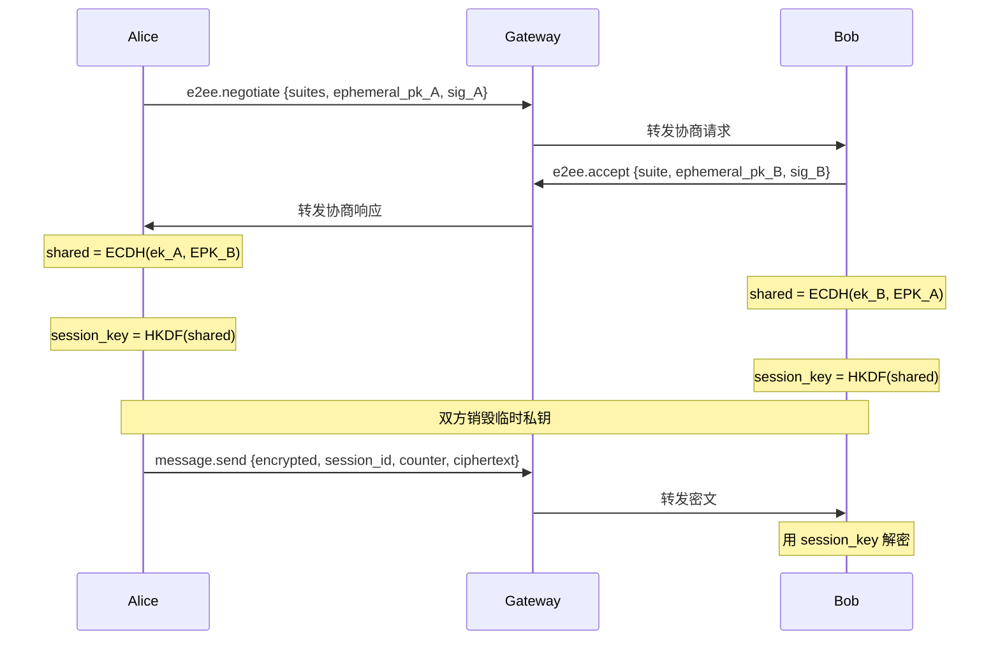
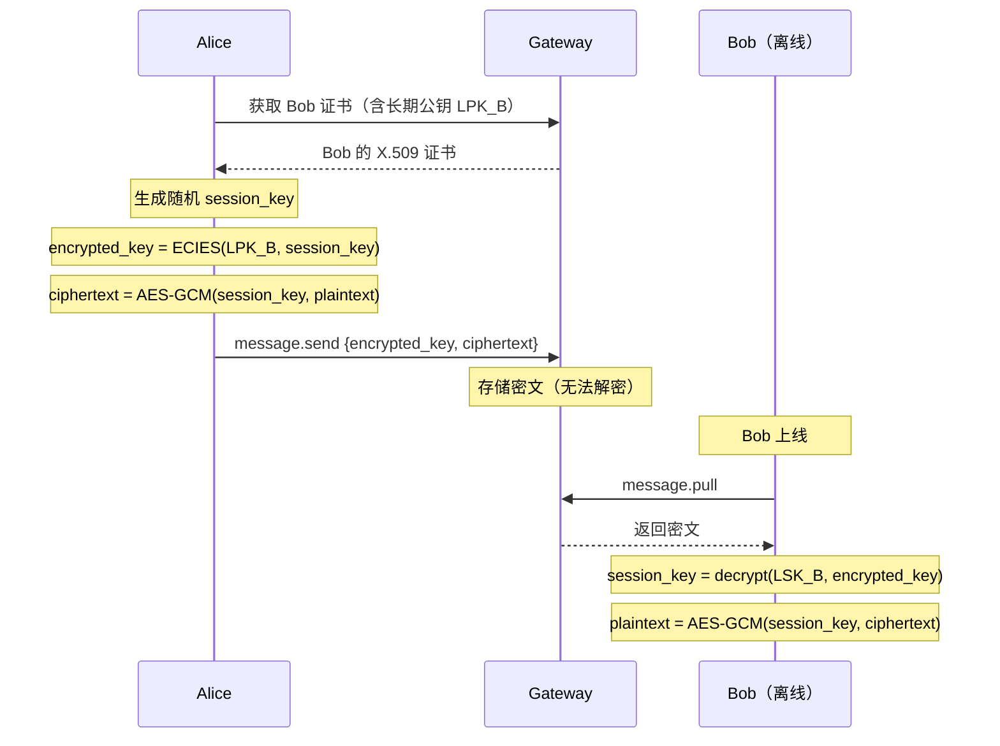
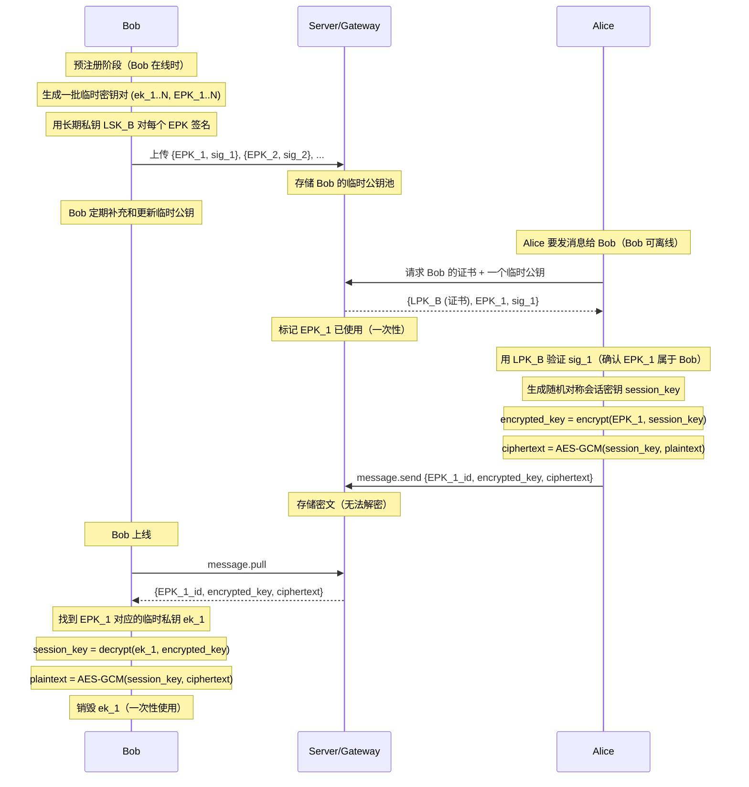
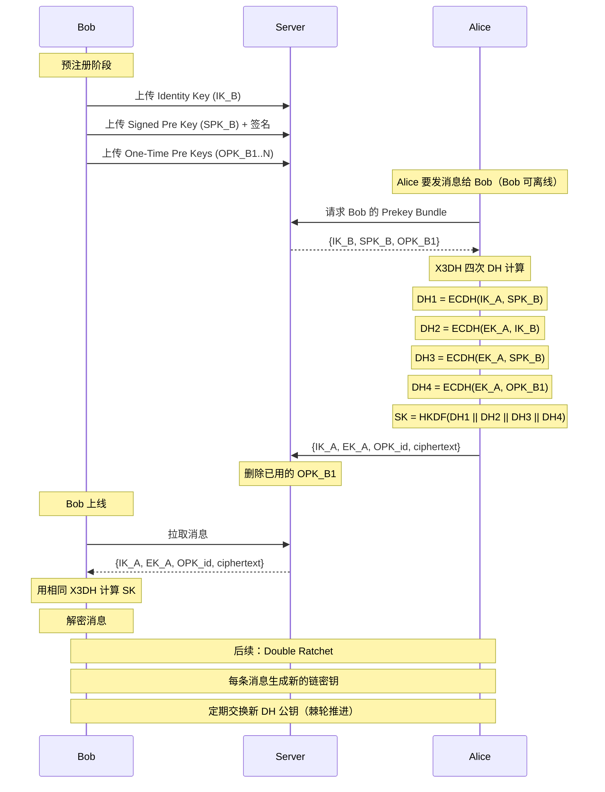

# E2EE 方案对比分析

> 版本：1.0-draft
> 状态：分析文档（非规范性）
> 适用范围：AUN E2EE 方案选型参考

---

## 方案 1：基于 ECDH 的在线 E2EE

**机制**：双方在线时各自生成临时密钥对，通过 ECDH 协商派生会话密钥。



**特性**：

- ✅ 完美前向安全性（PFS）—— 临时私钥用完即销毁，即使长期私钥泄露也无法恢复历史会话密钥
- ✅ 会话密钥可复用，后续消息无需重新协商
- ✅ 支持计数器防重放
- ❌ **需要双方同时在线**
- ❌ 协商需要多次往返

---

## 方案 2：基于长期公钥的 E2EE

**机制**：发送方直接用接收方的长期公钥（X.509 证书中）加密会话密钥，无需协商。



**特性**：

- ✅ 支持离线消息
- ✅ 无需协商，单次发送即可
- ✅ 实现简单
- ❌ **无前向安全性** —— 长期私钥泄露 → 所有历史消息被解密
- ❌ 每条消息独立加密，无会话概念
- ❌ 无计数器防重放（依赖 message_id 去重）

---

## 方案 3：基于长期公钥 + 预存临时公钥的 E2EE

**机制**：接收方预先生成一批临时密钥对，用长期私钥对每个临时公钥签名后上传到服务器，并定期更新。发送方从服务器获取接收方的证书（长期公钥）和一个临时公钥，用长期公钥验证临时公钥的签名（确保不被篡改），然后生成随机对称会话密钥，用已验证的临时公钥加密会话密钥，再用会话密钥加密消息，将加密后的会话密钥和密文一起发送。接收方上线后用对应的临时私钥解密会话密钥，再解密消息。

- **长期公钥的角色**：认证（验证临时公钥确实属于接收方，防止服务器或中间人替换假的临时公钥）
- **临时公钥的角色**：加密（提供前向安全性，用后销毁）



**与方案 2 的关键区别**：

- 方案 2：用接收方**长期公钥**加密会话密钥，长期私钥泄露 → 所有历史消息暴露
- 方案 3：用接收方**预存的临时公钥**加密会话密钥（长期公钥仅用于验证临时公钥的真实性），临时私钥用后即销毁 → 即使接收方长期私钥泄露，已销毁临时私钥对应的消息仍安全

**特性**：

- ✅ 支持离线消息
- ✅ 接收方前向安全 —— 临时私钥销毁后，对应消息不可恢复，即使长期私钥泄露也无法解密
- ✅ 临时公钥经长期密钥签名认证，防止中间人替换
- ✅ 比方案 2 安全性显著提升
- ❌ 需要服务端存储和管理临时公钥池
- ❌ 临时公钥耗尽时需要降级（退化为方案 2）
- ❌ 接收方需要定期补充临时公钥
- ❌ 无计数器防重放

---

## 方案 4：Signal Protocol（X3DH + Double Ratchet）

**机制**：接收方预先上传身份密钥、签名预共享密钥和一批一次性预共享密钥到服务器。发送方使用 X3DH（Extended Triple Diffie-Hellman）协议进行四次 DH 计算派生初始密钥，后续使用 Double Ratchet 不断更新密钥。



**X3DH 四次 DH 的作用**：

| DH 计算 | 输入 | 保护目标 |
|---|---|---|
| DH1 = ECDH(IK_A, SPK_B) | 双方长期/半长期密钥 | 身份认证 |
| DH2 = ECDH(EK_A, IK_B) | 发送方临时 + 接收方长期 | 发送方前向安全 |
| DH3 = ECDH(EK_A, SPK_B) | 发送方临时 + 接收方半长期 | 双向前向安全 |
| DH4 = ECDH(EK_A, OPK_B1) | 发送方临时 + 接收方一次性 | 一次性密钥保护 |

**注意**：Signal 中 `EK_A`（Ephemeral Key）是**发送方临时生成**的密钥，`SPK_B`/`OPK_B` 是**接收方预存**的密钥。X3DH 通过交叉组合双方的临时和长期密钥，实现了双向前向安全。

**Double Ratchet 机制**：

- **对称棘轮**：每条消息派生新的消息密钥，用后销毁
- **DH 棘轮**：每次收到对方新消息时交换新 DH 公钥，重新派生根密钥
- 效果：即使某条消息的密钥泄露，也无法推导出其他消息的密钥

**一消息一密钥**：

Signal 实现了"一消息一密钥"——每条消息使用独立派生的对称密钥加密，用后即销毁。这与传统密码学中的"一次一密"（One-Time Pad, OTP）有本质区别：

| | 一次一密（OTP） | Signal（一消息一密钥） |
|---|---|---|
| **密钥来源** | 完全随机 | KDF 链式派生 |
| **密钥长度** | = 消息长度 | 固定 256 位 |
| **安全性** | 信息论安全（数学不可破解） | 计算安全（依赖 AES/SHA-256 假设） |
| **密钥分发** | 需要预先安全分发等长密钥 | 通过协议自动派生 |
| **实用性** | 几乎无法工程使用 | 工程可用，业界最强的可用方案 |

**后向安全性（Post-compromise Security）为何成立**：

方案 3 的临时密钥是"提前存好的一池子"，攻击者入侵设备后可获取所有尚未使用的临时私钥，后续消息仍可被解密，系统无法自动恢复。

Signal 的密钥是"边聊边换的"：Double Ratchet 在每次消息交互时自动交换新 DH 公钥，新私钥是在攻击者失去控制**之后**生成的，攻击者无法获取。恢复是协议自动完成的，不需要用户干预。

**特性**：

- ✅ 完整前向安全性（包括离线消息）
- ✅ 后向安全性（Break-in Recovery）—— 密钥泄露后通过棘轮自愈
- ✅ 每条消息独立密钥，单条泄露不影响其他
- ✅ 支持离线消息
- ❌ **实现极复杂**（X3DH + Double Ratchet + Prekey 管理 + 消息排序）
- ❌ 需要服务端存储和管理多种 Prekey
- ❌ OPK 耗尽时降级为三次 DH（安全性略降）
- ❌ 多设备同步极其困难（Sesame 协议等扩展）
- ❌ 消息乱序处理复杂

---

## 四种方案对比

| 特性 | 方案 1 | 方案 2 | 方案 3 | 方案 4 |
|---|---|---|---|---|
| | ECDH 在线 | 长期公钥 | 长期+预存临时 | Signal |
| **离线消息** | ❌ | ✅ | ✅ | ✅ |
| **发送方 PFS** | ✅ | ❌ | N/A（发送方私钥不参与） | ✅ |
| **接收方 PFS** | ✅ | ❌ | ✅ | ✅ |
| **完整 PFS** | ✅（仅在线） | ❌ | ❌ | ✅ |
| **后向安全** | ❌ | ❌ | ❌ | ✅ |
| **防重放** | ✅计数器 | ❌ | ❌ | ✅ |
| **实现复杂度** | 中 | 低 | 中 | 极高 |
| **服务端要求** | 无 | 证书存储 | 临时公钥池 | 多种 Prekey 管理 |
| **协商往返** | 多次 | 0 | 0 | 0 |
| **Prekey 耗尽** | N/A | N/A | 降级为方案 2 | 降级为 3 次 DH |
| **代表产品** | — | PGP/GPG | — | Signal/WhatsApp |

---

## 安全性层级排序

```
方案 4 (Signal) > 方案 3 (预存临时) > 方案 1 (在线 ECDH) > 方案 2 (长期公钥)
     ↑                  ↑                    ↑                    ↑
完整PFS+后向安全    接收方PFS+离线       完整PFS但仅在线        无PFS
```

**注意**：

- 方案 1 虽然有完整 PFS，但因不支持离线消息，整体可用性受限
- 方案 3 支持离线且有接收方 PFS（发送方私钥不参与加密，不存在发送方 PFS 问题），但无后向安全性
- 方案 4（Signal）是目前业界公认最安全的方案，但实现成本极高

---

## 业界典型实现参考

### Signal

Signal 是现代消息类 E2EE 的经典参考实现。

**核心结构**：

- 首消息使用 X3DH 建立初始会话密钥（2023 年已升级为 **PQXDH**，混合 X25519 + ML-KEM/Kyber 抵御量子威胁）
- 后续消息使用 Double Ratchet（2025 年升级为 **Triple Ratchet**，在 Double Ratchet 基础上增加稀疏后量子公钥棘轮）
- 群组消息使用 Sender Keys 机制

**主要特点**：

- 支持离线首消息（通过预密钥体系解决异步建链）
- 通过双棘轮实现持续前向保密和后向安全（密钥泄露自愈）
- 可否认性（Deniability）
- 积极推进后量子密码学迁移

**对 AUN 的参考价值**：Signal 是产品级安全 IM 最值得直接对齐的基线方案。

### WhatsApp

WhatsApp 的端到端加密采用 Signal Protocol，并在此基础上做了大规模工程化扩展。

**核心结构**：

- 个人消息使用完整的 Signal Protocol（X3DH + Double Ratchet）
- 群组消息使用 **Sender Keys**（单次加密、多方分发，提升群组性能）
- 关联设备（桌面端、Web 端）各自与联系人维护独立的 Signal Protocol 会话，无需手机在线

**工程扩展**：

- **端到端加密备份**：用户密码或 HSM 密钥保管库保护备份密钥，Meta 无法解密
- **密钥透明性（Key Transparency）**：部署了 **Auditable Key Directory（AKD）**——追加写入的哈希树结构，Cloudflare 作为第三方审计方验证目录未被篡改。AKD 已开源并经 NCC Group 审计

**对 AUN 的参考价值**：证明 Signal 路线不仅适用于理论上的安全协议，也能支撑超大规模异步消息产品。密钥透明性机制值得 AUN 未来参考。

### Messenger（Meta）

Messenger 的默认 E2EE 于 **2023 年 12 月**全面启用（此前仅 Secret Conversations 支持）。

**核心结构**：

- 1:1 消息使用 Signal Protocol
- 群组消息使用 Sender Keys 变体
- 加密消息历史同步使用 Meta 自研的 **Labyrinth 协议**

**Labyrinth 协议**（与 Signal/WhatsApp 的关键区别）：

- 加密后的消息密文存储在**服务端**（而非仅存于设备本地）
- 任意已授权设备可按需加载历史消息
- 用户通过 PIN 码在新设备上访问历史（或选择仅设备本地存储）
- 设备吊销后自动轮换密钥，被移除设备无法解密新消息
- 使用 CPace PAKE 进行跨设备注册

**对 AUN 的参考价值**：当系统进入多设备和历史同步阶段后，E2EE 的重点会从"如何建链"扩展到"如何安全地保存和恢复状态"。Labyrinth 的服务端加密存储模型是重要参考。

### iMessage（Apple）

iMessage 不使用 Signal Protocol，而是 Apple 自研协议。2024 年升级为 **PQ3 协议**（后量子混合设计）。

**核心结构**：

- 每台设备本地生成三组密钥对：长期身份密钥（P-256 ECDSA）、ECDH 预密钥、KEM 预密钥（ML-KEM/Kyber，后量子）
- 公钥上传到 Apple 的 **Identity Directory Service（IDS）**
- 发送方从 IDS 查询接收方每台设备的公钥集合
- **按目标账号下的每个设备分别加密**（每台设备收到的密文不同）

**PQ3 特性**（iOS 17.4+）：

- 混合经典 ECC + 后量子 ML-KEM
- 前向安全 + 后量子安全
- 定期后量子 rekeying 实现密钥泄露自愈
- Apple 称其为 Level 3 安全（超越 Signal 的 Level 2）

**对 AUN 的参考价值**：如果未来 AUN 强化多设备支持，目录服务和设备级公钥管理会变得非常重要。iMessage 的"每设备独立密钥 + 按设备分别加密"模型是重要参考。

### Matrix

Matrix 的 E2EE 在多设备和群聊场景中很有代表性，且天然适配联邦式架构。

**核心结构**：

- 1:1 会话使用 **Olm**（基于 Double Ratchet，类似 Signal Protocol）
- 群聊使用 **Megolm**（哈希推导密钥链，新成员可解密加入后的消息但不能解密历史）
- 每台设备有 Ed25519（签名）和 Curve25519（密钥协商）两组长期密钥
- 设备上传一次性密钥（OTK）到 homeserver，建立 Olm 会话时通过 `/keys/claim` 获取对方 OTK

**近期演进**：

- **Vodozemac**（Rust 实现）已替代 libolm，性能提升 5-6 倍，解决内存安全问题
- 正在推进 **MSC2883**，用 MLS（Messaging Layer Security）协议替代 Megolm 进行群聊加密

**对 AUN 的参考价值**：如果后续 AUN 要支持群聊或多节点通信，Matrix 的设备模型和群聊加密模型值得重点参考。其联邦式架构下的 E2EE 设计与 AUN 的多 Issuer 架构有相似之处。

### Telegram Secret Chats

Telegram 的 Secret Chats 是典型的自研 E2EE 路线。

**核心结构**：

- **仅 Secret Chats 是 E2EE**，普通聊天（包括群组）使用 MTProto 2.0 客户端-服务器加密，**不是端到端加密**
- Secret Chats 使用 2048-bit DH 密钥交换建立共享密钥
- 不采用 Double Ratchet，无逐消息密钥更新

**安全局限**：

- E2EE 是 opt-in 而非默认
- 不支持群组 E2EE
- 无逐消息前向安全性（会话内不做密钥棘轮）
- 自研协议，审计和同行评审远少于 Signal Protocol
- 服务端以可访问形式存储所有非 Secret Chat 消息

**对 AUN 的参考价值**：自研协议并非不可行，但如果没有完整的协议证明、异常流程设计和长期演进能力，工程风险会明显更高。Telegram 的案例说明 E2EE 应该是默认行为而非可选功能。

### Zoom

Zoom 的 E2EE 更接近"会议型 E2EE"，与消息 IM 方案有本质区别。

**核心结构**：

- 参与者设备本地生成临时 DH 密钥对，通过签名交换建立会议密钥
- 核心模型是 **CGKA**（Continuous Group Key Agreement），成员变动时自动重新生成密钥
- 加密使用 XChaCha20-Poly1305 + HKDF + Ed25519 签名
- 自研协议，非 MLS 但与 MLS 是相关工作
- 2024 年已推出抗量子 E2EE 版本

**启用 E2EE 后的限制**：

- 禁用：云录制、直播、实时转录、分组讨论室、投票
- 不支持电话/SIP/H.323 接入
- 参与人数上限 200

**对 AUN 的参考价值**：实时会议类 E2EE 与异步消息类 E2EE 的工程取舍不同，不应简单混用其模型。但其 CGKA 模型对未来 AUN 群组通信场景有参考意义。

---

## 业界小结

从业界实践看，主流产品大致分为两类路线：

**消息 IM 主流路线**（Signal / WhatsApp / Messenger）：

- 以 Signal Protocol（X3DH + Double Ratchet）为核心
- 通过预密钥体系解决异步建链
- 工程扩展集中在：群组加密（Sender Keys）、加密备份、密钥透明性、多设备同步

**目录 / 多设备路线**（iMessage / Matrix）：

- 强调设备级密钥管理和公钥目录
- 按设备分别加密（iMessage）或设备级会话（Matrix）
- 更适合多设备、联邦式场景

**选型建议**：

- 异步消息 E2EE → 最值得参考 Signal / WhatsApp
- 设备目录、多设备分发和群聊 → 最值得参考 iMessage / Matrix
- Telegram 和 Zoom 更适合作为特定设计取舍的反例或补充案例，而不宜作为 AUN 的主方案模板
