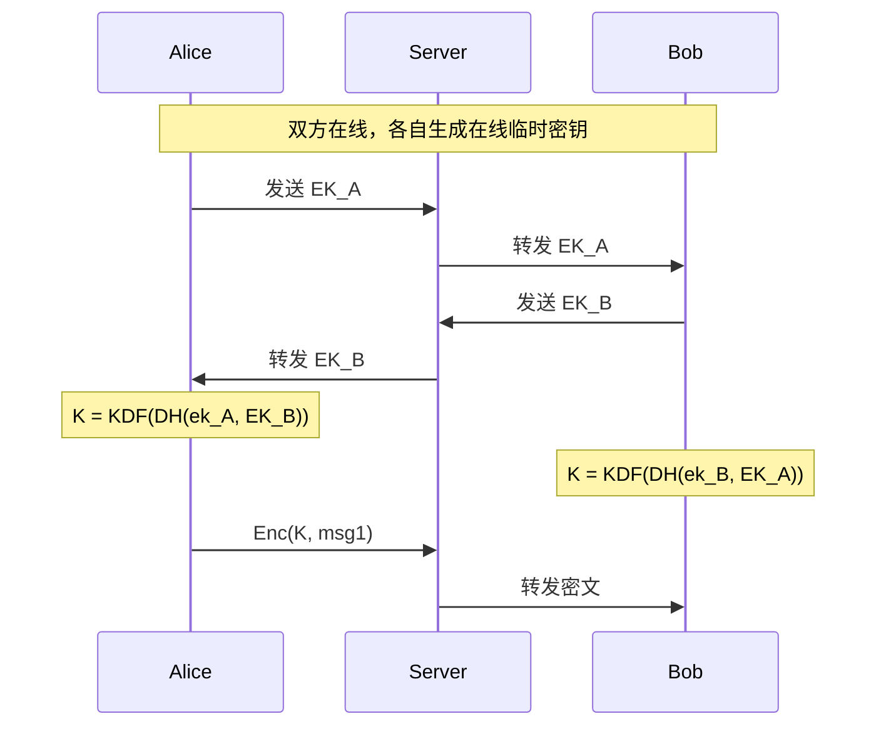
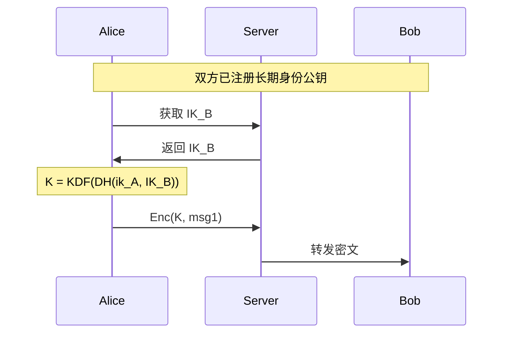
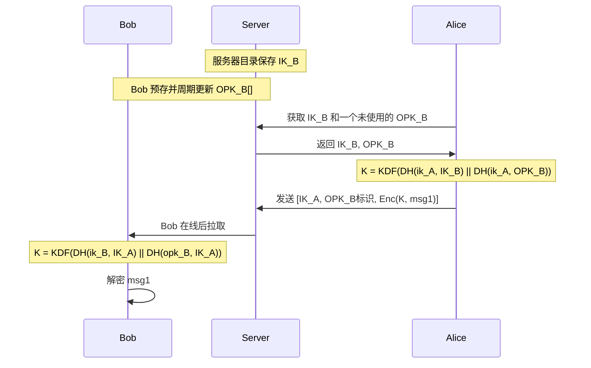
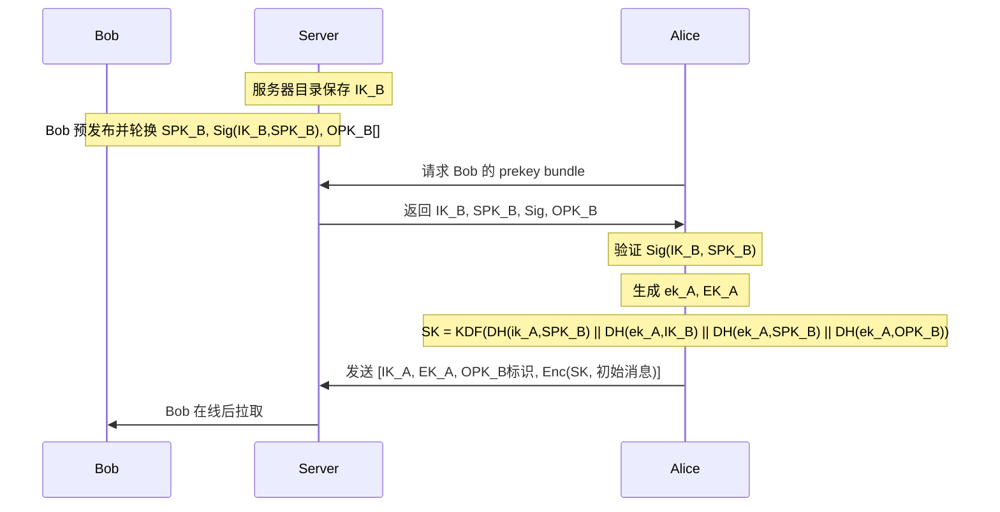
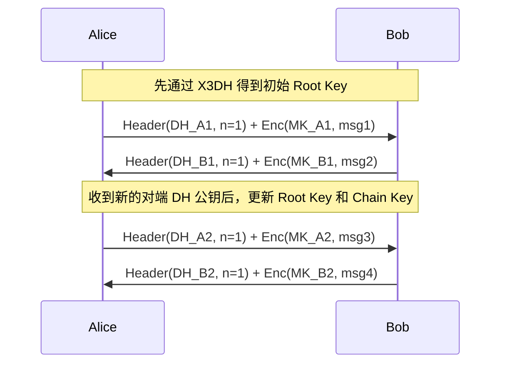

# 端到端加密（E2EE）机制方案整理

## 1. 文档目的

本文对以下四种 E2EE 机制进行统一整理，并明确区分两类“临时公钥”：

1. 基于 ECDH 的在线 E2EE
2. 基于长期公钥的 E2EE
3. 基于长期公钥 + 接收方预存临时公钥的 E2EE
4. Signal E2EE

本文采用的定义是：

- 方案 1 的临时公钥：双方在线时各自现场生成的会话临时公钥
- 方案 3 的临时公钥：接收方预先存放到服务器、供离线首消息使用的预密钥（prekey）

同时，本文不再保留“混合方案”作为建议方案。原因是把两种机制直接拼接实现，容易在身份绑定、状态管理、密钥生命周期和异常分支上引入逻辑漏洞。

## 2. 术语与符号

- `IK_A / IK_B`：Alice / Bob 的长期身份公钥
- `ik_A / ik_B`：Alice / Bob 的长期身份私钥
- `EK_A / EK_B`：Alice / Bob 在线握手时生成的临时公钥
- `ek_A / ek_B`：对应的在线临时私钥
- `OPK_B`：Bob 预存到服务器的一次性临时公钥（One-Time PreKey）
- `opk_B`：Bob 的一次性临时私钥
- `SPK_B`：Bob 的签名预密钥（Signed PreKey）
- `spk_B`：Bob 的签名预密钥私钥
- `DH(x, Y)`：使用私钥 `x` 与公钥 `Y` 做 ECDH
- `KDF(...)`：对一个或多个共享秘密做密钥派生
- `Enc(K, M)`：使用对称密钥 `K` 加密消息 `M`

## 3. 评估维度

- 是否要求双方在线
- 是否支持离线首消息
- 是否能绑定长期身份
- 是否具备前向保密
- 是否具备持续密钥演进
- 是否要求服务器维护预密钥池
- 工程实现复杂度

# 4. 各方案整理

## 4.1 方案一：基于 ECDH 的在线 E2EE

### 核心机制

双方在线时，各自生成一次性的在线临时密钥对，交换临时公钥后做 ECDH，得到共享会话密钥。

### 密钥计算

- Alice 生成 `(ek_A, EK_A)`
- Bob 生成 `(ek_B, EK_B)`
- `K = KDF(DH(ek_A, EK_B)) = KDF(DH(ek_B, EK_A))`

### 时序图

### 主要特点

- 优点
- 协议最简单
- 具备会话级前向保密
- 适合实时会话

- 缺点
- 必须双方在线
- 不带身份认证时容易被中间人攻击
- 不支持离线首消息

## 4.2 方案二：基于长期公钥的 E2EE

### 核心机制

双方直接使用长期身份密钥协商共享秘密，或者发送方直接用接收方长期公钥加密随机会话密钥。

### 密钥计算

- `K = KDF(DH(ik_A, IK_B)) = KDF(DH(ik_B, IK_A))`

### 时序图

### 主要特点

- 优点
- 支持离线消息
- 机制简单
- 容易部署

- 缺点
- 不具备前向保密
- 长期私钥泄露会影响历史消息
- 长期密钥暴露面较大

## 4.3 方案三：基于长期公钥 + 接收方预存临时公钥的 E2EE

### 核心机制

在 AUN 体系中，接收方长期身份公钥由服务器目录统一保管。接收方自己额外预先在服务器存放一批临时公钥。发送方发起离线首消息时，从服务器获取：

- 服务器目录中的接收方长期身份公钥
- 一个尚未使用的接收方临时公钥

然后把本次首消息与这两个材料绑定，派生出共享密钥。

这里的临时公钥是接收方预存的，不是发送方现场生成的。

### 抽象密钥计算

假设 AUN 服务器目录保存 `IK_B`，同时 Bob 预存并周期轮换 `OPK_B`。

Alice 获取后，可按抽象模型计算：

- Alice：`K = KDF(DH(ik_A, IK_B) || DH(ik_A, OPK_B))`
- Bob：`K = KDF(DH(ik_B, IK_A) || DH(opk_B, IK_A))`

这个模型的重点是表达：

- 会话绑定到 Bob 的长期身份
- 会话同时绑定到 Bob 的一次性预密钥

### 时序图

### 主要特点

- 优点
- 支持离线首消息
- 比纯长期公钥方案更强
- 可将首消息绑定到接收方一次性预密钥

- 缺点
- 是否有强认证，取决于发送方身份如何参与
- 服务端需要维护预密钥池与消耗状态
- 若没有后续 ratchet，后续消息仍缺少持续密钥演进

## 4.4 方案四：Signal E2EE

### 核心机制

Signal 由两部分组成：

- `X3DH`：异步首消息建链
- `Double Ratchet`：后续消息持续密钥演进

如果按本文的定义理解，Signal 的关键不是“有临时公钥”这么简单，而是：

- 接收方发布的是结构化预密钥体系
- 发送方还会引入自己的在线临时密钥
- 建链后并不长期复用单一会话密钥，而是持续 ratchet

### X3DH 的密钥角色

在 AUN 语义下，服务器目录负责提供 `IK_B`，而 Bob 额外向服务器发布并轮换：

- `SPK_B`
- `Sig(IK_B, SPK_B)`
- `OPK_B`

Alice 获取 prekey bundle 后：

- 验证 `SPK_B` 的签名
- 生成自己的在线临时密钥 `(ek_A, EK_A)`
- 计算：
  - `DH1 = DH(ik_A, SPK_B)`
  - `DH2 = DH(ek_A, IK_B)`
  - `DH3 = DH(ek_A, SPK_B)`
  - `DH4 = DH(ek_A, OPK_B)`，若存在
- `SK = KDF(DH1 || DH2 || DH3 || DH4)`

### X3DH 时序图

### Double Ratchet

Signal 在 X3DH 之后进入 Double Ratchet：

- 每发送一条消息就推进发送链
- 每收到新的对端 DH 公钥就推进一次 DH ratchet
- 每条消息使用独立消息密钥

### Double Ratchet 时序图

### 主要特点

- 优点
- 支持离线首消息
- 强身份绑定
- 强前向保密
- 具备持续密钥演进
- compromise 后恢复能力更强

- 缺点
- 实现复杂度最高
- 预密钥、会话状态、乱序消息处理都更复杂

# 5. 方案横向对比

| 方案 | 双方在线 | 离线首消息 | 临时公钥来源 | 身份绑定 | 前向保密 | 持续 Ratchet | 复杂度 |
|---|---|---|---|---|---|---|---|
| 1. 在线 ECDH | 是 | 否 | 双方在线生成 | 弱 | 有 | 否 | 低 |
| 2. 长期公钥 | 否 | 是 | 无 | 有 | 无 | 否 | 低 |
| 3. 长期公钥 + 接收方预存临时公钥 | 否 | 是 | 接收方预存 | 中到强 | 部分 | 否 | 中 |
| 4. Signal | 否 | 是 | 发送方在线临时 + 接收方预密钥体系 | 强 | 强 | 是 | 高 |

## 6. 选型建议

### 6.1 通用建议

- 如果只做实时在线协商，可选方案 1
- 如果要支持离线首消息，至少应达到方案 3
- 如果要做产品级安全 IM，应直接对齐方案 4，也就是 Signal

### 6.2 AUN 协议采用策略

**AUN 采用方案 1 + 方案 3 + 方案 2 三级降级策略**：

1. **优先**：方案 1（在线 ECDH）— 双方在线时使用，提供完美前向安全性
2. **降级**：方案 3（预存临时公钥）— 对方离线但有预存临时公钥时使用，提供接收方前向安全性
3. **最终降级**：方案 2（长期公钥）— 对方离线且无预存临时公钥时使用，无前向安全性

**关键规则**：

- 预存临时公钥被消费后，服务端必须保留至少 1 个
- 接收方应定期补充临时公钥（建议保持 10 个以上）
- 对于重要敏感消息，应在双方都在线时发送（使用方案 1）
- SDK 应在 UI 中标注消息使用的加密模式

**设计理念**：

- 方案 1 提供最强安全性，但需要双方在线
- 方案 3 在离线场景下提供接收方前向安全性，是方案 1 和方案 2 之间的平衡
- 方案 2 作为最终降级，确保在任何情况下都能发送加密消息

## 7. 参考资料

- Signal X3DH 规范：https://signal.org/docs/specifications/x3dh/
- Signal Double Ratchet 规范：https://signal.org/docs/specifications/doubleratchet/
- Signal PQXDH 规范：https://signal.org/docs/specifications/pqxdh/

## 8. 业界典型实现参考

### 8.1 Signal

Signal 是现代消息类 E2EE 的经典参考实现。

其核心结构为：

- 首消息使用 `X3DH`
- 后续消息使用 `Double Ratchet`

主要特点：

- 支持离线首消息
- 通过预密钥体系解决异步建链
- 通过双棘轮实现持续前向保密和更强的恢复能力

对 AUN 的参考价值在于：如果目标是产品级安全 IM，Signal 是最值得直接对齐的基线方案。

### 8.2 WhatsApp

WhatsApp 的端到端加密总体上采用 Signal Protocol 路线，并在此基础上做了大规模工程化扩展。

其典型特点包括：

- 以 Signal 协议族为核心
- 支持多设备
- 对密钥目录、设备同步、备份恢复做了额外工程设计

对 AUN 的参考价值在于：它说明 Signal 路线不仅适用于理论上的安全协议，也能支撑超大规模异步消息产品。

### 8.3 Messenger

Messenger 的默认 E2EE 也采用 Signal 协议族思路。

其工程重点不只在消息传输，还包括：

- 多设备历史消息同步
- 加密历史消息存储
- 设备恢复与迁移

对 AUN 的参考价值在于：当系统进入多设备和历史同步阶段后，E2EE 的重点会从“如何建链”扩展到“如何安全地保存和恢复状态”。

### 8.4 iMessage

iMessage 不是 Signal 协议，但它是“目录服务 + 每设备公钥分发”路线的经典代表。

其典型做法是：

- 每台设备单独生成密钥对
- 公钥上传到 Apple 的目录系统
- 发送方按目标账号下的每个设备分别加密

其特点在于：

- 多设备模型非常强
- 目录服务是核心基础设施
- 协议设计更偏设备级分发而不是单一会话模型

对 AUN 的参考价值在于：如果未来 AUN 强化多设备支持，目录服务和设备级公钥管理会变得非常重要。

### 8.5 Matrix

Matrix 的 E2EE 在多设备和群聊场景中很有代表性。

其典型结构是：

- 单聊使用 `Olm`
- 群聊使用 `Megolm`
- 设备上传 identity keys 和 one-time keys
- 建会话时向服务器 claim 对方 one-time key

其特点在于：

- 非常强调设备粒度
- 单聊和群聊使用不同机制
- 适合联邦式、去中心化环境

对 AUN 的参考价值在于：如果后续 AUN 要支持群聊或多节点联邦通信，Matrix 的设备模型和群聊加密模型值得重点参考。

### 8.6 Telegram Secret Chats

Telegram 的 Secret Chats 是典型的自研 E2EE 路线。

其特点包括：

- 仅 Secret Chats 是 E2EE，普通聊天不是
- 基于 DH 建链
- 通过周期性重换钥提供一定前向保密
- 不采用 Signal/X3DH + Double Ratchet 体系

对 AUN 的参考价值在于：自研协议并非不可行，但如果没有完整的协议证明、异常流程设计和长期演进能力，工程风险会明显更高。

### 8.7 Zoom

Zoom 的 E2EE 更接近“会议型 E2EE”，不是典型消息 IM 方案。

其特点包括：

- 参与者设备生成会议密钥
- 服务端负责媒体转发但不掌握明文内容
- 开启 E2EE 后，部分服务端能力会被限制

对 AUN 的参考价值在于：实时会议类 E2EE 与异步消息类 E2EE 的工程取舍不同，不应简单混用其模型。

### 8.8 小结

从业界实践看，主流产品大致分为两类：

- 消息 IM 主流路线：Signal、WhatsApp、Messenger
- 目录/多设备路线：iMessage、Matrix

其中：

- 如果目标是异步消息 E2EE，最值得参考的是 Signal/WhatsApp
- 如果目标是设备目录、多设备分发和群聊，最值得参考的是 iMessage/Matrix
- Telegram 和 Zoom 更适合作为特定设计取舍的反例或补充案例，而不宜直接作为 AUN 的主方案模板
