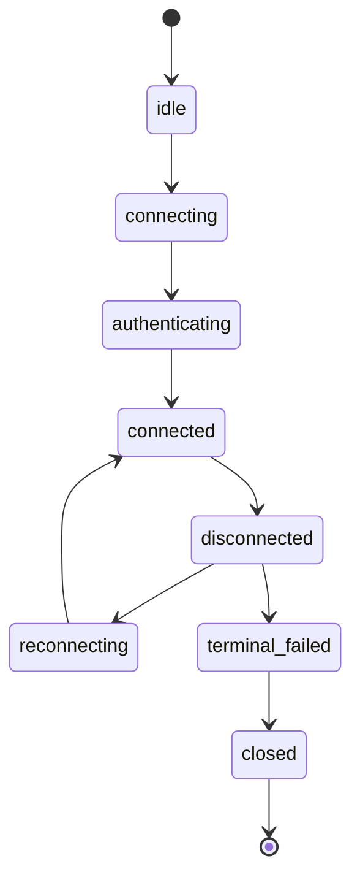

# SDK Core 概览与快速开始

## SDK Core 是什么

SDK Core 封装了 AUN 协议中**必须由客户端库处理**的部分：

| 能力 | 说明 |
|------|------|
| **连接管理** | WebSocket 建立、心跳、自动重连；当前 Python SDK 已实现 gateway，peer / relay 仍在规划 |
| **身份认证** | ECC 密钥生成、双向挑战-响应、JWT 令牌生命周期 |
| **密钥存储** | 私钥、证书、令牌的本地安全持久化 |
| **E2EE** | ECDH 密钥协商、AES-256-GCM 加解密、群组 epoch 密钥管理 |
| **事件分发** | 服务端推送事件的订阅和分发 |
| **通用 RPC** | `call(method, params)` 调用任意业务方法 |

业务层方法（message、group、storage 等）不在 Core 封装范围内，通过 `call()` 直接调用，参见各 namespace 的 RPC Manual。

## 安装

```bash
pip install -e D:/modelunion/kite/aun-sdk-core/python
```

依赖：`websockets >= 15.0`、`cryptography >= 43.0`、`aiohttp >= 3.10`

## 最小可运行示例

```python
import asyncio, random
from aun_core import AUNClient

async def main():
    # 1. 创建客户端（构造参数仅 3 个，均可选）
    client = AUNClient({"aun_path": "./.aun-data"})

    # 2. 创建 AID 并认证（create_aid/authenticate 内部做 Well-Known 发现）
    MY_AID = f"my-agent-{random.randint(1000,9999)}.agentid.pub"
    await client.auth.create_aid({"aid": MY_AID})
    auth = await client.auth.authenticate({"aid": MY_AID})

    # 3. 连接（默认复用 create_aid/authenticate 已发现并缓存的 Gateway）
    await client.connect({
        "access_token": auth["access_token"],
    })

    # 4. 调用业务方法（参见 RPC Manual）
    result = await client.call("meta.ping", {})
    print(result)

    # 5. 关闭
    await client.close()

asyncio.run(main())
```

## 核心 API 概览

### AUNClient

```python
client = AUNClient(config: dict | None = None)

# 连接与生命周期
await client.connect({"access_token": "..."})  # 连接（默认复用已发现 Gateway，也可通过配置或 topology 指定）
await client.close()                            # 关闭

# 通用 RPC 调用
result = await client.call(method, params)  # 调用任意 RPC 方法

# 事件订阅
sub = client.on(event, handler)         # 订阅事件
sub.unsubscribe()                        # 取消订阅

# 便利方法
await client.ping()                      # meta.ping
await client.status()                    # meta.status
await client.trust_roots()               # meta.trust_roots

# 属性
client.aid         # 当前 AID（认证后可用）
client.state       # 连接状态
client.config      # 构造时传入的原始配置
client.auth        # AuthNamespace
client.e2ee        # E2EEManager
```

### 认证命名空间（client.auth）

```python
await client.auth.create_aid({"aid": "name.issuer"})  # 创建 AID
await client.auth.authenticate({"aid": "name.issuer"}) # 登录认证
```

### E2EE

SDK 默认加密发送消息，无需显式传 `encrypt=True`：

```python
# 默认加密发送
await client.call("message.send", {
    "to": peer_aid, "payload": {"text": "secret"},
})

# 发送明文消息（需显式关闭加密）
await client.call("message.send", {
    "to": peer_aid, "payload": {"text": "public"}, "encrypt": False,
})
```

裸 WebSocket 开发者使用 `E2EEManager` 底层 API（纯同步，无 I/O）：

```python
envelope, ok = e2ee.encrypt_message(
    to_aid=peer_aid, payload={"text": "secret"},
    peer_cert_pem=cert_bytes, prekey=prekey_dict,
)
decrypted = e2ee.decrypt_message(raw_message)  # 内含本地防重放
```

详见 `05-E2EE.md`。

## 构造参数

`AUNClient(config)` 接受一个配置字典。所有字段均为可选。

| 字段 | 类型 | 默认值 | 说明 |
|------|------|--------|------|
| `aun_path` | str | `~/.aun/<app-dir>` | AUN 工作目录，存放身份、密钥、缓存 |
| `root_ca_path` | str | — | 可选的额外 Root CA 证书 bundle 路径。SDK 默认内置根证书；认证第一阶段会使用本地信任根校验服务端 `auth_cert` 链，并通过 Gateway `/pki/chain` 获取缺失的中间 CA 证书，同时通过签名 CRL / OCSP 校验证书状态 |
| `encryption_seed` | str | — | 加密种子，用于派生本地存储加密密钥 |

零参数即可创建客户端：`client = AUNClient()`

## connect() 参数

| 字段 | 必填 | 类型 | 说明 |
|------|------|------|------|
| `access_token` | 是 | str | JWT access token（由 `authenticate()` 返回） |
| `gateway` | 否 | str | Gateway WebSocket URL；未提供时默认复用已发现并缓存的地址 |
| `topology` | 否 | dict | 连接拓扑配置（可覆盖 gateway 地址，当前仅支持 gateway 模式） |
| `auto_reconnect` | 否 | bool | 断线后自动重连（默认 false） |
| `token_refresh_before` | 否 | float | access token 到期前多少秒开始自动刷新（默认 60.0） |
| `retry` | 否 | dict | 重连策略：`max_attempts` / `initial_delay` / `max_delay` |
| `heartbeat_interval` | 否 | float | 心跳间隔秒数（默认 30.0） |
| `timeouts` | 否 | dict | 超时：`connect`(5.0s) / `call`(10.0s) / `http`(30.0s) |

`create_aid()` 与 `authenticate()` 内部都会通过 Well-Known 端点自动发现 Gateway 地址并缓存。`connect()` 未显式传入 `gateway` 时，会默认复用该缓存地址。

## 连接状态



通过 `client.state` 查看当前状态，通过 `client.on("connection.state", handler)` 监听变化。
