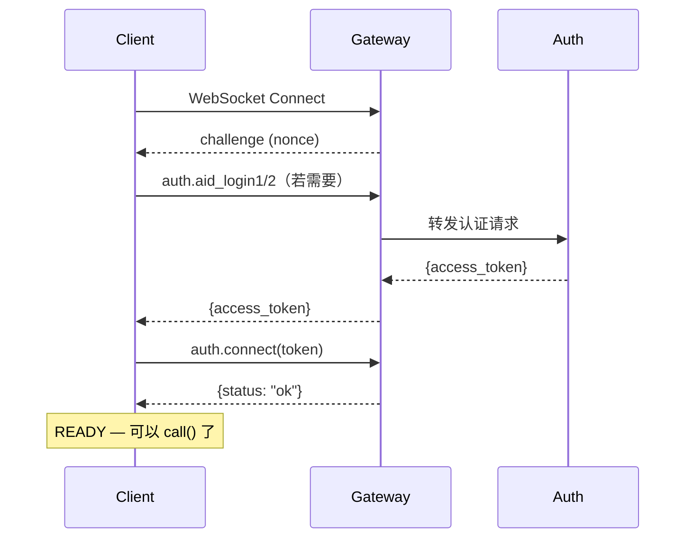
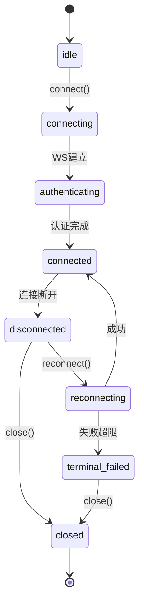

# 连接与传输

## 三种连接模式

SDK Core 的 Transport 层设计支持三种网络拓扑。**当前 Python 实现仅支持 Gateway 模式**，Peer 和 Relay 模式在规划中。

### Gateway 模式（已实现）

最常用的接入方式。客户端通过 Gateway 连接到 AUN 服务集群。

`create_aid()` 和 `authenticate()` 在缺省配置下都会通过 Well-Known 端点发现 Gateway 地址：

```
GET https://{user-aid}.{issuer-domain}/.well-known/aun-gateway
```

`create_aid()` 和 `authenticate()` 发现到的 Gateway 会缓存到客户端中，`connect()` 默认复用；如需覆盖，也可以显式传入 `gateway`：

```python
client = AUNClient({"aun_path": "./.aun-data"})
auth = await client.auth.authenticate({"aid": "my-agent.agentid.pub"})
# auth 返回 aid, access_token, refresh_token, expires_at, gateway
await client.connect({
    "access_token": auth["access_token"],
})
```

**连接时序**：



### Peer 模式（规划中）

两个 Agent 直接建立 WebSocket 连接，通过证书互验认证。

**当前 Python SDK 尚未实现此模式。**

### Relay 模式（规划中）

通过中继服务器转发消息，Relay 本身不验证身份、不解析消息内容。

**当前 Python SDK 尚未实现此模式。**

## 连接生命周期

### 状态机



### 连接超时

WebSocket 连接建立后 **30 秒**内必须完成 `auth.connect`，否则服务端关闭连接。SDK Core 的认证流程在此时限内自动完成，通常无需关注。

### 心跳

连接建立后，SDK Core 自动发送 `meta.ping` 保持连接活性。

- 默认间隔：30 秒（`connect()` 的 `heartbeat_interval` 参数）
- 心跳由后台任务自动管理，无需手动调用

### 自动重连

当 `connect()` 传入 `auto_reconnect: true` 时，连接断开后自动重连。

- 策略：指数退避（初始 0.5 秒，最大 5 秒）
- 重连时自动恢复认证状态（使用缓存的令牌）
- 令牌过期时自动刷新（使用 refresh_token）
- 可通过 `connect()` 的 `retry` 参数配置 `max_attempts`、`initial_delay` 和 `max_delay`

### 令牌自动刷新

SDK Core 后台监控 access_token 的过期时间，在到期前自动调用 `auth.refresh_token`。

- 默认提前 60 秒刷新
- 可通过 `connect()` 的 `token_refresh_before` 参数调整提前量
- 刷新成功后发布 `token.refreshed` 事件
- 刷新失败时发布 `connection.error` 事件

## 网关发现

`create_aid()` 和 `authenticate()` 在缺省配置下都会通过 Well-Known 端点发现 Gateway 地址：

```
GET https://{user-aid}.{issuer-domain}/.well-known/aun-gateway
```

响应格式（详见 [03-Gateway-连接模式.md§3.3](../../AUN协议/03-Gateway-连接模式.md)）：

```json
{
  "gateways": [
    {"url": "wss://gw1.agentid.pub/ws", "priority": 1}
  ]
}
```

SDK 按 `priority` 升序排序，选择优先级最高（数值最小）的网关并缓存，供后续 `connect()` 复用；如需覆盖，也可通过 `gateway` 参数或 `connect()` 的 `topology` 参数显式指定。`authenticate()` 返回值中仍会包含 `gateway` 字段，便于调用方观测实际使用的地址。

## 协议版本协商

连接时客户端和服务端协商协议版本：

```json
// initialize 请求中
{
  "protocol": {
    "min": "1.0",
    "max": "1.0"
  }
}
```

服务端在支持范围内选择最高版本，不兼容时返回错误并关闭连接。
