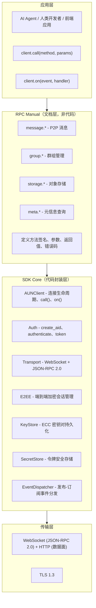
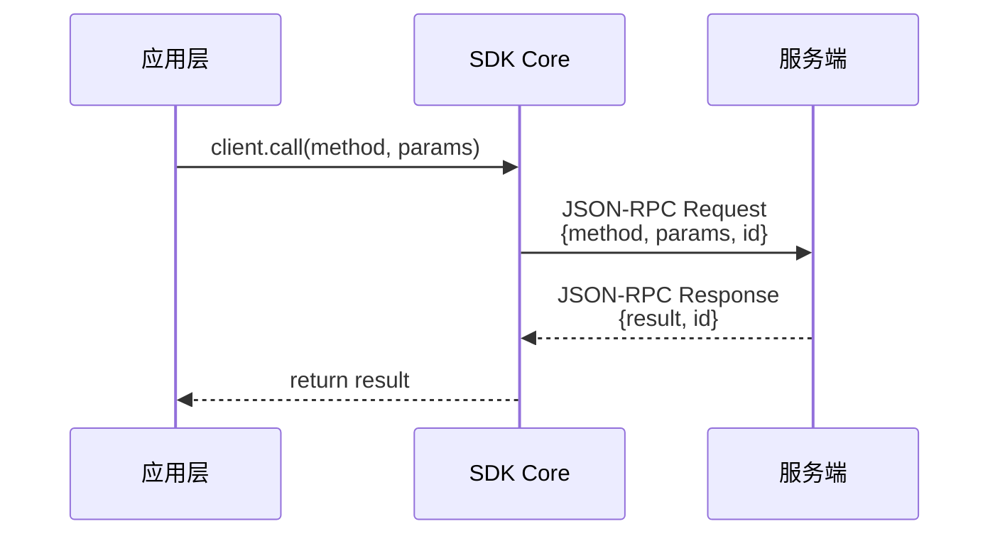
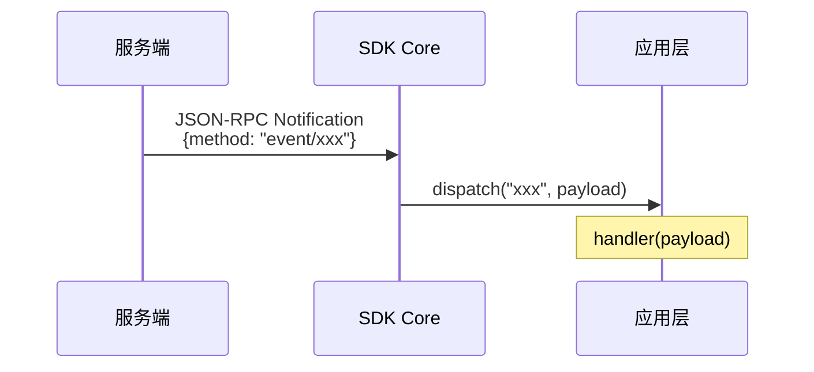
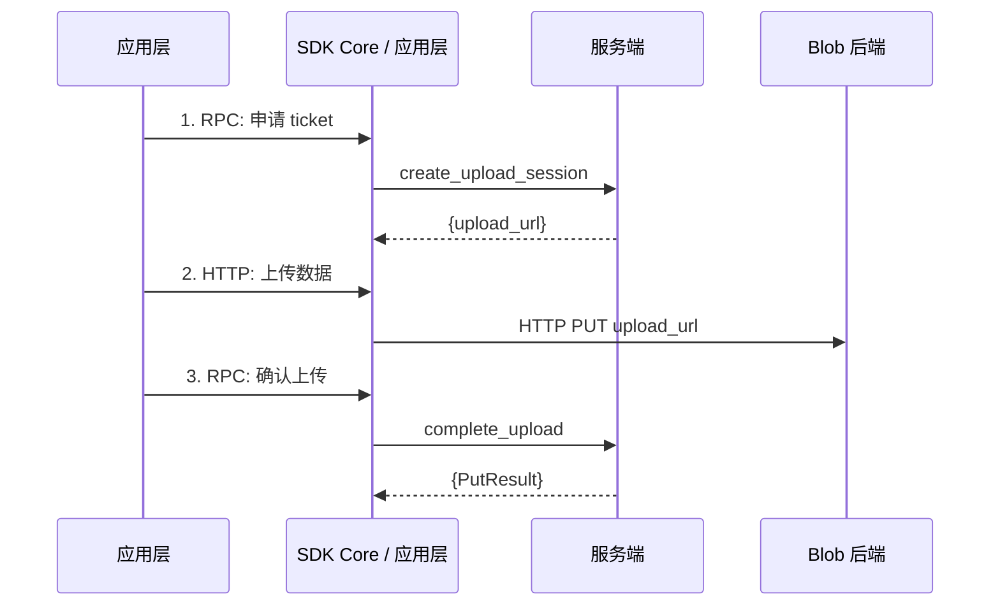
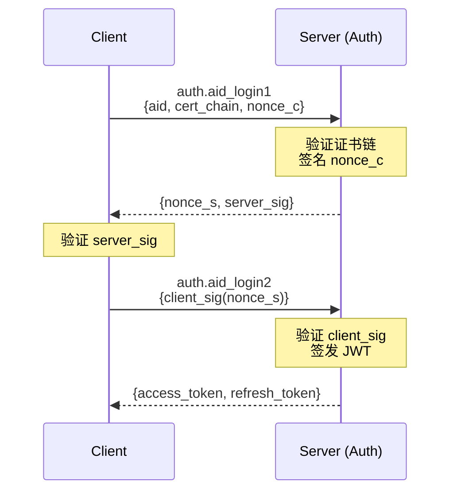

# 总体架构

## 分层总览



**Core 封装边界**：凡涉及密码学运算、本地状态管理、连接状态机的，由 Core 封装。凡业务层的请求-响应交互，由 RPC Manual 描述、调用者自行 `call()`。

## 网络拓扑

AUN 协议设计支持三种连接模式。**当前 Python SDK 仅实现 Gateway 模式**。

### Gateway 模式（已实现）

```
Client ──WebSocket──▶ Gateway ──JSON-RPC──▶ Kernel ──▶ 各服务模块
                         │
                    JWT 认证、权限检查、事件转发
```

- 客户端通过 Gateway 接入，Gateway 负责认证和权限控制
- 适用于公网接入、移动端、浏览器

### Peer 模式（规划中）

```
Client A ◀──WebSocket──▶ Client B
              │
         双向证书验证（peer.hello / hello_reply / confirm）
```

- 两个 Agent 直接建立 WebSocket 连接
- 通过证书互验完成双向认证，不依赖 JWT
- 适用于局域网、已知对端地址的场景
- **当前 Python SDK 尚未实现**

### Relay 模式（规划中）

```
Client A ──▶ Relay ◀── Client B
               │
          AID 路由转发（零信任笨管道）
```

- Relay 仅维护 AID→WebSocket 映射并转发消息
- 不验证证书、不签发 JWT、不解析消息内容
- 认证由端到端 peer.* 握手完成（穿透 Relay）
- 适用于 NAT 穿透、无法直连的场景
- **当前 Python SDK 尚未实现**

### 拓扑对上层的透明性

| 特性 | Gateway | Peer | Relay |
|------|---------|------|-------|
| 认证方式 | JWT（auth.* + initialize） | 证书互验（peer.*） | peer.* 穿透 Relay |
| 权限模型 | 角色（admin/agent/viewer） | 对等（双方平级） | 对等 |
| 事件推送 | Gateway 转发 | 对端直接推送 | Relay 转发 |
| `client.call()` | 一致 | 一致 | 一致 |
| `client.on()` | 一致 | 一致 | 一致 |

## Namespace 全景

| Namespace | 定位 | 方法数 | 数据面 |
|-----------|------|--------|--------|
| **message** | P2P 消息收发、离线存储、送达确认 | 6 | 无 |
| **group** | 群组生命周期、成员管理、群消息、资源共享 | 50+ | HTTP（群资源下载） |
| **storage** | 对象存储、文件上传下载、配额管理 | 12 | HTTP（大文件上传/下载） |
| **meta** | 心跳、状态查询、信任根证书 | 3 | 无 |

**Namespace 间关系**：
- `group` 依赖 `storage` 管理群资源（头像、附件）
- `message` 和 `group` 共享相似的 seq/ack 投递模型
- `meta` 独立于所有业务 namespace

**未来 namespace**（协议已规划，尚未实现）：
- `federation.*` — 跨 Issuer 消息路由（mTLS）
- `search.*` — Agent 搜索与发现
- `task.*` — Agent 协作与任务执行

## 数据流

### 请求-响应（RPC）



### 事件推送（Notification）



### 数据面（HTTP，仅 storage 和 group resources）



> 注：数据面的 HTTP 调用不在 SDK Core 封装范围内。RPC Manual 中会详细说明 ticket 流程，调用者用 aiohttp/requests/fetch 等自行完成 HTTP 部分。

## 认证与安全模型

### 证书链

```
Root CA (P-384, pathlen=2)
  └── Registry CA (P-384, pathlen=1)
        └── Issuer CA (P-384, pathlen=0)
              └── Agent cert (P-256)
```

- 每个 Agent 持有 P-256 密钥对和 X.509 证书
- 证书由 Issuer CA 签发，通过 `auth.create_aid` 获得
- 证书链可离线验证（不依赖在线服务）

### 认证流程



### 安全层级

| 层级 | 机制 | 保护范围 |
|------|------|---------|
| 传输层 | TLS 1.3 | 链路加密 |
| 认证层 | 双向 ECDSA 挑战-响应 + JWT | 身份验证 |
| 应用层（可选） | E2EE (P256_HKDF_SHA256_AES_256_GCM) | 端到端内容加密 |

E2EE 是独立的安全层，横跨三种网络拓扑，不替代传输层 TLS 和认证层 JWT/证书验证。
